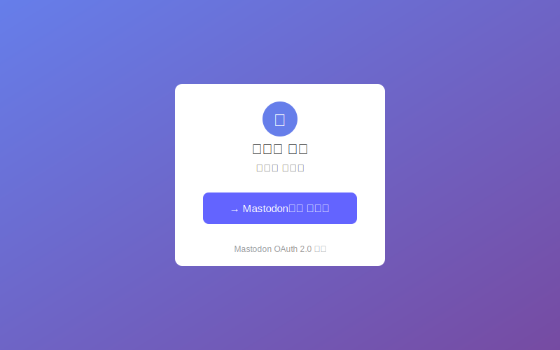
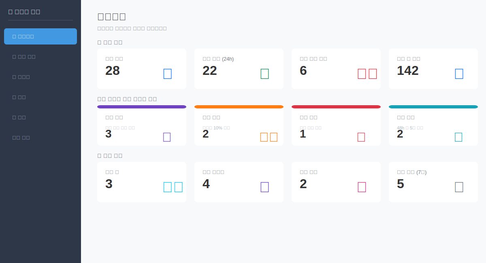
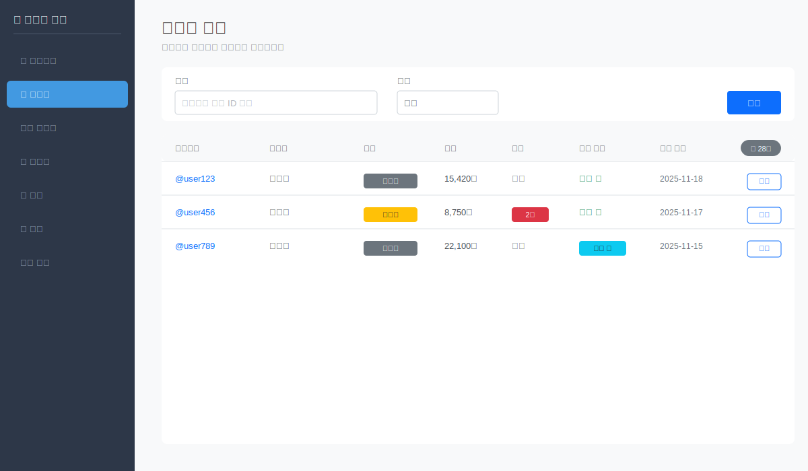
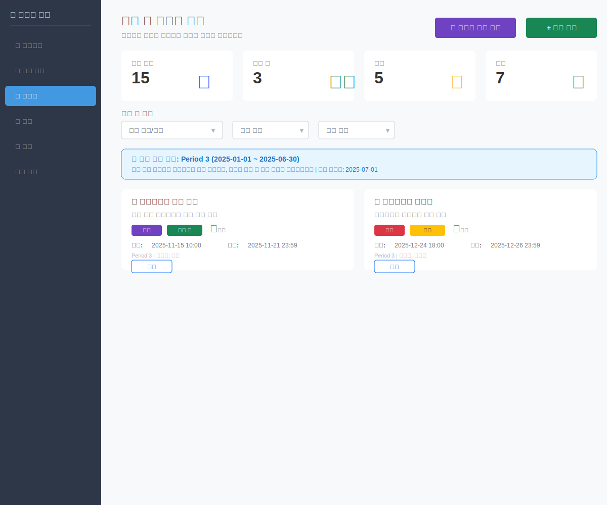
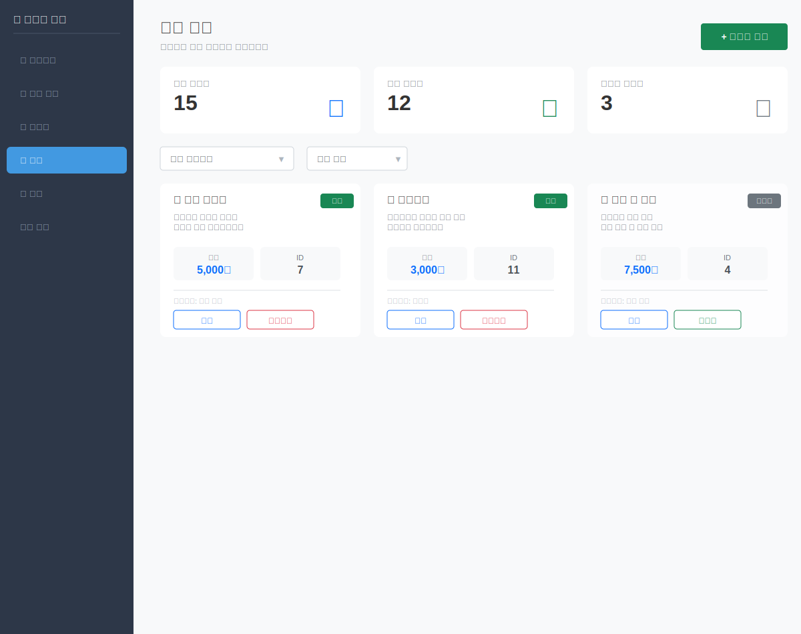

# 마녀봇 관리자 가이드

> **대상**: 마녀봇 관리자 웹 인터페이스를 사용하는 관리자
> **목적**: 웹 브라우저를 통한 커뮤니티 관리 완벽 가이드

---

## 📋 목차

1. [시스템 접속 및 인증](#1-시스템-접속-및-인증)
2. [대시보드](#2-대시보드)
3. [활동량 관리](#3-활동량-관리)
4. [재화 관리](#4-재화-관리)
5. [상점 관리](#5-상점-관리)
6. [시스템 설정](#6-시스템-설정)
7. [관리 로그](#7-관리-로그)
8. [화면 예시](#8-화면-예시)
9. [자주 묻는 질문](#9-자주-묻는-질문)

---

## 1. 시스템 접속 및 인증

### 1.1 관리 페이지 URL

```
http://[서버주소]:5000/
```

- **로컬 개발**: `http://localhost:5000/`
- **테스트 서버**: `https://testadmin.duckdns.org/` (예시)
- **프로덕션**: 실제 배포된 도메인 주소

### 1.2 OAuth 로그인



#### 접근 권한

1. **총괄계정** OAuth (모든 권한)
2. **role='admin' 유저** OAuth (역할 변경 제외)
3. 세션 기반 인증 (24시간)

#### 페이지별 권한

| 기능 | 총괄계정 | role='admin' |
|------|----------|--------------|
| 대시보드, 유저 관리, 재화 조정 | ✅ | ✅ |
| 활동량, 일정, 시스템 설정 | ✅ | ✅ |
| **역할 변경** | ✅ | ❌ |

---

## 2. 대시보드

### 2.1 접속 방법

- 상단 메뉴에서 "대시보드" 클릭
- 또는 메인 페이지에서 자동 이동

### 2.2 화면 구성

**목표**: 5초 안에 전체 상황 파악



### 2.3 통계 카드

#### 📊 전체 유저
- 시스템에 등록된 전체 사용자 수
- 활성/비활성 포함

#### ✅ 활성 유저 (24시간)
- 최근 24시간 이내 활동한 사용자 수
- 커뮤니티 활성도 지표

#### 🏖️ 휴식 중
- 현재 휴식 상태인 사용자 수
- 휴식 기간 중에는 활동량 체크 면제

#### ⚠️ 경고 발송 (7일)
- 최근 7일간 발송된 경고 수
- 활동량 미달 사용자 추이 파악

### 2.4 전체 유저 활동 현황



**상태 범례:**
- 🟢 정상 (기준 충족)
- 🟡 주의 (기준의 70~99%)
- 🔴 경고 (기준 미달)
- 💤 휴식 중

**💡 Tip:** 사용자명 클릭 시 상세 페이지로 이동, 옆의 외부 링크 아이콘(<i class="bi bi-box-arrow-up-right"></i>) 클릭 시 마스토돈 프로필 새 창에서 열림

### 2.5 시스템 정보

- **활동량 체크 주기**: 오전 4시, 오후 4시 (12시간 간격)
- **최소 답글 기준**: 48시간 내 20개
- **재화 지급 비율**: 답글 1개당 10원

---

## 3. 활동량 관리

### 3.1 자동 경고 내역


**기능:**
- 48시간 답글 수 기준으로 자동 체크
- 필터: 오늘, 이번주, 전체
- 정렬: 최신순, 답글수순
- 유저별 상세 활동 내역 조회
- 최근 7일 경고 기록 확인

### 3.2 수동 경고 보내기

**기능:**
- 유저 검색 또는 목록에서 선택
- 템플릿 제공 (활동량 부족, 규칙 위반, 사용자 정의)
- 메시지 작성 (최대 500자)
- DM으로 즉시 발송
- 모든 발송 내역 자동 기록

⚠️ **주의**: 발송 후 취소 불가, 관리 로그에 영구 기록

### 3.3 휴식 관리



**기능:**
- 휴식 중인 유저 목록 조회
- 휴식 기간 등록 (시작일, 종료일, 사유)
- 휴식 해제
- 전역 휴식기간 설정

⚠️ 휴식 기간 동안 활동량 체크 제외

---

## 4. 재화 관리

### 4.1 전체 유저 목록


**기능:**
- 검색, 정렬, 필터 기능 제공
- 엑셀 다운로드 지원
- 사용자명 옆 <i class="bi bi-box-arrow-up-right"></i> 아이콘 클릭 시 마스토돈 프로필로 이동 (새 창)

### 4.2 재화 조정


**기능:**
- 유저 정보 조회 (현재 재화, 누적 획득/사용)
- 재화 지급 또는 차감
- 사유 필수 입력 (예: 이벤트 보상, 오류 수정)
- 미리보기로 결과 확인
- 모든 조정 내역 자동 기록 (관리 로그)

⚠️ **주의**: 사유는 필수이며, 모든 조정은 로그에 영구 기록됨

---

## 5. 상점 관리

### 5.1 아이템 목록



- 카테고리 및 상태별 필터 지원
- 아이템 추가, 편집, 삭제 기능

### 5.2 아이템 추가/편집


**폼 필드:**
- 아이템 이름 (필수)
- 설명, 가격 (필수)
- 카테고리 (선택 또는 새로 생성)
- 이미지 URL (선택)
- 판매 상태 (판매중/중단)

**유저 구매 흐름:**
`@봇 상점` → 아이템 목록 DM → `@봇 구매 [아이템명]` → 멘션에 별표⭐ → DM 결과 확인

---

## 6. 시스템 설정

### 🛠️ 시스템 설정

**주요 설정 항목:**

1. **활동량 체크 기준**
   - 체크 기간: 48시간
   - 최소 답글 수: 20개

2. **재화 지급 설정**
   - 답글 N개당 M원 지급
   - 예: 1개당 10원, 100개당 1000원

3. **체크 시간**
   - 오전 5시: 벌크 처리
   - 오후 12시: 중간 체크

**⚠️ 주의사항:**
- 변경사항은 즉시 적용
- 크론 설정 자동 갱신
- 문제 시 "기본값으로 되돌리기" 사용

---

## 7. 관리 로그

### 📝 관리자 작업 기록


투명한 관리를 위해 모든 작업이 기록됩니다

**기능:**
- 액션 타입별 필터 (재화조정, 경고발송, 설정변경, 상점관리)
- 기간별 조회 (최근 7일, 30일, 전체)
- 관리자명 또는 유저명으로 검색
- 엑셀 다운로드 지원

### 7.1 활용 방법

**필터 옵션:**
- 액션 타입별 (재화조정, 경고발송, 설정변경, 상점관리)
- 기간별 (최근 7일, 30일, 전체)
- 관리자별
- 복합 필터 지원

**예시:** "운영진A"가 오늘 수행한 "재화 조정"만 조회
→ 관리자 선택 + 액션 타입 체크 + 필터 적용

---

## 8. 화면 예시

> 관리자 웹 인터페이스의 주요 화면 모습입니다.

### 8.1 사용자 목록 페이지


- 유저별 재화 현황
- 활동 상태 표시
- 검색 및 필터 기능

---

### 8.2 이벤트 관리 페이지


- 커뮤니티 일정 관리
- 전역 휴식기간 설정
- 이벤트 CRUD

---

### 8.3 상점 관리 페이지


- 아이템 등록/수정/삭제
- 판매 상태 관리
- 카테고리별 정리

---

### 💡 사용 팁

- 모든 페이지는 반응형 디자인으로 태블릿과 모바일에서도 사용 가능합니다
- Bootstrap 5 기반의 깔끔한 UI로 직관적으로 사용할 수 있습니다
- 각 페이지에는 검색, 필터링, 페이지네이션 기능이 제공됩니다

---

## 9. 자주 묻는 질문

### Q1. 로그인이 안 돼요

**확인 사항:**
1. Mastodon 계정이 관리자 권한이 있나요?
2. 서버가 정상 실행 중인가요?
3. 네트워크 연결은 정상인가요?

**해결 방법:**
- 개발자에게 관리자 권한 요청
- 서버 상태 확인 (EMERGENCY.md 참조)

### Q2. 통계가 업데이트 안 돼요

**원인:**
- 대시보드는 페이지 로드 시점의 데이터를 보여줍니다
- 실시간 업데이트가 아닙니다

**해결 방법:**
- 브라우저 새로고침 (F5 또는 Ctrl+R)

### Q3. 로그가 너무 많아서 찾기 힘들어요

**해결 방법:**
1. 액션 타입 필터 활용
   - 보고 싶은 타입만 체크
2. 관리자 필터 활용
   - 특정 관리자의 활동만 확인
3. 복합 필터링 사용
   - 두 필터를 동시에 적용

**예시:**
- 오늘 "운영진A"가 수행한 "재화 조정"만 보고 싶다면:
  1. 관리자: "운영진A" 선택
  2. 액션: "재화 조정"만 체크
  3. 필터 적용

### Q4. 특정 사용자의 활동 기록을 보고 싶어요

**현재 기능:**
- 로그 뷰어에서는 관리자 활동만 조회 가능
- 사용자별 필터링은 아직 미구현

**대안:**
- 브라우저 검색 기능 (Ctrl+F) 사용
- 사용자 이름으로 검색

**향후 업데이트:**
- 사용자별 필터 추가 예정

### Q5. 로그를 엑셀로 내보낼 수 있나요?

**현재 상태:**
- 웹 UI에서 직접 내보내기는 미구현

**대안:**
1. 브라우저의 "페이지 저장" 기능 사용
2. 또는 개발자에게 데이터베이스 추출 요청

**향후 업데이트:**
- CSV/Excel 내보내기 기능 추가 예정

### Q6. 서버가 다운되었어요!

긴급 상황입니다. **EMERGENCY.md** 문서를 참조하세요.

간단한 재시작 방법:
```bash
# 서버 재시작 (한 줄 명령어)
pkill -9 -f "python.*admin_web" && cd /home/user/commumanager && nohup python3 -m admin_web.app > flask_server.log 2>&1 &
```

### Q7. 사용자 재화를 지급하고 싶어요

**재화 조정 절차:**
1. "재화 관리" 페이지 접속
2. 대상 유저 검색
3. [수정] 버튼 클릭
4. 금액 및 사유 입력
5. [적용하기] 버튼 클릭

**주의사항:**
- 사유는 필수 입력 항목입니다
- 모든 재화 조정은 로그에 기록됩니다

### Q8. 경고를 발송하고 싶어요

**경고 발송 절차:**
1. "활동량 관리" 페이지 접속
2. [수동 경고 보내기] 버튼 클릭
3. 대상 유저 선택
4. 경고 메시지 작성 (템플릿 활용 가능)
5. [경고 DM 발송하기] 버튼 클릭

**주의사항:**
- 경고는 DM으로 발송됩니다
- 발송 기록이 남습니다
- 취소할 수 없습니다

---

## 📞 추가 지원

### 문제가 해결되지 않을 때

1. **긴급 상황**: EMERGENCY.md 참조
2. **개발자 연락**: [개발자 연락처]
3. **로그 확인**: 서버의 `flask_server.log` 파일 확인

### OAuth 인증 관련

#### OAuth 앱 등록

```bash
# 마스토돈 서버에서 OAuth 앱 생성
애플리케이션 이름: 마녀봇 관리자 웹
리디렉션 URI: https://admin.yourdomain.com/oauth/callback
스코프: read write follow
```

#### 환경변수

```bash
MASTODON_INSTANCE=https://yourserver.duckdns.org
MASTODON_CLIENT_ID=your_client_id
MASTODON_CLIENT_SECRET=your_client_secret
MASTODON_REDIRECT_URI=https://admin.yourdomain.com/oauth/callback
ADMIN_ACCOUNT_ID=총괄계정_mastodon_id
```

#### 초기 설정

**1. 총괄계정 ID 확인**
```bash
docker-compose exec web bin/tootctl accounts show admin_username
# Account ID: 1234567890
```

**2. .env 설정**
```bash
ADMIN_ACCOUNT_ID=1234567890
```

**3. 첫 관리자 등록**
```sql
-- economy.db
UPDATE users SET role = 'admin' WHERE mastodon_id = '첫_관리자_ID';
```

---

## 문서 업데이트

이 문서는 시스템 업데이트에 따라 계속 갱신됩니다.

**관련 문서:**
- [시스템 아키텍처](ARCHITECTURE.md)
- [기능 목록](features.md)
- [긴급 대응](EMERGENCY.md)
- [유지보수 가이드](MAINTENANCE.md)
