# 마녀봇 관리자 가이드

> **대상**: 마녀봇 관리자 웹 인터페이스를 사용하는 관리자
> **목적**: 웹 브라우저를 통한 커뮤니티 관리 완벽 가이드

---

## 📋 목차

1. [시스템 접속 및 인증](#1-시스템-접속-및-인증)
2. [대시보드](#2-대시보드)
3. [유저 관리](#3-유저-관리)
   - 3.1 [활동량 모니터링](#31-활동량-모니터링-탭-1)
   - 3.2 [휴식 현황](#32-휴식-현황-탭-2)
   - 3.3 [재화 관리](#33-재화-관리-탭-3)
4. [상점 관리](#4-상점-관리)
5. [일정 및 이벤트 관리](#5-일정-및-이벤트-관리)
6. [스토리 예약 관리](#6-스토리-예약-관리)
7. [공지 예약 관리](#7-공지-예약-관리)
8. [시스템 설정](#8-시스템-설정)
9. [관리 로그](#9-관리-로그)
10. [자주 묻는 질문](#10-자주-묻는-질문)
11. [시스템 유지보수](#11-시스템-유지보수)

---

## 1. 시스템 접속 및 인증

### 1.1 관리 페이지 URL

```
http://[서버주소]:5000/
```

- **로컬 개발**: `http://localhost:5000/`
- **테스트 서버**: `https://testadmin.duckdns.org/` (예시)
- **프로덕션**: 실제 배포된 도메인 주소

### 1.2 OAuth 로그인


#### 접근 권한

1. **총괄계정** OAuth (모든 권한)
2. **role='admin' 유저** OAuth (역할 변경 제외)
3. 세션 기반 인증 (24시간)

#### 페이지별 권한

| 기능 | 총괄계정 | role='admin' |
|------|----------|--------------|
| 대시보드, 유저 관리, 재화 조정 | ✅ | ✅ |
| 활동량, 일정, 시스템 설정 | ✅ | ✅ |
| **역할 변경** | ✅ | ❌ |

---

## 2. 대시보드

**접근 경로:** 상단 메뉴 → 📊 대시보드 (로그인 후 기본 화면)

**목표**: 5초 안에 커뮤니티 전체 상황 파악


### 2.1 주요 지표

대시보드 최상단에 가장 중요한 4가지 지표가 표시됩니다:

#### 👥 전체 유저
- 시스템에 등록된 전체 사용자 수
- 활성/비활성/휴식 중 포함

#### ✓ 활성 유저 (24h)
- 최근 24시간 이내 활동한 사용자 수
- 커뮤니티 활성도 지표

#### ⚠️ 위험 감지 유저
- 다각도 활동량 분석에서 위험으로 감지된 사용자 수
- 고립/편향/회피/비활동/답글 미달 중 1개 이상 해당
- 즉시 관리가 필요한 유저 파악

#### 💰 총 재화
- 모든 유저의 보유 재화 합계
- 커뮤니티 경제 규모 파악

### 2.2 관리 현황

커뮤니티 관리 작업 현황을 한눈에 확인:

- **🏖️ 휴식 중**: 현재 휴식 기간인 유저 수
- **📹 예약 스토리**: 발송 대기 중인 스토리 이벤트 수
- **📢 예약 공지**: 발송 대기 중인 공지 수
- **📨 경고 발송 (7일)**: 최근 7일간 발송된 경고 수

### 2.3 시스템 정보

현재 적용 중인 시스템 설정 확인:

#### 활동량 관련
- **분석 방식**: 다각도 위험 감지 (고립/편향/회피/비활동/답글 미달)
- **체크 주기**: 오전 4시, 오후 4시 (12시간 간격)
- **답글 수 기준**: 48시간 내 5개
- **휴식 중 체크**: 비활성화

#### 재화 관련
- **지급 비율**: 답글 1개당 10원
- **휴식 중 지급**: 비활성화

#### 경고 관련
- **자동 경고 발송**: 활성화

#### 최근 활동
- 마지막 활동량 정산 시간
- 마지막 재화 지급 내역

---

## 3. 유저 관리

**접근 경로:** 상단 메뉴 → 👥 유저 관리

유저 관리는 **3개의 탭**으로 구성되어 관련 기능을 통합 관리합니다:
- **⚠️ 활동량 모니터링** (탭 1): 4가지 관점에서 유저 활동 건강도 분석
- **🏖️ 휴식 현황** (탭 2): 유저가 신청한 휴식 기간 조회 및 강제 해제
- **💰 재화 관리** (탭 3): 유저별 재화 현황 조회 및 거래 내역 관리

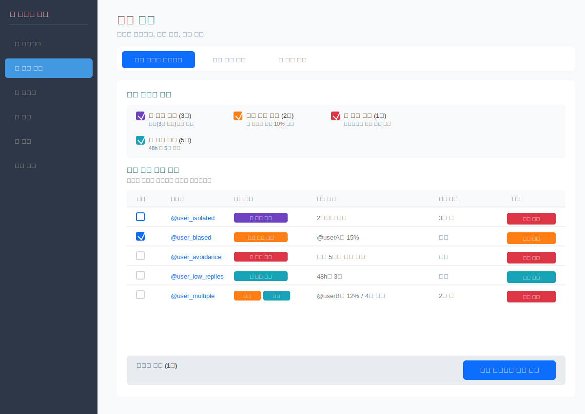

### 3.1 활동량 모니터링 (탭 1)

#### 위험 유형별 필터

시스템은 **4가지 위험 유형**으로 유저를 분석합니다. 체크박스로 원하는 유형만 선택하여 조회할 수 있습니다:

**🎯 고립 위험**
- **기준**: 대화 상대가 접속 중인 인원의 절반 미만
- **설명**: 소수와만 교류하는 유저
- **예시**: 10명 접속 중인데 userA가 4명 이하와만 대화

**⚖️ 편향 위험**
- **기준**: 특정 1인과의 대화가 전체의 10% 이상
- **설명**: 한 유저에게 과도하게 집중된 교류
- **예시**: userA의 전체 대화 중 userB와의 대화가 15%

**🚫 회피 패턴**
- **기준**: 활동은 활발하지만 특정 주요 멤버를 회피
- **설명**: 커뮤니티 중심 인물과 교류하지 않음
- **⚠️ 중요**: 상대방이 접속하지 않은 경우는 회피로 분류되지 않습니다
- **예시**: userA가 활발히 활동하지만 주요 멤버 userX와는 48시간 동안 한 번도 대화하지 않음 (단, userX도 활동 중일 때만 감지)

**💬 답글 미달**
- **기준**: 48시간 내 답글 5개 미만
- **설명**: 기본 활동량 부족
- **예시**: 48시간 동안 답글 3개만 작성

#### 복합 위험 표시

한 유저가 여러 위험 유형에 동시에 해당할 수 있습니다:

- **예시 1**: `편향` + `미달` → "@userB와 15% / 4개 답글"
- **예시 2**: `고립` + `미달` → "3명과만 대화 / 4개 답글"

테이블에서 각 위험 유형은 색상별 배지로 표시됩니다.

#### 유저 상세 정보

테이블에서 각 유저의 상세 정보를 확인할 수 있습니다:

- **선택**: 체크박스로 일괄 작업 대상 선택
- **사용자**: 마스토돈 아이디
- **위험 유형**: 해당하는 위험 유형 배지 (여러 개 가능)
- **상세 현황**: 각 위험 유형의 구체적인 수치
- **작업**: 개별 경고 발송 버튼

#### 경고 발송

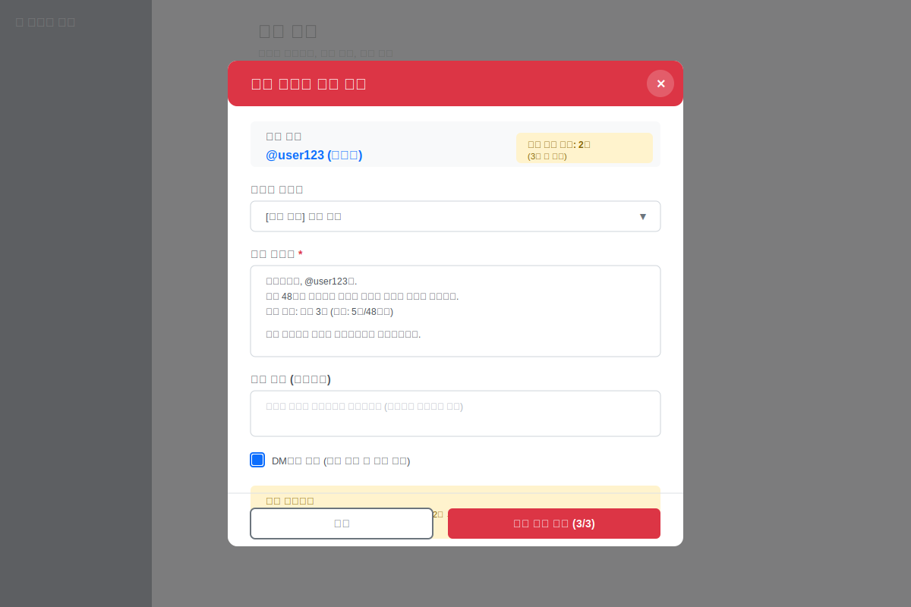

**경고 누적 시스템:**
- 경고는 1차/2차/3차가 아닌 **누적 횟수**로 관리됩니다
- 경고 발송 시 해당 유저의 누적 경고 횟수가 자동으로 1회 증가
- **3회 경고 시 자동 아웃 처리**됩니다

**개별 발송:**
1. 테이블에서 유저 행의 "경고 발송" 버튼 클릭
2. 경고 발송 모달이 열립니다:
   - **대상 유저**: 유저 정보 및 **누적 경고 횟수** 표시 (예: 2회 / 3회 시 아웃)
   - **메시지 템플릿**: 사전 정의된 템플릿 선택 가능
   - **경고 메시지**: 템플릿 기반으로 자동 생성 (수정 가능)
   - **추가 메모**: 관리자 전용 메모 (유저에게 표시되지 않음)
   - **발송 옵션**: DM 또는 공개 멘션 선택
3. "⚠️ 경고 발송 (3/3)" 버튼 클릭
   - 괄호 안 숫자는 발송 후 누적 횟수를 의미

**일괄 발송:**
1. 체크박스로 여러 유저 선택
2. 하단 "선택한 유저에게 경고 발송" 버튼 클릭
3. 일괄 발송 확인

⚠️ **주의사항**:
- 발송 후 취소 불가
- 경고 발송 시 누적 경고 횟수가 자동으로 1회 증가
- **3회 누적 경고 시 해당 유저는 자동 아웃 처리**
- 모든 발송 내역은 warnings 테이블 및 관리 로그에 영구 기록
- 경고 메시지는 위험 유형에 따라 맞춤 생성됨
- 휴가 중인 유저는 경고 발송에서 자동 제외됨

#### 회피 패턴 감지 로직

**중요**: 회피 패턴은 다음 조건을 **모두** 만족할 때만 감지됩니다:

1. **유저 본인이 활동 중**: 48시간 내 답글 5개 이상
2. **상대방도 활동 중**: 회피 대상 유저도 48시간 내 접속 3회 이상
3. **교류 부재**: 두 유저 간 대화 기록이 없음

**예외 처리**:
- UserA가 활동하지만, UserB가 접속하지 않은 경우 → **회피로 감지되지 않음** (UserB가 비활동으로 분류됨)
- UserA 자체가 비활동인 경우 → **회피로 감지되지 않음** (UserA가 비활동으로 분류됨)

이를 통해 "상대방이 안 들어와서 대화 못한 경우"는 억울하게 회피 패턴으로 걸리지 않습니다.

### 3.2 휴식 현황 (탭 2)

유저가 봇 명령어로 신청한 휴식 기간을 조회하고 관리합니다.

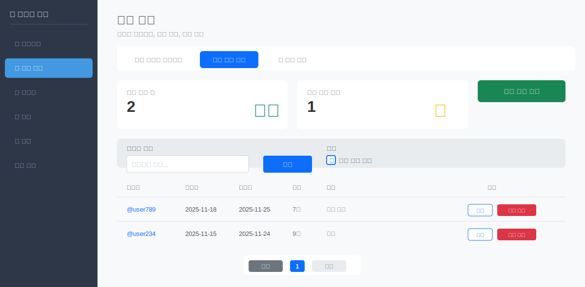

#### 통계 카드

- **🏖️ 현재 휴식 중**: 휴식 기간이 진행 중인 유저 수
- **⏰ 오늘 종료 예정**: 오늘 휴식이 끝나는 유저 수

#### 휴식 신청 방법 (유저 셀프 서비스)

**유저가 직접 마스토돈에서 신청합니다:**

```
@봇 휴식 N
```
- N일간 휴식 신청 (자동 승인)
- 예: `@봇 휴식 7` → 오늘부터 7일간 휴식

**유저가 직접 해제:**
```
@봇 휴식 해제
```
- 현재 휴식을 즉시 종료

#### 관리자 휴식 등록 (수동 등록)

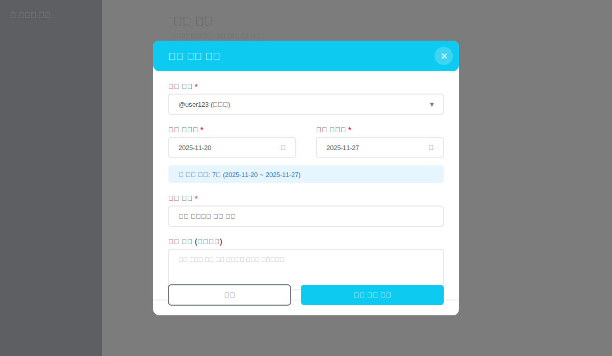

관리자가 특정 유저를 대신하여 휴식을 등록할 수 있습니다:

1. "🏖️ 휴식 등록" 버튼 클릭
2. 휴식 등록 모달이 열립니다:
   - **대상 유저**: 드롭다운에서 유저 선택
   - **휴식 시작일**: 달력에서 시작일 선택
   - **휴식 종료일**: 달력에서 종료일 선택
   - **휴식 기간 요약**: 자동 계산되어 표시 (예: 7일)
   - **휴식 사유**: 사유 입력 (필수)
   - **상세 설명**: 추가 메모 (선택사항)
   - **자동 처리 옵션**:
     - 휴식 기간 동안 활동량 모니터링 일시 중지 (기본 체크)
     - 종료일에 자동으로 휴식 상태 해제 (기본 체크)
3. "🏖️ 휴식 등록" 버튼 클릭

💡 **사용 시나리오**: 유저가 봇을 사용하지 못하는 상황이나, 사전에 휴식을 예약해야 하는 경우 관리자가 대신 등록합니다.

#### 휴식 목록 조회

테이블에서 각 휴식의 상세 정보를 확인할 수 있습니다:

- **사용자**: 휴식 중인 유저
- **시작일**: 휴식 시작 날짜
- **종료일**: 휴식 종료 예정 날짜
- **기간**: 총 N일
- **사유**: 휴식 사유
- **작업**: 수정/강제 해제 버튼

#### 휴식 정보 수정

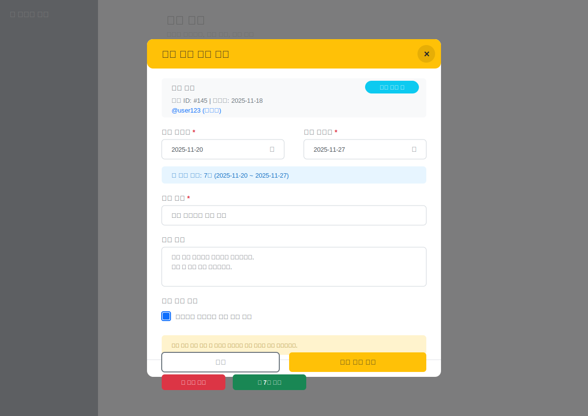

각 휴식 행의 "수정" 버튼을 클릭하면 수정 모달이 열립니다:

1. **기존 정보 표시**:
   - 휴식 ID, 등록일
   - 대상 유저 및 현재 상태
2. **수정 가능 항목**:
   - 시작일/종료일 (날짜 변경)
   - 휴식 사유
   - 상세 설명
   - 자동 처리 옵션
3. **빠른 액션**:
   - 🚫 즉시 종료: 휴식을 즉시 종료
   - ➕ 7일 연장: 종료일을 7일 연장
4. "✏️ 수정 완료" 버튼 클릭

⚠️ **주의사항**:
- 휴식 기간 수정 시 활동량 모니터링 제외 기간도 함께 변경됩니다

#### 강제 해제 (관리자 권한)

특별한 사유로 휴식을 조기 종료해야 할 경우:

1. 테이블에서 해당 유저의 **"강제 해제"** 버튼 클릭
2. 확인 모달에서 사유 입력
3. 즉시 휴식 종료

⚠️ **주의사항**:
- 강제 해제는 관리 로그에 기록됩니다
- 유저에게 DM 알림이 발송됩니다
- 해제 후 복구 불가

#### 휴식 효과

휴식 기간 동안:
- ✅ 활동량 체크 제외 (5가지 위험 유형 모두)
- ✅ 경고 발송 대상에서 제외
- ❌ 재화 지급 중단
- ❌ 출석 트윗 발행 중단

⚠️ **개별 휴식 vs 리뉴얼 기간**:
- **개별 휴식**: 특정 유저만 휴식 (유저가 `@봇 휴식 N`으로 신청, 관리자가 조회)
- **리뉴얼 기간**: 커뮤니티 전체 휴식 → [6. 일정 및 이벤트 관리](#6-일정-및-이벤트-관리) 참조

### 3.3 재화 관리 (탭 3)

유저별 재화 현황을 조회하고 내역을 관리합니다.

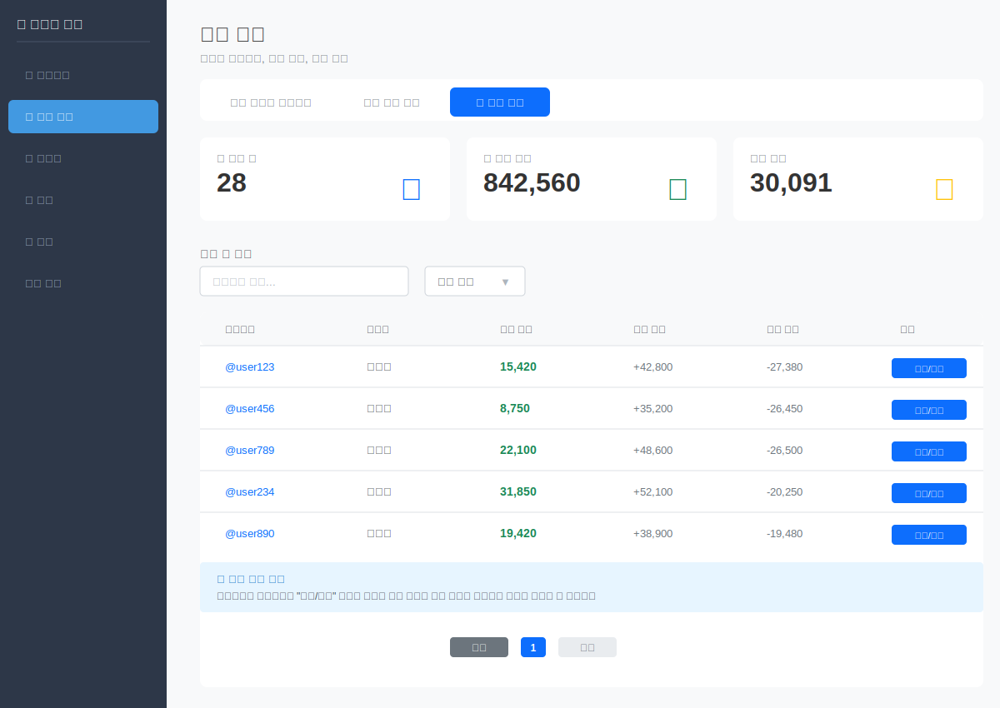

#### 통계 카드

- **👥 총 유저 수**: 시스템에 등록된 전체 유저 수
- **💰 총 유통 재화**: 모든 유저의 보유 재화 합계 (커뮤니티 경제 규모, 단위: 갈레온)
- **📊 평균 보유**: 유저당 평균 재화 보유량 (단위: 갈레온)

#### 유저 목록

테이블에서 각 유저의 재화 현황을 확인할 수 있습니다:

- **사용자명**: 마스토돈 아이디 (클릭 시 상세 페이지로 이동)
- **표시명**: 유저의 표시 이름
- **현재 잔액**: 현재 보유 중인 재화 (갈레온)
- **누적 획득**: 가입 이후 획득한 총 재화 (갈레온)
- **누적 사용**: 가입 이후 사용한 총 재화 (갈레온)
- **작업**: "상세/조정" 버튼 → 재화 내역 상세 페이지로 이동

#### 유저별 재화 내역 상세

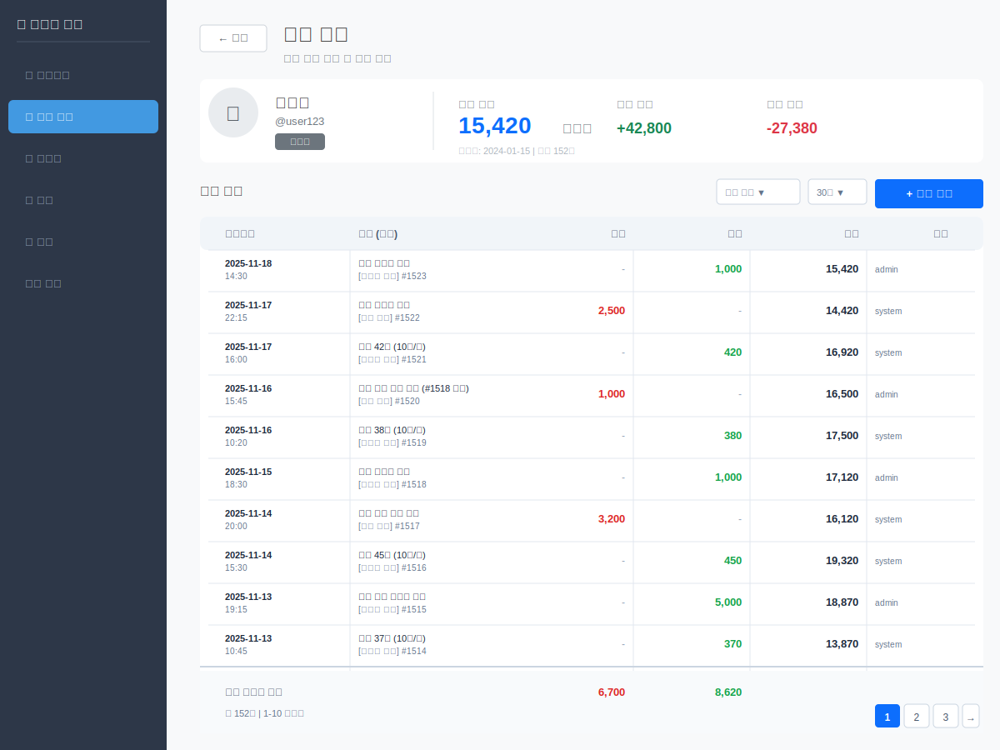

사용자명을 클릭하거나 "상세/조정" 버튼을 누르면 해당 유저의 상세 재화 내역 페이지로 이동합니다.

**주요 기능:**

**1. 유저 정보 카드**
- 프로필 정보 (아이디, 표시명, 역할)
- 현재 잔액, 누적 획득, 누적 사용 (단위: 갈레온)
- 가입일 및 총 내역 건수

**2. 재화 내역 테이블**
- **일시**: 내역이 발생한 날짜와 시간
- **내용**: 사유 및 카테고리 (예: [이벤트 보상] 출석 이벤트 참여)
- **차감**: 차감된 금액 (빨간색, 갈레온)
- **지급**: 지급된 금액 (초록색, 갈레온)
- **잔액**: 잔액 (갈레온)
- **작업**: 수정/삭제 버튼

**3. 재화 조정**

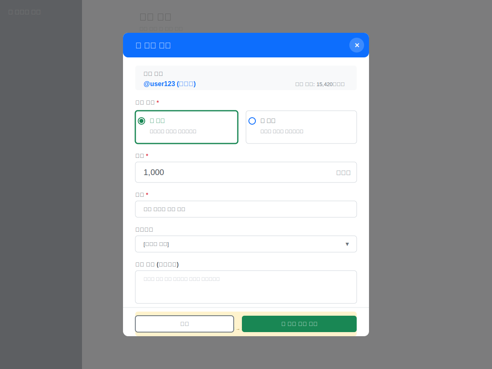

"+ 재화 조정" 버튼을 클릭하면 모달이 열립니다:

1. **조정 유형 선택**:
   - ➕ 지급: 유저에게 재화를 지급
   - ➖ 차감: 유저의 재화를 차감

2. **금액 입력** (필수):
   - 지급하거나 차감할 금액 입력 (단위: 갈레온)

3. **내용 입력** (필수):
   - 조정 사유 (예: "출석 이벤트 참여 보상")

4. **카테고리 선택**:
   - [이벤트 보상], [상점 구매], [활동량 정산], [오류 수정] 등

5. **세부 설명** (선택사항):
   - 추가 메모나 상세 설명

⚠️ **주의사항**:
- 재화 조정 시 잔액이 자동으로 계산됩니다
- 모든 조정은 관리 로그에 영구 기록됩니다
- 사유는 필수 항목입니다

**4. 내역 수정**

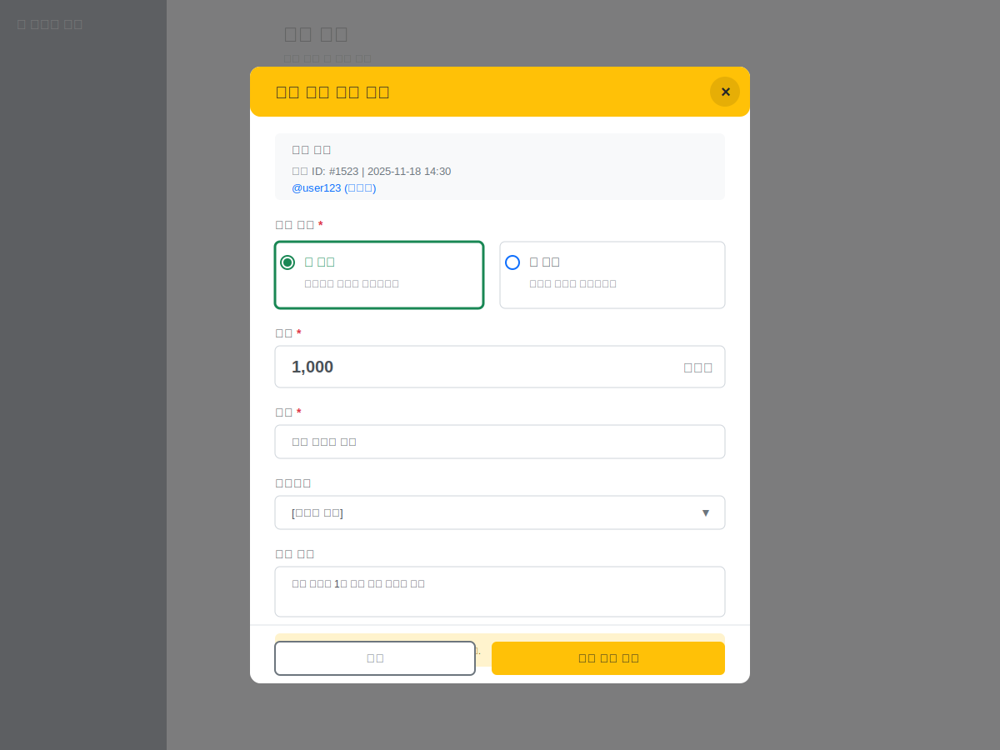

각 내역 행의 "수정" 버튼을 클릭하면 수정 모달이 열립니다:

- 기존 내역 정보가 채워진 상태로 표시
- 금액, 사유, 카테고리, 세부 설명 수정 가능
- 수정 시 잔액이 자동으로 재계산됨

⚠️ **주의**: 내역 수정 시 잔액이 재계산되므로 신중하게 수정하세요.

**5. 내역 삭제**

각 내역 행의 "삭제" 버튼을 클릭하면:
- 확인 모달이 표시됨
- 삭제 후 복구 불가
- 잔액이 자동으로 재계산됨
- 삭제 내역이 관리 로그에 기록됨

**6. 필터 및 검색**
- **전체 유형**: 내역 카테고리로 필터링
- **기간**: 30일, 90일, 전체 기간 등

---

## 4. 상점 관리

**접근 경로:** 상단 메뉴 → 🛒 상점


### 4.1 아이템 목록

**기능:**
- 카테고리 및 상태별 필터 지원
- 아이템 추가, 편집, 삭제 기능
- 판매 중/중단 상태 관리

테이블에서 각 상품의 정보를 확인할 수 있습니다:

- **상품명**: 아이템 이름
- **카테고리**: 상품 분류
- **가격**: 판매 가격 (갈레온)
- **재고**: 현재 재고 수량 (무제한 표시 가능)
- **상태**: 판매 중/판매 중지
- **작업**: 수정/삭제 버튼

### 4.2 상품 등록

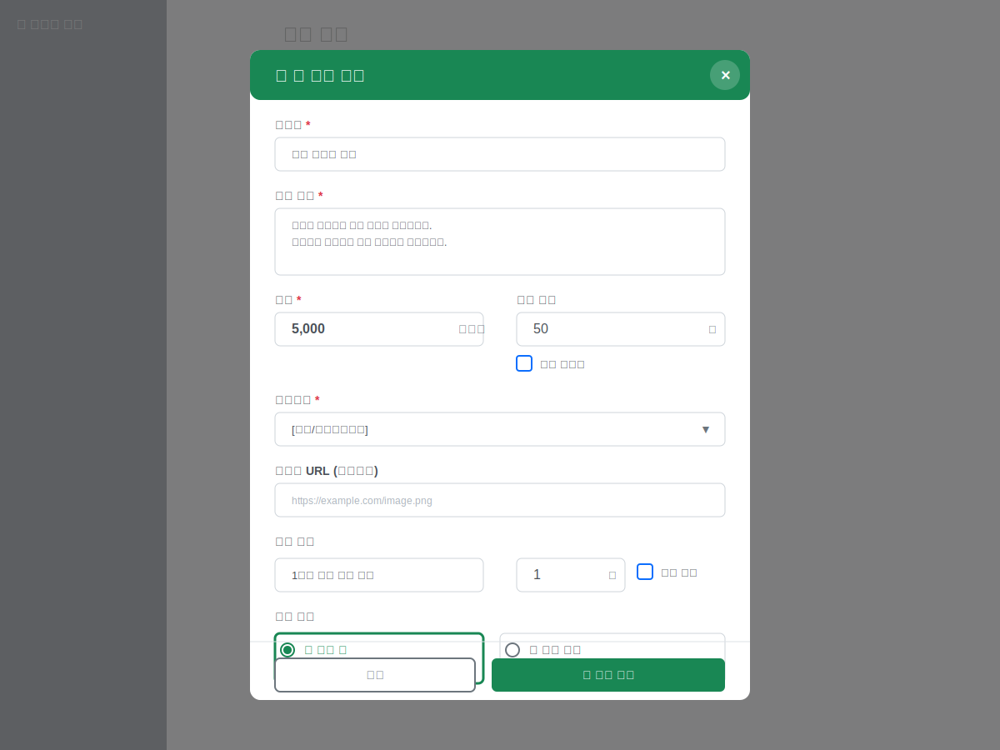

"🛒 새 상품 등록" 버튼을 클릭하면 등록 모달이 열립니다:

1. **기본 정보**:
   - **상품명**: 상품 이름 입력 (필수)
   - **상품 설명**: 상세 설명 입력 (필수)
2. **가격 및 재고**:
   - **가격**: 판매 가격 입력 (갈레온, 필수)
   - **재고 수량**: 재고 개수 입력
   - **재고 무제한**: 체크 시 무제한 판매
3. **분류**:
   - **카테고리**: 드롭다운에서 선택 (예: [스킨/커스터마이징], [이벤트 아이템] 등)
   - **이미지 URL**: 상품 이미지 URL (선택사항)
4. **구매 제한**:
   - **1인당 최대 구매 수량**: 개수 입력
   - **제한 없음**: 체크 시 무제한 구매 가능
5. **판매 상태**:
   - ✅ **판매 중**: 즉시 상점에 노출됨
   - 🚫 **판매 중지**: 상점에 노출되지 않음
6. "🛒 상품 등록" 버튼 클릭

### 4.3 상품 정보 수정

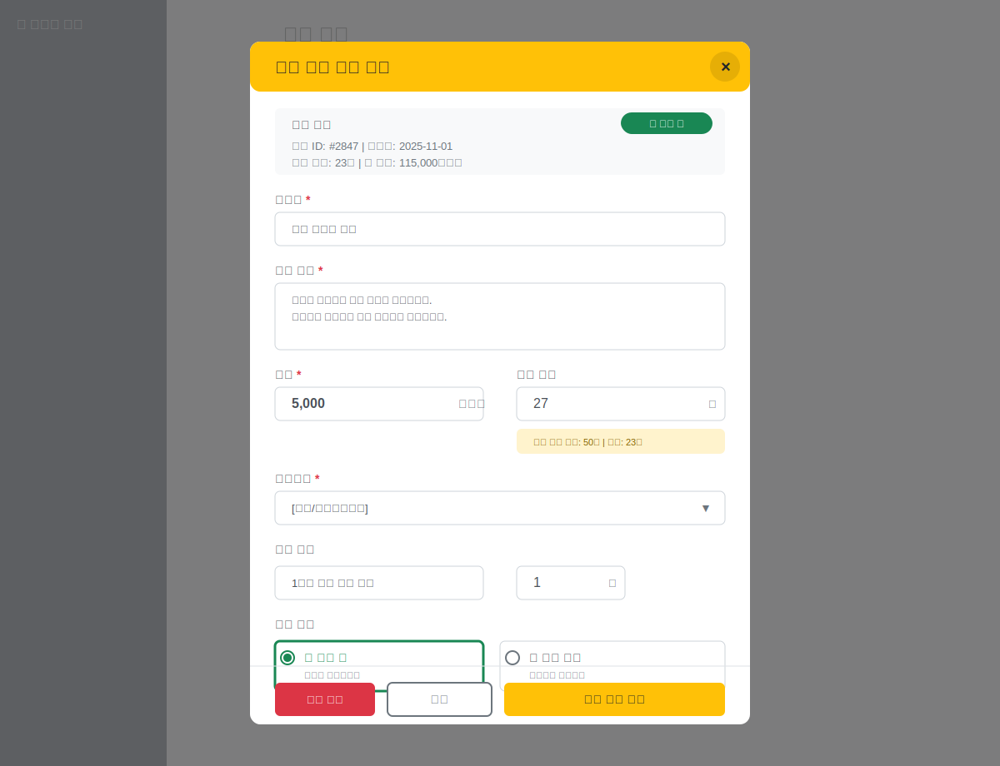

각 상품 행의 "수정" 버튼을 클릭하면 수정 모달이 열립니다:

1. **기존 정보 표시**:
   - 상품 ID, 등록일
   - 누적 판매, 총 매출
   - 현재 판매 상태
2. **수정 가능 항목**:
   - 상품명, 상품 설명
   - 가격, 재고 수량
   - 카테고리
   - 구매 제한
   - 판매 상태 (판매 중/판매 중지)
3. **재고 현황**:
   - 초기 재고, 판매량, 남은 재고가 자동 표시됨
4. **작업 버튼**:
   - 🗑️ **삭제**: 상품 삭제 (복구 불가)
   - **취소**: 수정 취소
   - ✏️ **수정 완료**: 변경사항 저장

⚠️ **주의사항**:
- 상품 가격 변경 시 기존 구매 내역에는 영향 없음
- 재고 수량 변경 시 즉시 반영됨
- 삭제된 상품은 복구 불가능

### 4.4 유저 구매 흐름

`@봇 상점` → 아이템 목록 DM → `@봇 구매 [아이템명]` → 멘션에 별표⭐ → DM 결과 확인

---

## 6. 일정 및 이벤트 관리

**접근 경로:** 상단 메뉴 → 📅 콘텐츠 → 일정 관리


### 6.1 이벤트 목록

**기능:**
- 커뮤니티 일정 등록 및 관리
- 러닝 기간/리뉴얼 기간 설정
- 기간 설정 가능 (단일 날짜 또는 시작일~종료일)
- 유저 봇 명령어 `@봇 일정`으로 조회 가능

### 6.2 일정 등록

**폼 필드:**
- 제목 (필수)
- 설명 (선택)
- 이벤트 날짜 (필수)
- 종료 날짜 (선택, 기간 이벤트인 경우)
- 이벤트 유형: 일반/공휴일/커뮤니티
- 리뉴얼 기간 체크박스

**사용 예시:**
- 정기 이벤트: "봄맞이 축제", "추석 연휴"
- 커뮤니티 리뉴얼: "여름 리뉴얼 기간", "시즌2 준비 기간"
- 공휴일: "설날", "크리스마스"

---

## 7. 스토리 예약 관리

### 7.1 개요

**접근 경로:** 상단 메뉴 → 📅 콘텐츠 → 스토리 이벤트

스토리 이벤트는 **여러 개의 포스트를 일정 간격으로 자동 발송**하는 기능입니다.

**사용 사례:**
- 새해 인사 스토리 시리즈 (10분 간격으로 3개 발송)
- 이벤트 진행 안내 (5분마다 업데이트)
- 생일 축하 메시지 연속 발송

### 7.2 구조

```
스토리 이벤트
├── 제목: "새해 인사 시리즈"
├── 시작 시간: 2025-01-01 00:00
├── 간격: 10분
├── 연결된 일정: (선택) "새해" 이벤트와 연결
└── 포스트 목록
    ├── 포스트 1 (00:00 발송) - "새해 복 많이 받으세요! 🎉"
    ├── 포스트 2 (00:10 발송) - "2025년도 즐거운 한 해 되세요!"
    └── 포스트 3 (00:20 발송) - "올해는 더 많은 이벤트 준비했어요!"
```

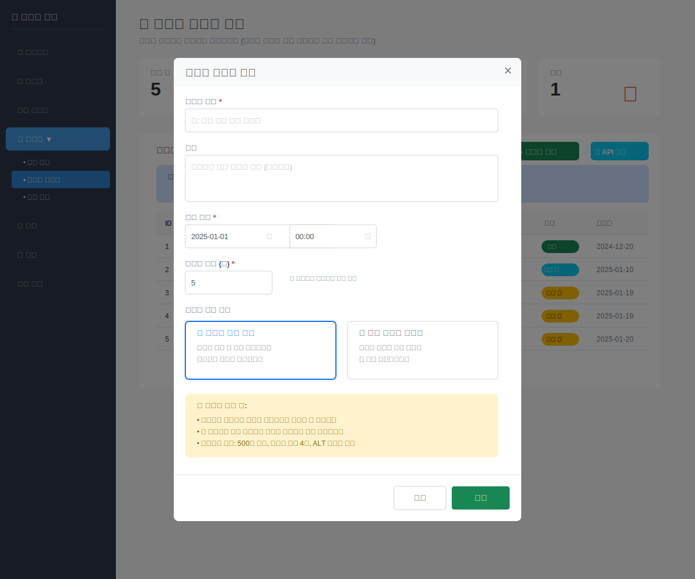

### 7.3 이벤트 생성

**현재는 API를 통해서만 관리 가능합니다.**

스토리 이벤트 생성은 두 단계로 진행됩니다:

#### 1단계: 이벤트 기본 정보 등록
- 제목, 설명 입력
- 시작 시간 설정
- 포스트 간격 설정 (분 단위)
- 연결할 일정 선택 (선택사항)

#### 2단계: 포스트 추가
- 각 포스트의 내용 작성
- 순서 지정 (1번, 2번, 3번...)
- 이미지 첨부 (선택사항)

💡 **개발자 문의**: 자세한 API 사용법은 개발 담당자에게 문의하세요.

### 7.4 엑셀 일괄 업로드

여러 개의 스토리 이벤트와 포스트를 엑셀 파일로 한 번에 등록할 수 있습니다.

**엑셀 파일 형식:**

| 컬럼명 | 설명 | 예시 |
|--------|------|------|
| event_title | 이벤트 제목 | 새해 이벤트 |
| start_time | 시작 시간 | 2025-01-01T00:00:00 |
| interval_minutes | 간격 (분) | 10 |
| post_content | 포스트 내용 | 새해 복 많이 받으세요! |
| post_media_urls | 이미지 URL (선택) | https://example.com/img.jpg |

**작성 요령:**
- 같은 `event_title`을 가진 행들은 하나의 이벤트로 묶입니다
- 각 행이 하나의 포스트가 됩니다
- 시작 시간과 간격은 첫 행의 값이 사용됩니다

💡 **개발자 문의**: 엑셀 업로드 기능 사용은 개발 담당자에게 문의하세요.

### 7.5 주의사항

⚠️ **현재 상태:**
- DB 및 API는 구현 완료
- 실제 자동 발송은 Celery Task 미구현 (TODO)
- 포스트의 `scheduled_at`는 자동 계산됨:
  - 포스트 1: start_time
  - 포스트 2: start_time + interval_minutes
  - 포스트 3: start_time + (interval_minutes × 2)

---

## 8. 공지 예약 관리

### 8.1 개요

**접근 경로:** 상단 메뉴 → 📅 콘텐츠 → 공지 예약

단일 공지를 특정 시간에 예약 발송하는 기능입니다.

**사용 사례:**
- 정기 공지 예약 (매주 월요일 아침)
- 이벤트 시작 안내 (당일 자정)
- 시스템 점검 사전 공지

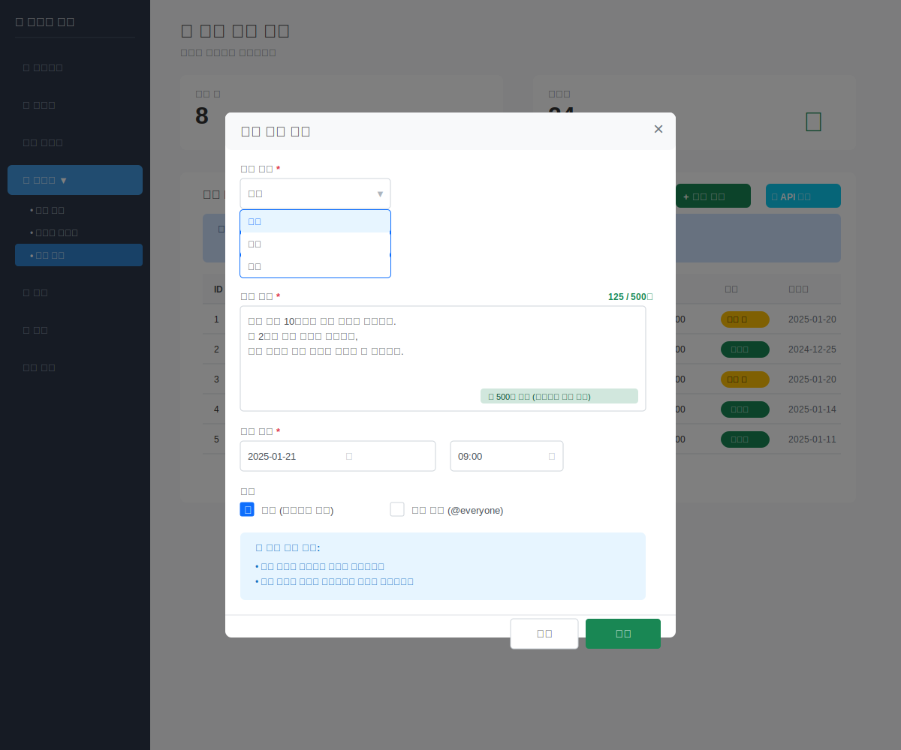

### 8.2 공지 생성

**현재는 API를 통해서만 관리 가능합니다.**

공지 생성 시 필요한 정보:
- **내용**: 공지할 메시지 (필수)
- **예약 시간**: 발송될 날짜와 시간 (필수)
- **공개 여부**: 유저가 `@봇 공지` 명령어로 조회 가능 여부
- **게시 범위**: public (공개), unlisted (미등록), private (비공개) 등

💡 **개발자 문의**: 자세한 API 사용법은 개발 담당자에게 문의하세요.

### 8.3 공개/비공개 설정

**공개 공지**
- 유저가 `@봇 공지` 명령어로 조회 가능
- 일반적인 커뮤니티 공지사항에 사용

**비공개 공지**
- 관리자만 확인 가능
- 내부 테스트나 임시 메모용

### 8.4 관리 기능

공지는 다음 작업을 수행할 수 있습니다:
- **목록 조회**: 등록된 공지 목록 확인
- **새 공지 작성**: 예약 공지 생성
- **수정**: 기존 공지 내용이나 시간 변경
- **삭제**: 발송 전 공지 취소

💡 **웹 UI**: 현재 간략한 목록 화면만 제공됩니다. 자세한 관리는 개발자에게 문의하세요.

### 8.5 주의사항

⚠️ **현재 상태:**
- DB 및 API는 구현 완료
- 실제 자동 발송은 Celery Task 미구현 (TODO)
- 유저는 `@봇 공지` 명령어로 최근 공지 3개 조회 가능

---

## 9. 시스템 설정

**접근 경로:** 상단 메뉴 → ⚙️ 설정

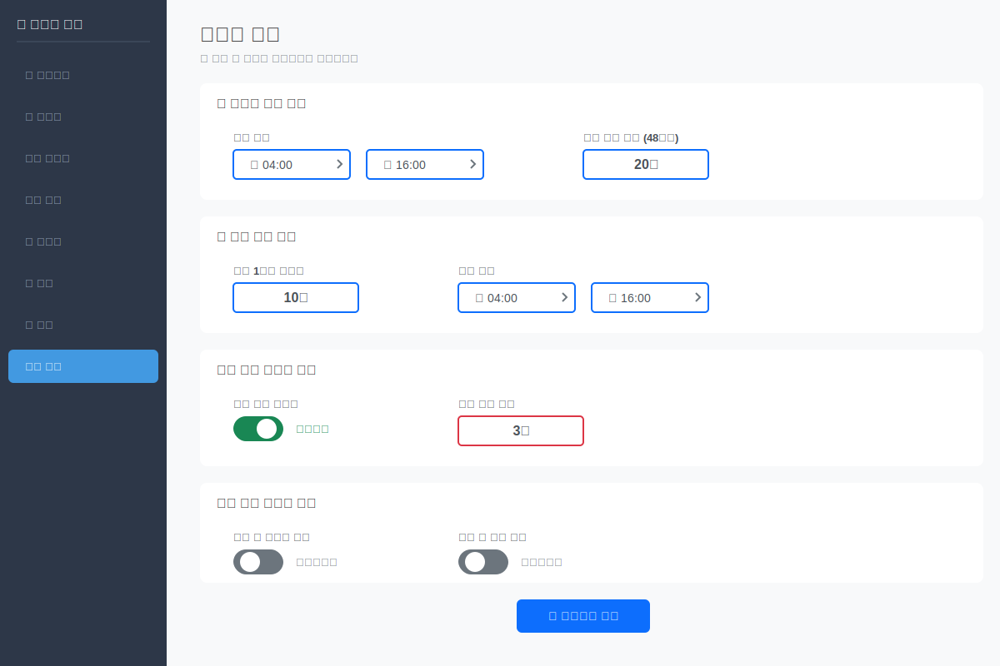

### 🛠️ 주요 설정 항목

1. **활동량 체크 기준**
   - 체크 기간: 48시간
   - 최소 답글 수: 5개

2. **재화 지급 설정**
   - 답글 N개당 M원 지급
   - 예: 1개당 10원, 100개당 1000원

3. **체크 시간**
   - 오전 5시: 벌크 처리
   - 오후 12시: 중간 체크

**⚠️ 주의사항:**
- 변경사항은 즉시 적용
- 크론 설정 자동 갱신
- 문제 시 "기본값으로 되돌리기" 사용

---

## 10. 관리 로그

**접근 경로:** 상단 메뉴 → 📋 로그


### 📝 관리자 작업 기록

투명한 관리를 위해 모든 작업이 기록됩니다

**기능:**
- 액션 타입별 필터 (재화조정, 경고발송, 설정변경, 상점관리)
- 기간별 조회 (최근 7일, 30일, 전체)
- 관리자명 또는 유저명으로 검색
- 엑셀 다운로드 지원

### 10.1 활용 방법

**필터 옵션:**
- 액션 타입별 (재화조정, 경고발송, 설정변경, 상점관리)
- 기간별 (최근 7일, 30일, 전체)
- 관리자별
- 복합 필터 지원

**예시:** "운영진A"가 오늘 수행한 "재화 조정"만 조회
→ 관리자 선택 + 액션 타입 체크 + 필터 적용

---

## 11. 자주 묻는 질문

### Q1. 로그인이 안 돼요

**확인 사항:**
1. Mastodon 계정이 관리자 권한이 있나요?
2. 서버가 정상 실행 중인가요?
3. 네트워크 연결은 정상인가요?

**해결 방법:**
- 개발자에게 관리자 권한 요청
- 서버 상태 확인 (EMERGENCY.md 참조)

### Q2. 통계가 업데이트 안 돼요

**원인:**
- 대시보드는 페이지 로드 시점의 데이터를 보여줍니다
- 실시간 업데이트가 아닙니다

**해결 방법:**
- 브라우저 새로고침 (F5 또는 Ctrl+R)

### Q3. 로그가 너무 많아서 찾기 힘들어요

**해결 방법:**
1. 액션 타입 필터 활용
   - 보고 싶은 타입만 체크
2. 관리자 필터 활용
   - 특정 관리자의 활동만 확인
3. 복합 필터링 사용
   - 두 필터를 동시에 적용

**예시:**
- 오늘 "운영진A"가 수행한 "재화 조정"만 보고 싶다면:
  1. 관리자: "운영진A" 선택
  2. 액션: "재화 조정"만 체크
  3. 필터 적용

### Q4. 특정 사용자의 활동 기록을 보고 싶어요

**현재 기능:**
- 로그 뷰어에서는 관리자 활동만 조회 가능
- 사용자별 필터링은 아직 미구현

**대안:**
- 브라우저 검색 기능 (Ctrl+F) 사용
- 사용자 이름으로 검색

**향후 업데이트:**
- 사용자별 필터 추가 예정

### Q5. 로그를 엑셀로 내보낼 수 있나요?

**현재 상태:**
- 웹 UI에서 직접 내보내기는 미구현

**대안:**
1. 브라우저의 "페이지 저장" 기능 사용
2. 또는 개발자에게 데이터베이스 추출 요청

**향후 업데이트:**
- CSV/Excel 내보내기 기능 추가 예정

### Q6. 서버가 다운되었어요!

긴급 상황입니다. **EMERGENCY.md** 문서를 참조하세요.

간단한 재시작 방법:
```bash
# 서버 재시작 (한 줄 명령어)
pkill -9 -f "python.*admin_web" && cd /home/user/commumanager && nohup python3 -m admin_web.app > flask_server.log 2>&1 &
```

### Q7. 사용자 재화를 지급하고 싶어요

**재화 조정 절차:**
1. "재화 관리" 페이지 접속
2. 대상 유저 검색
3. [수정] 버튼 클릭
4. 금액 및 사유 입력
5. [적용하기] 버튼 클릭

**주의사항:**
- 사유는 필수 입력 항목입니다
- 모든 재화 조정은 로그에 기록됩니다

### Q8. 경고를 발송하고 싶어요

**경고 발송 절차:**
1. "유저 관리" 페이지 접속
2. "⚠️ 경고 발송" 탭 선택
3. 경고 대상 유저 목록에서:
   - 레벨별 현황 카드로 전체 상황 파악
   - 테이블에서 대상 유저 확인 (레벨, 답글 수, 최근 경고)
4. 발송 방법 선택:
   - **개별 발송**: 각 유저의 "경고 발송" 버튼 클릭
   - **일괄 발송**: 체크박스로 여러 유저 선택 후 하단 버튼 클릭

**주의사항:**
- 경고는 DM으로 즉시 발송됩니다
- 발송 후 취소할 수 없습니다
- 모든 발송 기록이 관리 로그에 남습니다
- 레벨에 따라 자동으로 적절한 템플릿 메시지가 발송됩니다

---

## 12. 시스템 유지보수

**대상**: 시스템 관리자 (서버 접근 권한 보유자)

### 12.1 자동 유지보수 스케줄

시스템은 새벽 시간대에 자동으로 유지보수 작업을 수행합니다:

```
02:00 - 데이터베이스 백업
03:00 - 데이터베이스 최적화
04:00 - 재화 정산 + 소셜 분석 + 활동량 체크
05:00 - 로그 정리
05:30 - 시스템 헬스체크
10:00 - 출석 트윗 발행
16:00 - 재화 정산 + 활동량 체크
```

### 12.2 백업 관리

**자동 백업:**
- 매일 02:00 데이터베이스 백업
- 백업 파일 위치: `data/backups/`
- 보관 정책: 7일 (일일), 4주 (주간), 12개월 (월간)

**수동 백업:**
```bash
# SQLite 백업
sqlite3 data/economy.db ".backup 'data/backups/manual_backup.db'"

# 압축
gzip data/backups/manual_backup.db
```

**복구 방법:**
```bash
# 압축 해제
gunzip data/backups/economy_backup_YYYYMMDD.db.gz

# 복구
cp data/backups/economy_backup_YYYYMMDD.db data/economy.db

# 서비스 재시작
./scripts/docker/restart.sh
```

### 12.3 데이터베이스 최적화

매일 03:00 자동 실행:
- VACUUM: 삭제된 데이터 공간 회수
- ANALYZE: 통계 정보 갱신
- 무결성 체크

**수동 실행:**
```bash
docker-compose exec web python -c "from bot.tasks import optimize_database_task; optimize_database_task()"
```

### 12.4 로그 관리

**자동 정리 (매일 05:00):**
- 30일 이상 로그 삭제
- 7일 이상 로그 압축

**로그 위치:**
```
logs/
├── reward.log          # 재화 지급
├── activity.log        # 활동량 체크
├── command.log         # 명령어 처리
└── error.log           # 에러
```

**로그 확인:**
```bash
# 최근 에러 확인
tail -f logs/error.log

# 특정 기간 로그 조회
grep "2025-11-20" logs/reward.log
```

### 12.5 시스템 헬스체크

매일 05:30 자동 실행 및 체크 항목:
- ✓ SQLite 연결
- ✓ PostgreSQL 연결
- ✓ Redis 연결
- ✓ 디스크 공간 (10% 미만 시 알림)
- ✓ 마스토돈 API 연결

**수동 실행:**
```bash
docker-compose exec web python -c "from bot.tasks import health_check_task; health_check_task()"
```

### 12.6 문제 해결

**서비스 상태 확인:**
```bash
# 전체 서비스 상태
docker-compose ps

# 특정 서비스 로그
docker-compose logs web
docker-compose logs redis
docker-compose logs celery-beat
```

**일반적인 문제:**

| 문제 | 원인 | 해결 방법 |
|------|------|-----------|
| 백업 실패 | 디스크 공간 부족 | 오래된 백업 삭제 |
| DB 잠금 오류 | 동시 접근 | WAL 모드 활성화 |
| API 연결 실패 | 네트워크/인증 | 토큰 갱신 |
| 디스크 공간 부족 | 로그/미디어 축적 | 정리 스크립트 실행 |

**긴급 재시작:**
```bash
# 전체 서비스 재시작
docker-compose restart

# 특정 서비스만 재시작
docker-compose restart web
```

### 12.7 정기 점검 체크리스트

**일일 점검:**
- [ ] 백업 성공 확인 (`ls -lh data/backups/`)
- [ ] 디스크 공간 확인 (`df -h`)
- [ ] 에러 로그 확인 (`tail logs/error.log`)

**주간 점검:**
- [ ] 성능 지표 검토 (대시보드)
- [ ] 사용자 피드백 확인
- [ ] 보안 업데이트 확인

**월간 점검:**
- [ ] 백업 복구 테스트
- [ ] DB 무결성 전체 체크
- [ ] 의존성 업데이트 (`pip list --outdated`)

### 12.8 성능 모니터링

**시스템 리소스:**
```bash
# CPU, 메모리 사용량
htop

# 디스크 사용량
df -h

# 프로세스별 리소스
docker stats
```

**알림 조건:**
- 에러율 5% 초과
- 응답 시간 1초 초과
- 디스크 공간 10% 미만
- DB 백업 실패

**관리자 알림:**
긴급 문제 발생 시 총괄계정으로 DM 발송

---

## 📞 추가 지원

### 문제가 해결되지 않을 때

1. **긴급 상황**: EMERGENCY.md 참조
2. **개발자 연락**: [개발자 연락처]
3. **로그 확인**: 서버의 `flask_server.log` 파일 확인

### OAuth 인증 관련

#### OAuth 앱 등록

```bash
# 마스토돈 서버에서 OAuth 앱 생성
애플리케이션 이름: 마녀봇 관리자 웹
리디렉션 URI: https://admin.yourdomain.com/oauth/callback
스코프: read write follow
```

#### 환경변수

```bash
MASTODON_INSTANCE=https://yourserver.duckdns.org
MASTODON_CLIENT_ID=your_client_id
MASTODON_CLIENT_SECRET=your_client_secret
MASTODON_REDIRECT_URI=https://admin.yourdomain.com/oauth/callback
ADMIN_ACCOUNT_ID=총괄계정_mastodon_id
```

#### 초기 설정

**1. 총괄계정 ID 확인**
```bash
docker-compose exec web bin/tootctl accounts show admin_username
# Account ID: 1234567890
```

**2. .env 설정**
```bash
ADMIN_ACCOUNT_ID=1234567890
```

**3. 첫 관리자 등록**
```sql
-- economy.db
UPDATE users SET role = 'admin' WHERE mastodon_id = '첫_관리자_ID';
```

---

## 문서 업데이트

이 문서는 시스템 업데이트에 따라 계속 갱신됩니다.

**관련 문서:**
- [시스템 아키텍처](ARCHITECTURE.md) - 전체 시스템 구조
- [기능 목록](features.md) - 봇 명령어 레퍼런스
- [긴급 대응](EMERGENCY.md) - 트러블슈팅
- [시스템 유지보수](#12-시스템-유지보수) - 시스템 관리
