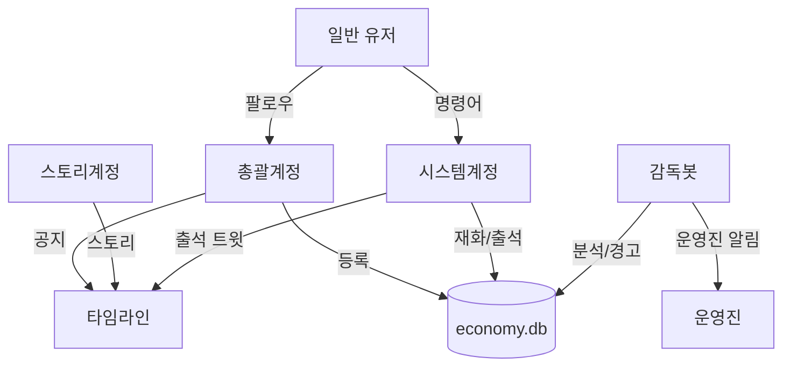

# 마녀봇 시스템 아키텍처

마스토돈 커뮤니티를 위한 활동량 기반 자동 관리 시스템의 전체 아키텍처와 기술 스택

---

## 목차

1. [봇 구조 (4개 계정)](#1-봇-구조-4개-계정)
2. [전체 시스템 구조](#2-전체-시스템-구조)
3. [데이터 흐름](#3-데이터-흐름)
4. [기술 스택](#4-기술-스택)
5. [인프라 구성](#5-인프라-구성)
6. [성능 최적화](#6-성능-최적화)
7. [컴포넌트 상세](#7-컴포넌트-상세)

---

## 1. 봇 구조 (4개 계정)

### 계정 구조도



### 1.1 총괄계정

**역할**: 커뮤니티 대표, 어드민

**기능**:
- 유저 팔로우 → DB 등록 (follow 이벤트)
- 관리자 웹 OAuth (총괄계정 + role='admin' 유저)
- 공지 발행 (announcement)

### 1.2 스토리계정

**역할**: 콘텐츠 전용

**기능**:
- 스토리 발행 (story)
- 자동 발행 (scheduled_posts)

### 1.3 시스템계정 (@봇)

**역할**: 유저 친화적 봇

**자동 시스템**:
- 재화 지급 (4시/16시)
- 출석 트윗 발행 (10시)
- 출석 답글 처리

**명령어**:
- `@봇 내재화`, `@봇 상점`, `@봇 구매 [아이템]`, `@봇 내아이템`
- `@봇 휴식 N`, `@봇 휴식 해제`
- `@봇 일정`, `@봇 공지`, `@봇 도움말`

**응답**: 모두 DM

### 1.4 감독봇

**역할**: 백그라운드 관리

**기능**:
- 소셜 분석 실행 (매일 4시)
- 경고 발송 (관리자 판단 후 수동)
- 운영진 알림 (admin_notice, private)
- 크리티컬 에러 알림

### 계정 설정

```sql
INSERT INTO settings (key, value, description) VALUES
('admin_account', 'admin_account_name', '총괄계정명'),
('story_account', 'story_account_name', '스토리 계정명'),
('system_bot_account', 'system_bot_name', '시스템계정명'),
('supervisor_bot_account', 'supervisor_bot_name', '감독봇 계정명'),
('attendance_tweet_template', '🌟 오늘의 출석 체크!\n이 트윗에 답글 달아주세요!', '출석 트윗 템플릿');
```

---

## 2. 전체 시스템 구조

```
┌─────────────────────────────────────────────────────┐
│        Whipping Edition Mastodon Server             │
│                                                      │
│  • 사용자 답글 작성                                   │
│  • OAuth 인증 제공                                   │
│  • 폐쇄형 운영 (외부 차단)                            │
│  • PostgreSQL (마스토돈 데이터) ← 읽기 전용 참조     │
└──────────────┬──────────────────────────────────────┘
               │ Mastodon API (HTTP/WebSocket)
               ↓
┌─────────────────────────────────────────────────────┐
│           Economy Bot (Python, systemd)             │
│                                                      │
│  [실시간 감시 모듈] - 24시간 구동                     │
│   • stream_local()로 로컬 타임라인 감시              │
│   • 답글 감지 → 즉시 재화 지급                       │
│   • status_id로 중복 방지                            │
│   • 멘션 명령어 처리 + 별표 확인                      │
│                                                      │
│  [활동량 체크 모듈] - 하루 2회 (벌크)                │
│   • 오전 5시: 48시간 벌크 체크 (무거운 작업)         │
│   • 오후 12시: 중간 체크 (가벼운 확인)               │
│   • PostgreSQL에서 유저+답글 벌크 조회               │
│   • 역할 필터링 (시스템/스토리 계정 제외)            │
│   • 휴식계 유저 제외                                 │
└──────────────┬──────────────────────────────────────┘
               │ 공유 DB (SQLite)
               ↓
┌─────────────────────────────────────────────────────┐
│              SQLite Database (economy.db)           │
│                                                      │
│  • users (유저별 재화, 역할, 기숙사)                 │
│  • transactions (거래 기록)                          │
│  • warnings (경고 로그)                              │
│  • settings (시스템 설정)                            │
│  • vacation (휴식 기간)                              │
│  • items (상점 아이템)                               │
│  • inventory (보유 아이템)                           │
│  • admin_logs (관리자 작업 기록)                     │
└──────────────┬──────────────────────────────────────┘
               │ 읽기/쓰기
               ↓
┌─────────────────────────────────────────────────────┐
│          Admin Web (Flask + Nginx)                  │
│                                                      │
│  [관리자 전용 - OAuth로 권한 체크]                    │
│   • 홈: 대시보드 (활동 현황, 봇 상태)                │
│   • 활동량 관리: 경고 내역 + 수동 경고 + 휴식 관리   │
│   • 재화 관리: 유저 목록 + 재화 지급/차감            │
│   • 상점 관리: 아이템 등록/수정/삭제                 │
│   • 시스템 설정: 봇 기준 변경 (DB 직접 수정)        │
│   • 관리 로그: 모든 관리 작업 기록                   │
└─────────────────────────────────────────────────────┘
```

---

## 3. 데이터 흐름

### 3.1 재화 지급 흐름

```
1. 유저가 답글 작성
   ↓
2. 마스토돈 Streaming API 이벤트 발생 (WebSocket 실시간 푸시)
   ↓
3. Economy Bot 실시간 감지 (stream_local() 리스너)
   ↓
4. 답글 여부 확인 (if status['in_reply_to_id'] is not None)
   ↓
5. 중복 체크 (status_id가 이미 처리되었는가?)
   ↓ NO (새 답글)
6. 재화 지급 계산 (settings에서 replies_per_reward, reward_amount 조회)
   ↓
7. SQLite 업데이트
   a. users.balance += amount
   b. users.reply_count += 1
   c. users.total_earned += amount
   d. transactions 테이블에 기록
   ↓
8. 로그 출력 및 완료
```

### 3.2 활동량 체크 흐름 (벌크)

```
[오전 5시 크론 실행]
   ↓
1. 설정 로드 (SQLite settings)
   - check_period_hours = 48
   - min_replies_48h = 20
   ↓
2. PostgreSQL 벌크 쿼리 (한 번에)
   SELECT u.id, u.username, COUNT(s.id) as replies
   FROM accounts u
   LEFT JOIN statuses s ON s.account_id = u.id
       AND s.in_reply_to_id IS NOT NULL
       AND s.created_at > NOW() - INTERVAL '48 hours'
   WHERE u.suspended = false
   GROUP BY u.id
   ↓
3. SQLite users와 매칭 (각 유저의 role, vacation 확인)
   ↓
4. 각 유저별 판정
   for user in results:
       if user.role in ['admin', 'system', 'story']:
           continue  # 체크 제외
       if is_on_vacation(user):
           continue  # 휴식 중
       if user.replies < 20:
           create_warning(user)
           send_admin_notification(user)
   ↓
5. 경고 처리
   a. warnings 테이블에 기록
   b. 관리자 봇으로 비공개 툿 발송
   ↓
6. SQLite 통계 업데이트
   a. users.last_check = NOW()
   b. settings.last_check = NOW()
```

### 3.3 상점 구매 흐름 (멘션 + 별표 확인)

```
1. 유저가 멘션으로 구매 요청 ("@봇 구매 빨강 염색약")
   ↓
2. Streaming API 감지 (notification_type = 'mention')
   ↓
3. 봇이 멘션 처리
   a. 명령어 파싱: "구매 빨강 염색약"
   b. SQLite에서 아이템 조회
   c. 유저 재화 확인 (balance >= price?)
   ↓ YES
4. 구매 성공
   a. users.balance -= price
   b. inventory에 아이템 추가
   c. transactions 기록
   d. 해당 멘션에 별표(⭐) 누름 → "처리 완료" 표시
   e. DM 발송: "✅ 빨강 염색약 구매 완료! (-100원) 💰 남은 재화: 1,150원"
   ↓ NO (재화 부족 or 아이템 없음)
5. 구매 실패
   a. 멘션에 별표 누르지 않음
   b. DM 발송: "❌ 재화가 부족합니다!"
```

---

## 4. 기술 스택

### 4.1 마스토돈 서버 (휘핑 에디션)

```yaml
베이스: 마스토돈 v4.2.1
언어: Ruby 3.2.2
프레임워크: Ruby on Rails
프론트엔드: React.js + Redux
스트리밍: Node.js 16.20.2
데이터베이스: PostgreSQL 12.16+
캐시/큐: Redis 5.0.7+
```

### 4.2 경제 시스템 봇

```yaml
언어: Python 3.9+
라이브러리:
  - Mastodon.py (마스토돈 API)
  - psycopg2 (PostgreSQL 연결)
  - sqlite3 (내장)
서비스 관리: systemd
스케줄링: cron
```

**주요 모듈**:
```
economy_bot/
├── reward_bot.py          # 실시간 재화 지급
├── activity_checker.py    # 활동량 체크 (벌크)
├── command_handler.py     # 봇 명령어 처리
├── game_engine.py         # 게임 로직 (추후)
├── database.py            # DB 유틸리티
└── config.py              # 설정 로드
```

### 4.3 관리자 웹

```yaml
프레임워크: Flask 3.x
템플릿: Jinja2
UI: Bootstrap 5 (기본 스타일만)
차트: Chart.js (통계용)
인증: Mastodon OAuth
```

**아키텍처**: Model - Repository - Service - Controller - Route (5계층)

```
HTTP Request → Route → Controller → Service → Repository → Database
```

### 4.4 데이터베이스 전략

#### PostgreSQL (마스토돈 기존 DB)
**용도**: 읽기 전용 참조
- 유저 계정 정보
- 답글/툿 데이터
- 마스토돈 원본 데이터

**접근 방식**:
```python
# 읽기 전용으로만 접근
conn = psycopg2.connect(
    dbname="mastodon_production",
    user="mastodon",
    password="...",
    host="localhost",
    options="-c default_transaction_read_only=on"
)
```

#### SQLite (경제 시스템 전용)
**용도**: 경제 데이터 독립 관리
- 재화, 거래 기록
- 경고 로그
- 휴식 기간
- 상점 아이템
- 시스템 설정

**파일 위치**: `/home/ubuntu/economy_bot/economy.db`

**장점**:
- 마스토돈 DB와 분리 (안전)
- 백업 간편 (파일 하나)
- 30~50명 규모 충분
- 별도 DB 서버 불필요

---

## 5. 인프라 구성

### 5.1 서버 인프라

#### Oracle Cloud Infrastructure (OCI) - Always Free Tier (1순위)

**선택 이유**:
- ✅ **완전 무료** (평생 프리 티어)
- ✅ **고성능**: Ampere A1 (4 OCPU, 24GB RAM)
- ✅ **한국 리전**: 춘천 (ap-chuncheon-1)
- ✅ **빠른 속도**: 국내 사용자에게 최적
- ✅ **충분한 성능**: 50~100명 가능
- ✅ **스토리지**: 200GB Block Volume

**스펙**:
```
CPU: ARM64 Ampere A1 (4 OCPU)
RAM: 24GB
Storage: 200GB (Boot Volume + Block Volume)
Network: 10TB/월 아웃바운드
리전: 춘천 (ap-chuncheon-1)
OS: Ubuntu 22.04 LTS
```

#### 대안 호스팅 (유료)

**Hetzner Cloud**: 월 €4.5 (약 6,500원)
- CPU: 2 vCPU, RAM: 4GB, Storage: 40GB SSD
- 위치: 독일 또는 핀란드
- 단점: 한국에서 느림 (지연 200~300ms)

**Contabo**: 월 €6.99 (약 10,000원)
- CPU: 6 vCPU, RAM: 16GB, Storage: 400GB SSD
- 위치: 독일 또는 미국

### 5.2 네트워크 구성

```
Internet
   │
   ▼
[DuckDNS]  yourserver.duckdns.org (무료 도메인)
   │
   ▼
[Cloudflare/Let's Encrypt SSL]
   │
   ▼
[Nginx - 리버스 프록시]
   ├──→ Mastodon Web (Port 3000)
   ├──→ Mastodon Streaming (Port 4000)
   └──→ Admin Web (Port 5000)
```

**포트 설정**:
```
22:  SSH
80:  HTTP (자동으로 443 리다이렉트)
443: HTTPS
3000: Mastodon Web (내부)
4000: Mastodon Streaming (내부)
5000: Admin Web (내부)
```

### 5.3 도메인 및 SSL

#### 도메인: DuckDNS (무료)
```
URL: https://www.duckdns.org
방식: DDNS (Dynamic DNS)
예시: yourserver.duckdns.org
갱신: 자동 (크론)
```

**설정**:
```bash
# 크론으로 5분마다 IP 갱신
*/5 * * * * curl "https://www.duckdns.org/update?domains=yourserver&token=YOUR_TOKEN"
```

#### SSL: Let's Encrypt (무료)
```
발급: Certbot
갱신: 자동 (certbot renew)
유효기간: 90일 (자동 갱신)
```

### 5.4 SMTP (이메일 발송)

**SendGrid 무료 플랜**
```
가격: 무료
한도: 월 100통
용도:
  - 가입 인증
  - 비밀번호 찾기
  - (선택) 관리자 알림
```

**대안**: Brevo (구 Sendinblue) - 월 300통 무료

### 5.5 보안 설정

#### 방화벽 (UFW)
```bash
sudo ufw default deny incoming
sudo ufw default allow outgoing
sudo ufw allow 22/tcp
sudo ufw allow 80/tcp
sudo ufw allow 443/tcp
sudo ufw enable
```

#### 파일 권한
```bash
# SQLite DB 권한
chmod 600 /path/to/economy.db
chown ubuntu:ubuntu /path/to/economy.db
```

#### OAuth 보안
- 관리자 웹은 OAuth만 허용
- 비밀번호 직접 입력 없음
- 권한 체크: Owner/Admin만 접근

---

## 6. 성능 최적화

### 6.1 마스토돈 최적화

**Docker 설정** (.env.production):
```bash
WEB_CONCURRENCY=4          # 4-core에 맞춤
MAX_THREADS=5
STREAMING_CLUSTER_NUM=1
DB_POOL=25
```

**Redis 캐싱**:
- 타임라인 캐싱
- 세션 저장
- Sidekiq 큐

### 6.2 경제 봇 최적화

**벌크 처리 전략**:
```python
# 오전 5시 - 심야 시간 활용
# PostgreSQL 한 번에 쿼리
query = """
SELECT
    u.id, u.username,
    COUNT(s.id) as reply_count
FROM accounts u
LEFT JOIN statuses s ON ...
WHERE s.created_at > NOW() - INTERVAL '48 hours'
GROUP BY u.id
"""

# 매시간 30명씩 조회 (720회/일)
# → 하루 2번 벌크 조회 (2회/일)
# 360배 감소!
```

**크론 스케줄**:
```bash
# 오전 5시 - 무거운 벌크 처리
0 5 * * * python3 /path/to/bulk_activity_check.py

# 오후 12시 - 중간 체크
0 12 * * * python3 /path/to/activity_check.py
```

### 6.3 백업 전략

**자동 백업 (크론)**:
```bash
# 매일 새벽 3시 - SQLite 백업
0 3 * * * sqlite3 /path/to/economy.db ".backup '/backups/economy_$(date +\%Y\%m\%d).db'"

# 주 1회 일요일 - PostgreSQL 백업
0 4 * * 0 docker exec mastodon_db_1 pg_dump -Fc -U postgres mastodon_production > /backups/mastodon_$(date +\%Y\%m\%d).dump

# 주 1회 - 미디어 파일 백업
0 5 * * 0 tar -czf /backups/media_$(date +\%Y\%m\%d).tar.gz /path/to/mastodon/public/system

# 30일 지난 백업 자동 삭제
0 6 * * 0 find /backups -name "*.db" -mtime +30 -delete
```

**백업 저장 위치**:
- 로컬: `/home/ubuntu/backups`
- (선택) 클라우드: Oracle Object Storage (무료)

### 6.4 병목 지점 및 해결

**PostgreSQL 쿼리**:
- 문제: 매시간 30명 조회 시 부하
- 해결: 하루 2회 벌크 조회 (360배 감소)

**SQLite 동시 쓰기**:
- 문제: 다중 프로세스 동시 쓰기
- 해결: WAL 모드 + 재시도 로직

**Streaming API 연결**:
- 문제: 네트워크 끊김
- 해결: 자동 재연결 + systemd 재시작

### 6.5 확장성

**50명 → 100명**:
- SQLite 충분
- 봇 성능 문제 없음
- 마스토돈 RAM 여유 있음

**100명 → 500명**:
- SQLite → PostgreSQL 마이그레이션
- 봇 멀티 프로세스
- 서버 업그레이드 필요

---

## 7. 컴포넌트 상세

### 7.1 실시간 감시 봇 (reward_bot.py)

**역할**: 24시간 답글 감지 및 재화 지급

**주요 로직**:
```python
class RewardListener(StreamListener):
    def on_update(self, status):
        # 답글만 처리
        if not status['in_reply_to_id']:
            return

        # 중복 체크
        if status_id in processed:
            return

        # 재화 지급
        give_reward(user_id, amount)
```

**실행**: systemd 서비스로 24시간 구동

### 7.2 활동량 체크 봇 (activity_checker.py)

**역할**: 하루 2회 벌크 체크

**실행 시간**:
- 오전 5시: 메인 체크 (벌크)
- 오후 12시: 중간 체크

**주요 로직**:
```python
def bulk_check():
    # PostgreSQL 벌크 쿼리
    query = """
    SELECT u.id, COUNT(s.id) as cnt
    FROM accounts u
    LEFT JOIN statuses s ...
    WHERE s.created_at > NOW() - INTERVAL '48 hours'
    """

    for user, count in results:
        if count < threshold:
            warn(user)
```

### 7.3 명령어 핸들러 (command_handler.py)

**역할**: 봇 멘션 처리 + 별표 확인 표시

**멘션 명령어**:
```
@봇 내재화              - 보유 재화 조회 DM
@봇 상점                - 아이템 목록 DM
@봇 구매 [아이템명]     - 구매 처리 + 멘션에 별표
@봇 내아이템            - 보유 아이템 목록 DM
@봇 @유저 [아이템] [개수] - 양도 처리 + 멘션에 별표
@봇 휴식 [날짜]까지     - 휴식 등록
@봇 게임 [종류] [금액]  - 게임 시작
@봇 도움말              - 명령어 안내
```

**별표(⭐) 사용**:
- 구매/양도 명령 처리 완료 시 해당 멘션에 별표
- 시각적 확인 표시 (타임라인에서 한눈에 파악)

### 7.4 관리자 웹 (Flask)

**라우트 구조**:
```
/                   → 홈 (대시보드)
/login              → OAuth 로그인
/logout             → 로그아웃
/activity           → 활동량 관리
/activity/warn      → 수동 경고
/balance            → 재화 관리
/balance/adjust     → 재화 조정
/shop               → 상점 관리
/shop/items         → 아이템 CRUD
/settings           → 시스템 설정
/logs               → 관리 로그
```

**5계층 아키텍처**:
```
admin_web/
├── routes/         # Flask Blueprint (Route)
├── controllers/    # 비즈니스 로직 처리 (Controller)
├── services/       # 비즈니스 로직 (Service)
├── repositories/   # 데이터베이스 접근 (Repository)
├── models/         # 데이터 모델 (Model)
├── templates/      # Jinja2 템플릿
├── static/         # 정적 파일
└── utils/          # 유틸리티 함수
```

---

## 모니터링 및 로그

### 시스템 모니터링

**기본 도구**:
```bash
# 디스크 사용량
df -h

# 메모리 사용량
free -h

# 프로세스 상태
systemctl status economy-bot
systemctl status mastodon-web
```

### 로그 관리

**봇 로그**:
```
/home/ubuntu/economy_bot/logs/
├── reward.log          # 재화 지급
├── activity.log        # 활동량 체크
├── command.log         # 명령어 처리
└── error.log           # 에러
```

**로그 로테이션**:
```bash
# /etc/logrotate.d/economy-bot
/home/ubuntu/economy_bot/logs/*.log {
    daily
    rotate 30
    compress
    missingok
    notifempty
}
```

---

## 개발 환경

### 로컬 테스트 환경

```bash
# Docker Compose로 로컬 테스트
docker-compose -f docker-compose.dev.yml up

# SQLite DB 로컬 복사
scp ubuntu@server:/path/to/economy.db ./
```

### 배포 프로세스

```bash
# 1. 서버 접속
ssh ubuntu@yourserver.duckdns.org

# 2. 코드 업데이트
cd /home/ubuntu/economy_bot
git pull

# 3. 봇 재시작
sudo systemctl restart economy-bot

# 4. 로그 확인
tail -f logs/error.log
```
