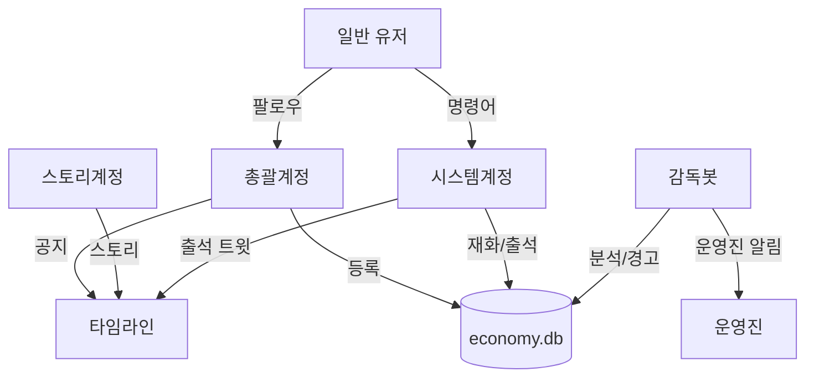
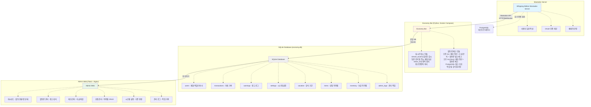
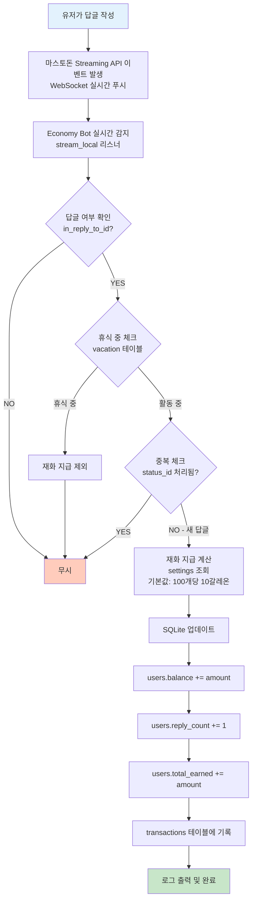
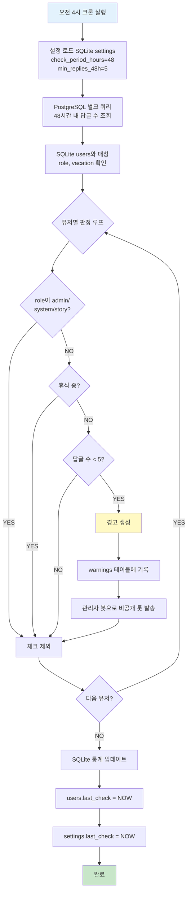
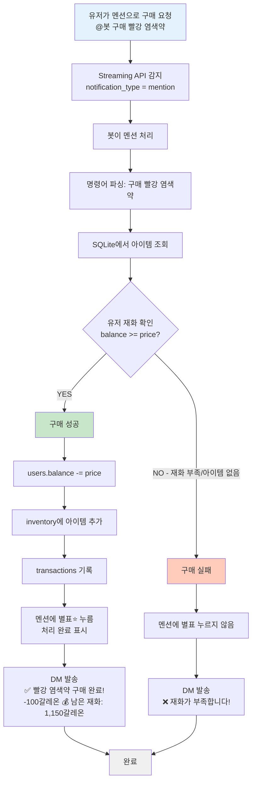
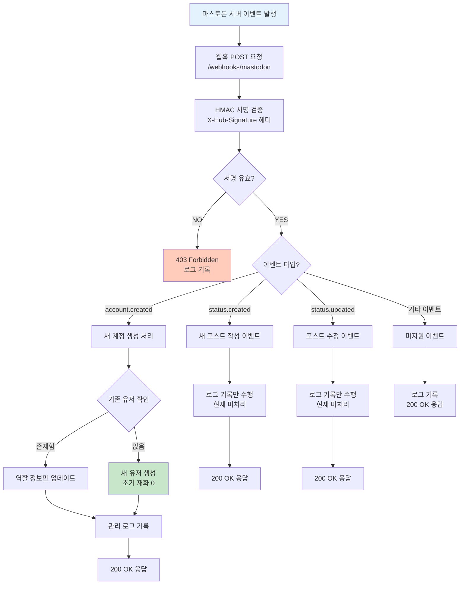

# 마녀봇 시스템 아키텍처

마스토돈 커뮤니티를 위한 활동량 기반 자동 관리 시스템의 전체 아키텍처와 기술 스택

---

## 목차

1. [봇 구조 (4개 계정)](#1-봇-구조-4개-계정)
2. [전체 시스템 구조](#2-전체-시스템-구조)
3. [데이터 흐름](#3-데이터-흐름)
4. [기술 스택](#4-기술-스택)
5. [인프라 구성](#5-인프라-구성)
6. [성능 최적화](#6-성능-최적화)
7. [컴포넌트 상세](#7-컴포넌트-상세)

---

## 1. 봇 구조 (4개 계정)

### 계정 구조도



### 1.1 총괄계정

**역할**: 커뮤니티 대표, 어드민

**기능**:
- 유저 팔로우 → DB 등록 (follow 이벤트)
- 관리자 웹 OAuth (총괄계정 + role='admin' 유저)
- 공지 발행 (announcement)

### 1.2 스토리계정

**역할**: 콘텐츠 전용

**기능**:
- 스토리 발행 (story)
- 자동 발행 (scheduled_posts)

### 1.3 시스템계정 (@봇)

**역할**: 유저 친화적 봇

**자동 시스템**:
- 재화 지급 (4시/16시)
- 출석 트윗 발행 (10시)
- 출석 답글 처리

**명령어**:
- `@봇 내재화`, `@봇 상점`, `@봇 구매 [아이템]`, `@봇 내아이템`
- `@봇 휴식 N`, `@봇 휴식 해제`
- `@봇 일정`, `@봇 공지`, `@봇 도움말`

**응답**: 모두 DM

### 1.4 감독봇

**역할**: 백그라운드 관리 및 다각도 위험 감지

**소셜 분석 시스템 (4가지 위험 유형)**:

시스템은 단순 답글 수 체크를 넘어 **4가지 위험 유형**으로 유저 활동을 분석합니다:

#### 1. 고립 위험
- **기준**: 대화 상대가 접속 중인 인원의 절반 미만
- **로직**: PostgreSQL에서 48시간 내 유저별 대화 상대 수 조회 → 접속 중인 전체 인원과 비교

#### 2. 편향 위험
- **기준**: 특정 1인과의 대화가 전체의 10% 이상
- **로직**: 유저별 대화 상대 분포 분석 → 최대 비율 계산

#### 3. 회피 패턴
- **기준**: 활동은 활발하지만 특정 주요 멤버를 회피
- **중요**: 상대방도 활동 중일 때만 감지 (접속하지 않은 경우 제외)
- **조건**:
  1. 유저 본인 활동 중 (48시간 내 답글 5개 이상)
  2. 회피 대상 유저도 활동 중 (48시간 내 접속 3회 이상)
  3. 두 유저 간 교류 부재
  4. 대상 유저가 주요 멤버(is_key_member=1)로 지정되어 있음

#### 4. 답글 미달
- **기준**: 48시간 내 답글 5개 미만
- **로직**: 기존 활동량 체크와 동일

**복합 위험**: 한 유저가 여러 위험 유형에 동시 해당 가능

**기타 기능**:
- 소셜 분석 실행 (매일 4시)
- 경고 발송 (관리자 판단 후 수동)
- 운영진 알림 (admin_notice, private)
- 크리티컬 에러 알림

### 계정 설정

```sql
INSERT INTO settings (key, value, description) VALUES
('admin_account', 'admin_account_name', '총괄계정명'),
('story_account', 'story_account_name', '스토리 계정명'),
('system_bot_account', 'system_bot_name', '시스템계정명'),
('supervisor_bot_account', 'supervisor_bot_name', '감독봇 계정명'),
('attendance_tweet_template', '🌟 오늘의 출석 체크!\n이 트윗에 답글 달아주세요!', '출석 트윗 템플릿');
```

---

## 2. 전체 시스템 구조



---

## 3. 데이터 흐름

### 3.1 재화 지급 흐름



### 3.2 활동량 체크 흐름 (벌크)



### 3.3 상점 구매 흐름 (멘션 + 별표 확인)



### 3.4 휴식 시스템 효과

유저가 휴식 기간에 있을 경우 다음 효과가 적용됩니다:

**제외되는 항목** (✅):
- 활동량 체크 (4가지 위험 유형 모두)
- 경고 발송 대상
- 소셜 분석 대상

**중단되는 항목** (❌):
- 재화 지급 (답글을 작성해도 지급되지 않음)
- 출석 트윗 참여 (출석 체크에서 제외)

**로직**:
```python
def should_process_user(user_id):
    # vacation 테이블에서 현재 휴식 중인지 확인
    query = """
    SELECT id FROM vacation
    WHERE user_id = ?
    AND start_date <= date('now')
    AND end_date >= date('now')
    LIMIT 1
    """
    if is_on_vacation(user_id):
        return False
    return True
```

**리뉴얼 기간 (is_global_vacation=1)**:
- 출석 트윗 발행 자체를 중단
- 모든 유저 활동량 체크 중단
- 재화 지급은 정상 작동

### 3.5 웹훅 처리 흐름

마스토돈 서버에서 발생하는 이벤트를 실시간으로 수신하여 처리합니다.



**웹훅 설정 요구사항**:
- 환경변수: `MASTODON_WEBHOOK_SECRET` (HMAC 서명용)
- 마스토돈 관리자 페이지에서 웹훅 등록 필요
- URL: `https://your-admin-server/webhooks/mastodon`
- 지원 이벤트: `account.created`, `status.created`, `status.updated`

**역할 정보 자동 동기화**:
- OAuth 로그인 시: 사용자의 마스토돈 역할 정보 자동 저장
- 웹훅 이벤트 시: 계정 생성/업데이트 시 역할 정보 동기화
- DB 저장 필드: `role_name` (역할 이름), `role_color` (역할 색상 hex)

**시스템 계정 필터링**:
대시보드 통계는 다음 `role_name`을 가진 사용자를 자동 제외:
- Owner, Admin, Moderator, 봇, 시스템, 테스트

---

## 4. 기술 스택

### 4.1 마스토돈 서버 (휘핑 에디션)

```yaml
베이스: 마스토돈 v4.2.1
언어: Ruby 3.2.2
프레임워크: Ruby on Rails
프론트엔드: React.js + Redux
스트리밍: Node.js 16.20.2
데이터베이스: PostgreSQL 12.16+
캐시/큐: Redis 5.0.7+
```

### 4.2 경제 시스템 봇

```yaml
언어: Python 3.9+
라이브러리:
  - Mastodon.py (마스토돈 API)
  - psycopg2 (PostgreSQL 연결)
  - sqlite3 (내장)
  - celery (스케줄링 - TODO)
서비스 관리: Docker Compose
스케줄링: Celery Beat (TODO: 현재는 cron 사용)
```

**주요 모듈**:
```
economy_bot/
├── reward_bot.py          # 실시간 재화 지급
├── activity_checker.py    # 활동량 체크 (벌크)
├── command_handler.py     # 봇 명령어 처리
├── game_engine.py         # 게임 로직 (추후)
├── database.py            # DB 유틸리티
└── config.py              # 설정 로드
```

### 4.3 관리자 웹

```yaml
프레임워크: Flask 3.x
템플릿: Jinja2
UI: Bootstrap 5 (기본 스타일만)
차트: Chart.js (통계용)
인증: Mastodon OAuth
```

**아키텍처**: Model - Repository - Service - Controller - Route (5계층)

```
HTTP Request → Route → Controller → Service → Repository → Database
```

### 4.4 데이터베이스 전략

#### PostgreSQL (마스토돈 기존 DB)
**용도**: 읽기 전용 참조
- 유저 계정 정보
- 답글/툿 데이터
- 마스토돈 원본 데이터

**접근 방식**:
```python
# 읽기 전용으로만 접근
conn = psycopg2.connect(
    dbname="mastodon_production",
    user="mastodon",
    password="...",
    host="localhost",
    options="-c default_transaction_read_only=on"
)
```

#### SQLite (경제 시스템 전용)
**용도**: 경제 데이터 독립 관리
- 재화, 거래 기록
- 경고 로그
- 휴식 기간
- 상점 아이템
- 시스템 설정

**파일 위치**: `/home/ubuntu/economy_bot/economy.db`

**장점**:
- 마스토돈 DB와 분리 (안전)
- 백업 간편 (파일 하나)
- 30~50명 규모 충분
- 별도 DB 서버 불필요

---

## 5. 인프라 구성

### 5.1 서버 인프라

#### Oracle Cloud Infrastructure (OCI) - Always Free Tier (1순위)

**선택 이유**:
- ✅ **완전 무료** (평생 프리 티어)
- ✅ **고성능**: Ampere A1 (4 OCPU, 24GB RAM)
- ✅ **한국 리전**: 춘천 (ap-chuncheon-1)
- ✅ **빠른 속도**: 국내 사용자에게 최적
- ✅ **충분한 성능**: 50~100명 가능
- ✅ **스토리지**: 200GB Block Volume

**스펙**:
```
CPU: ARM64 Ampere A1 (4 OCPU)
RAM: 24GB
Storage: 200GB (Boot Volume + Block Volume)
Network: 10TB/월 아웃바운드
리전: 춘천 (ap-chuncheon-1)
OS: Ubuntu 22.04 LTS
```

#### 대안 호스팅 (유료)

**Hetzner Cloud**: 월 €4.5 (약 6,500원)
- CPU: 2 vCPU, RAM: 4GB, Storage: 40GB SSD
- 위치: 독일 또는 핀란드
- 단점: 한국에서 느림 (지연 200~300ms)

**Contabo**: 월 €6.99 (약 10,000원)
- CPU: 6 vCPU, RAM: 16GB, Storage: 400GB SSD
- 위치: 독일 또는 미국

### 5.2 네트워크 구성

```
Internet
   │
   ▼
[DuckDNS]  yourserver.duckdns.org (무료 도메인)
   │
   ▼
[Cloudflare/Let's Encrypt SSL]
   │
   ▼
[Nginx - 리버스 프록시]
   ├──→ Mastodon Web (Port 3000)
   ├──→ Mastodon Streaming (Port 4000)
   └──→ Admin Web (Port 5000)
```

**포트 설정**:
```
22:  SSH
80:  HTTP (자동으로 443 리다이렉트)
443: HTTPS
3000: Mastodon Web (내부)
4000: Mastodon Streaming (내부)
5000: Admin Web (내부)
```

### 5.3 도메인 및 SSL

#### 도메인: DuckDNS (무료)
```
URL: https://www.duckdns.org
방식: DDNS (Dynamic DNS)
예시: yourserver.duckdns.org
갱신: 자동 (크론)
```

**설정**:
```bash
# 크론으로 5분마다 IP 갱신
*/5 * * * * curl "https://www.duckdns.org/update?domains=yourserver&token=YOUR_TOKEN"
```

#### SSL: Let's Encrypt (무료)
```
발급: Certbot
갱신: 자동 (certbot renew)
유효기간: 90일 (자동 갱신)
```

### 5.4 SMTP (이메일 발송)

**SendGrid 무료 플랜**
```
가격: 무료
한도: 월 100통
용도:
  - 가입 인증
  - 비밀번호 찾기
  - (선택) 관리자 알림
```

**대안**: Brevo (구 Sendinblue) - 월 300통 무료

### 5.5 보안 설정

#### 방화벽 (UFW)
```bash
sudo ufw default deny incoming
sudo ufw default allow outgoing
sudo ufw allow 22/tcp
sudo ufw allow 80/tcp
sudo ufw allow 443/tcp
sudo ufw enable
```

#### 파일 권한
```bash
# SQLite DB 권한
chmod 600 /path/to/economy.db
chown ubuntu:ubuntu /path/to/economy.db
```

#### OAuth 보안
- 관리자 웹은 OAuth만 허용
- 비밀번호 직접 입력 없음
- 권한 체크: Owner/Admin만 접근

---

## 6. 성능 최적화

### 6.1 마스토돈 최적화

**Docker 설정** (.env.production):
```bash
WEB_CONCURRENCY=4          # 4-core에 맞춤
MAX_THREADS=5
STREAMING_CLUSTER_NUM=1
DB_POOL=25
```

**Redis 캐싱**:
- 타임라인 캐싱
- 세션 저장
- Sidekiq 큐

### 6.2 경제 봇 최적화

**벌크 처리 전략**:
```python
# 오전 4시 - 심야 시간 활용
# PostgreSQL 한 번에 쿼리
query = """
SELECT
    u.id, u.username,
    COUNT(s.id) as reply_count
FROM accounts u
LEFT JOIN statuses s ON ...
WHERE s.created_at > NOW() - INTERVAL '48 hours'
GROUP BY u.id
"""

# 매시간 30명씩 조회 (720회/일)
# → 하루 2번 벌크 조회 (2회/일)
# 360배 감소!
```

**크론 스케줄**:
```bash
# 오전 4시 - 무거운 벌크 처리 (재화 정산 + 소셜 분석 + 활동량 체크)
0 4 * * * python3 /path/to/bulk_activity_check.py

# 오후 4시 (16시) - 재화 정산 + 활동량 체크
0 16 * * * python3 /path/to/activity_check.py
```

### 6.3 백업 및 자동 유지보수 스케줄

**자동 백업 및 유지보수 (크론)**:
```bash
# 02:00 - 데이터베이스 백업
0 2 * * * sqlite3 /path/to/economy.db ".backup '/backups/economy_$(date +\%Y\%m\%d).db'"

# 03:00 - 데이터베이스 최적화 (VACUUM, ANALYZE)
0 3 * * * python3 /path/to/optimize_database.py

# 04:00 - 재화 정산 + 소셜 분석 + 활동량 체크
0 4 * * * python3 /path/to/bulk_activity_check.py

# 05:00 - 로그 정리 (30일 이상 삭제, 7일 이상 압축)
0 5 * * * python3 /path/to/cleanup_logs.py

# 05:30 - 시스템 헬스체크 (SQLite, PostgreSQL, Redis, 디스크, API)
30 5 * * * python3 /path/to/health_check.py

# 10:00 - 출석 트윗 발행
0 10 * * * python3 /path/to/attendance_tweet.py

# 16:00 - 재화 정산 + 활동량 체크
0 16 * * * python3 /path/to/activity_check.py

# 주 1회 일요일 04:00 - PostgreSQL 백업
0 4 * * 0 docker exec mastodon_db_1 pg_dump -Fc -U postgres mastodon_production > /backups/mastodon_$(date +\%Y\%m\%d).dump

# 주 1회 일요일 05:00 - 미디어 파일 백업
0 5 * * 0 tar -czf /backups/media_$(date +\%Y\%m\%d).tar.gz /path/to/mastodon/public/system

# 30일 지난 백업 자동 삭제
0 6 * * 0 find /backups -name "*.db" -mtime +30 -delete
```

**백업 저장 위치**:
- 로컬: `/home/ubuntu/backups`
- (선택) 클라우드: Oracle Object Storage (무료)

### 6.4 병목 지점 및 해결

**PostgreSQL 쿼리**:
- 문제: 매시간 30명 조회 시 부하
- 해결: 하루 2회 벌크 조회 (360배 감소)

**SQLite 동시 쓰기**:
- 문제: 다중 프로세스 동시 쓰기
- 해결: WAL 모드 + 재시도 로직

**Streaming API 연결**:
- 문제: 네트워크 끊김
- 해결: 자동 재연결 + systemd 재시작

### 6.5 확장성

**50명 → 100명**:
- SQLite 충분
- 봇 성능 문제 없음
- 마스토돈 RAM 여유 있음

**100명 → 500명**:
- SQLite → PostgreSQL 마이그레이션
- 봇 멀티 프로세스
- 서버 업그레이드 필요

---

## 7. 컴포넌트 상세

### 7.1 실시간 감시 봇 (reward_bot.py)

**역할**: 24시간 답글 감지 및 재화 지급

**주요 로직**:
```python
class RewardListener(StreamListener):
    def on_update(self, status):
        # 답글만 처리
        if not status['in_reply_to_id']:
            return

        # 중복 체크
        if status_id in processed:
            return

        # 재화 지급
        give_reward(user_id, amount)
```

**실행**: Docker Compose 서비스로 24시간 구동

```yaml
# docker-compose.yml
reward-bot:
  build: ./economy_bot
  command: python reward_bot.py
  restart: always
  volumes:
    - ./data:/data
  depends_on:
    - db
    - redis
```

### 7.2 활동량 체크 봇 (activity_checker.py)

**역할**: 하루 2회 벌크 체크

**실행 시간**:
- 오전 4시: 메인 체크 (재화 정산 + 소셜 분석 + 활동량 벌크 체크)
- 오후 4시 (16시): 재화 정산 + 활동량 체크

**주요 로직**:
```python
def bulk_check():
    # PostgreSQL 벌크 쿼리
    query = """
    SELECT u.id, COUNT(s.id) as cnt
    FROM accounts u
    LEFT JOIN statuses s ...
    WHERE s.created_at > NOW() - INTERVAL '48 hours'
    """

    for user, count in results:
        if count < threshold:
            warn(user)
```

### 7.3 명령어 핸들러 (command_handler.py)

**역할**: 봇 멘션 처리 + 별표 확인 표시

**멘션 명령어**:
```
@봇 내재화              - 보유 재화 조회 DM
@봇 상점                - 아이템 목록 DM
@봇 구매 [아이템명]     - 구매 처리 + 멘션에 별표
@봇 내아이템            - 보유 아이템 목록 DM
@봇 @유저 [아이템] [개수] - 양도 처리 + 멘션에 별표
@봇 휴식 [날짜]까지     - 휴식 등록
@봇 게임 [종류] [금액]  - 게임 시작
@봇 도움말              - 명령어 안내
```

**별표(⭐) 사용**:
- 구매/양도 명령 처리 완료 시 해당 멘션에 별표
- 시각적 확인 표시 (타임라인에서 한눈에 파악)

### 7.4 관리자 웹 (Flask)

**라우트 구조**:
```
/                   → 홈 (대시보드)
/login              → OAuth 로그인
/logout             → 로그아웃
/activity           → 활동량 관리
/activity/warn      → 수동 경고
/balance            → 재화 관리
/balance/adjust     → 재화 조정
/shop               → 상점 관리
/shop/items         → 아이템 CRUD
/settings           → 시스템 설정
/logs               → 관리 로그
```

**5계층 아키텍처**:
```
admin_web/
├── routes/         # Flask Blueprint (Route)
├── controllers/    # 비즈니스 로직 처리 (Controller)
├── services/       # 비즈니스 로직 (Service)
├── repositories/   # 데이터베이스 접근 (Repository)
├── models/         # 데이터 모델 (Model)
├── templates/      # Jinja2 템플릿
├── static/         # 정적 파일
└── utils/          # 유틸리티 함수
```

---

## 모니터링 및 로그

### 시스템 모니터링

**기본 도구**:
```bash
# 디스크 사용량
df -h

# 메모리 사용량
free -h

# 프로세스 상태
systemctl status economy-bot
systemctl status mastodon-web
```

### 로그 관리

**봇 로그**:
```
/home/ubuntu/economy_bot/logs/
├── reward.log          # 재화 지급
├── activity.log        # 활동량 체크
├── command.log         # 명령어 처리
└── error.log           # 에러
```

**로그 로테이션**:
```bash
# /etc/logrotate.d/economy-bot
/home/ubuntu/economy_bot/logs/*.log {
    daily
    rotate 30
    compress
    missingok
    notifempty
}
```

---

## 개발 환경

### 로컬 테스트 환경

```bash
# Docker Compose로 로컬 테스트
docker-compose -f docker-compose.dev.yml up

# SQLite DB 로컬 복사
scp ubuntu@server:/path/to/economy.db ./
```

### 배포 프로세스

```bash
# 1. 서버 접속
ssh ubuntu@yourserver.duckdns.org

# 2. 코드 업데이트
cd /home/ubuntu/economy_bot
git pull

# 3. 봇 재시작
sudo systemctl restart economy-bot

# 4. 로그 확인
tail -f logs/error.log
```
