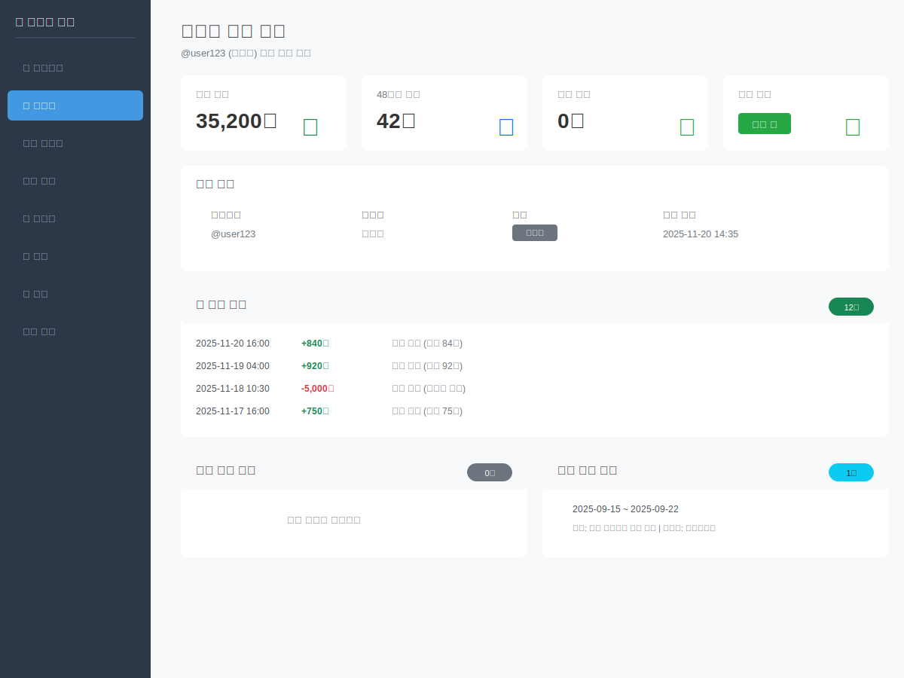

# 마녀봇 관리 시스템 화면 목업

> 관리자 웹 인터페이스 UI/UX 디자인 예시

---

## 📌 개요

이 문서는 마녀봇 관리 시스템의 주요 화면들을 SVG 목업으로 제공합니다. 실제 구현된 HTML 템플릿의 디자인과 레이아웃을 시각화하여, 개발자와 관리자가 시스템을 더 쉽게 이해할 수 있도록 합니다.

**특징:**
- 13개 화면 목업 (메인 12개 + 모달 1개)
- Bootstrap 5 기반 UI
- 반응형 디자인
- 30명 규모 커뮤니티에 최적화된 통계
- 하이브리드 메뉴 구조 (직접 접근 + 그룹화)
- 실제 사용 시나리오 기반

---

## 🔐 1. 로그인 화면

**파일:** `login.svg`

Mastodon OAuth 2.0 인증을 통한 로그인 화면입니다.


**주요 기능:**
- Mastodon OAuth 연동
- 관리자 권한 자동 확인
- 세션 기반 인증

---

## 📊 2. 대시보드

**파일:** `dashboard.svg`

시스템 전체 현황을 한눈에 볼 수 있는 메인 대시보드입니다.

**접근 방법:**
- 메인 페이지(`/`) 접속 시 로그인된 사용자에게 자동으로 표시
- 상단 네비게이션 바의 "✨ 마녀봇 관리" 로고 클릭
- 상단 메뉴에서 "📊 대시보드" 클릭


**표시 정보:**
- **전체 유저**: 28명 (30명 규모)
- **활성 유저 (24시간)**: 22명
- **휴식 중**: 3명
- **경고 발송 (7일)**: 4건

**시스템 정보:**
- 활동량 체크 주기: 오전 4시, 오후 4시 (12시간 간격)
- 최소 답글 기준: 48시간 내 20개
- 재화 지급 비율: 답글 1개당 10원

---

## 👥 3. 사용자 목록

**파일:** `users.svg`

전체 사용자 목록 및 상태를 조회할 수 있는 화면입니다.


**표시 항목:**
- 사용자명 (@username)
- 표시명
- 역할 (관리자/사용자)
- 잔액
- 경고 횟수
- 휴식 상태
- 최종 활동 일시
- 상세 보기 버튼

**총 사용자:** 28명 (30명 규모)

---

## 👤 4. 사용자 상세

**파일:** `user_detail.svg`

개별 사용자의 상세 정보 및 활동 내역을 확인하는 화면입니다.



**통계 카드:**
- **현재 잔액**: 35,200원
- **48시간 답글**: 42개
- **경고 횟수**: 0회
- **휴식 상태**: 활동 중

**상세 정보:**
- 기본 정보 (사용자명, 표시명, 역할, 최종 활동)
- 거래 내역 (정산 지급, 상점 구매 등)
- 경고 내역
- 휴식 내역

---

## ⚠️ 5. 활동량 모니터링

**파일:** `warnings.svg`

실시간으로 사용자 활동량을 모니터링하고 경고를 관리하는 대시보드입니다.


**통계 카드:**
- **위험군 (0~9개)**: 3명 🚨
- **주의군 (10~19개)**: 5명 ⚠️
- **정상군 (20개+)**: 20명 ✓
- **다음 체크**: 16:00 (2시간 30분 후)

**위험군 사용자 섹션:**
- 빨간색 배경으로 강조
- 사용자별 답글 수 표시 (카드 형태)
- 활동량 추이 바 차트

**주의군 사용자 섹션:**
- 노란색 배경
- 5명의 주의 대상 사용자 목록
- 사용자명 + 답글 수 표시

**최근 발송 경고:**
- 발송 일시
- 대상 사용자
- 자동발송 뱃지

**액션 버튼:**
- 전체 경고 내역 조회
- 수동 체크 실행
- 체크 설정

### 5-1. 수동 경고 발송 모달

**파일:** `warning_modal.svg`

활동량 모니터링 화면에서 수동으로 경고를 발송하는 모달 창입니다.


**구성 요소:**

1. **대상 유저 선택**
   - 검색 입력 필드
   - 유저 정보 미리보기 (답글 수, 경고 횟수)

2. **경고 템플릿 선택**
   - 활동량 부족 경고 (기본)
   - 규칙 위반 경고
   - 사용자 정의

3. **메시지 작성**
   - 텍스트 에리어 (최대 500자)
   - 템플릿 선택 시 자동 입력
   - 실시간 글자 수 카운터

4. **주의사항 안내**
   - 발송 후 취소 불가
   - 관리 로그 영구 기록

5. **액션 버튼**
   - 취소 (모달 닫기)
   - 경고 DM 발송하기 (빨간색, 강조)

---

## 🏖️ 6. 휴식 관리

**파일:** `vacations.svg`

사용자 휴식 신청을 조회하고 관리하는 화면입니다.


**통계 카드:**
- **총 휴식 기간**: 6건
- **현재 휴식 중**: 2명
- **이번 달 휴식**: 3건
- **종료된 휴식**: 4건

**휴식 목록:**
- 사용자
- 시작일 / 종료일
- 기간 (일수)
- 사유
- 승인자
- 상태 (진행 중 / 종료)

**필터 기능:**
- 사용자별 필터
- 상태 필터 (진행 중 / 종료)

---

## 🎉 7. 이벤트 관리

**파일:** `events.svg`

커뮤니티 이벤트를 조회하고 관리하는 화면입니다.


**통계 카드:**
- **전체 이벤트**: 15개
- **진행 중**: 3개
- **예정**: 5개
- **종료**: 7개

**이벤트 카드 예시:**
1. **🏰 호그스미드 방문 주간**
   - 타입: 외출 이벤트
   - 상태: 진행 중
   - 공개 여부: 공개
   - 기간: 2025-11-15 ~ 2025-11-21
   - 설명: 마법 마을 호그스미드 자유 방문 기간, 특별 상점 할인

2. **🎄 크리스마스 대연회**
   - 타입: 특별 이벤트
   - 상태: 예정
   - 공개 여부: 공개
   - 기간: 2025-12-24 ~ 2025-12-26
   - 설명: 대강당에서 펼쳐지는 연말 축제, 특별 보상 및 이벤트

---

## 🛒 8. 상점 관리

**파일:** `shop.svg`

상점 아이템을 조회하고 관리하는 화면입니다.


**통계 카드:**
- **전체 아이템**: 12개
- **판매 중**: 8개
- **품절**: 2개
- **비공개**: 2개

**아이템 카드 예시:**
1. **프로필 뱃지**
   - 가격: 5,000원
   - 재고: 무제한
   - 상태: 판매 중

2. **닉네임 색상 변경**
   - 가격: 3,000원
   - 재고: 무제한
   - 상태: 판매 중

3. **커스텀 이모지 슬롯**
   - 가격: 10,000원
   - 재고: 5개
   - 상태: 품절

---

## 🖥️ 9. 관리자 로그

**파일:** `logs.svg`

시스템 관리자 활동 로그를 실시간으로 모니터링하는 화면입니다.


**통계 카드:**
- **총 로그**: 1,523건 (누적)
- **현재 페이지**: 1 / 31

**로그 뷰어 (터미널 스타일):**
```
2025-11-18 14:30:25  마녀봇      adjust_balance   → user_123  +1000원 지급
2025-11-18 14:15:10  운영진A     create_warning   → user_456  활동량 부족 경고
2025-11-18 13:45:33  총괄관리자   create_vacation  → user_789  휴식 승인 (2025-11-20 ~ 2025-11-27)
2025-11-18 13:20:15  마녀봇      create_event     -           신년 이벤트 생성
2025-11-18 12:50:42  운영진B     update_setting   -           activity_threshold 변경: 20 → 25
```

**필터 기능:**
- 관리자별 필터
- 액션 타입 필터 (재화 조정, 경고 발송, 휴식 승인 등)

---

## ⚙️ 10. 시스템 설정

**파일:** `settings.svg`

봇 동작 및 시스템 파라미터를 조정하는 화면입니다.


**설정 항목:**

### ⏰ 활동량 체크 설정
- **체크 주기**: 오전 4시, 오후 4시 (12시간 간격)
- **최소 답글 기준**: 48시간 내 20개

### 💰 재화 지급 설정
- **답글 1개당 지급액**: 10원
- **정산 주기**: 오전 4시, 오후 4시 (12시간 간격)

### ⚠️ 경고 시스템 설정
- **자동 경고 활성화**: 활성화됨
- **경고 유지 기간**: 30일
- **누적 경고 제한**: 3회

### 🏖️ 휴식 시스템 설정
- **휴식 중 활동량 체크**: 비활성화됨
- **휴식 중 재화 지급**: 비활성화됨

---

## 📹 11. 스토리 이벤트 관리

**파일:** `story_events.svg`

스토리 이벤트와 포스트를 관리하는 화면입니다. 여러 개의 포스트를 일정 간격으로 자동 발송하는 기능입니다.

**접근 경로:** 상단 메뉴 → 콘텐츠 ▼ → 스토리 이벤트


**통계 카드:**
- **대기 중**: 5개 ⏳
- **진행 중**: 2개 ▶️
- **완료**: 12개 ✅
- **실패**: 1개 ❌

**표시 항목:**
- ID
- 제목
- 시작 시간
- 간격 (분 단위)
- 포스트 수
- 상태 (pending/in_progress/completed/failed)
- 생성일

**주요 기능:**
- 이벤트 목록 조회
- 이벤트별 포스트 관리
- API 문서 링크
- 일정(calendar_events)과 연결 가능

**사용 사례:**
- 새해 인사 스토리 시리즈 (10분 간격으로 3개 발송)
- 이벤트 카운트다운 (60분마다 24개 발송)
- 주간 활동 요약 (30분 간격)

**현재 상태:**
- UI는 간략하게 구현 (목록 조회만)
- 자세한 관리는 `/api/v1/story-events` API 사용
- 실제 자동 발송은 Celery Task 미구현 (TODO)

---

## 📢 12. 공지 예약 관리

**파일:** `announcements.svg`

단일 공지를 특정 시간에 예약 발송하는 기능을 관리하는 화면입니다.

**접근 경로:** 상단 메뉴 → 콘텐츠 ▼ → 공지 예약


**통계 카드:**
- **대기 중**: 8개 ⏳
- **발행됨**: 24개 ✅

**표시 항목:**
- ID
- 유형 (공지/안내)
- 내용 (최대 50자 미리보기)
- 예약 시간
- 상태 (pending/published/failed)
- 생성일

**주요 기능:**
- 공지 목록 조회
- 예약 공지 생성/수정/삭제
- API 문서 링크
- 공개/비공개 설정

**사용 사례:**
- 정기 공지 예약 (매주 월요일 아침)
- 이벤트 시작 안내 (당일 자정)
- 시스템 점검 사전 공지

**공개 설정:**
- `is_public: true` - 유저가 `@봇 공지` 명령어로 조회 가능
- `is_public: false` - 관리자만 확인 가능

**현재 상태:**
- UI는 간략하게 구현 (목록 조회만)
- 자세한 관리는 `/api/v1/announcements` API 사용
- 실제 자동 발송은 Celery Task 미구현 (TODO)

---

## 🎨 디자인 가이드

### 색상 팔레트

**Primary Colors:**
- 주요 액션: `#0d6efd` (파란색)
- 성공: `#198754` (초록색)
- 경고: `#ffc107` (노란색)
- 위험: `#dc3545` (빨간색)
- 정보: `#0dcaf0` (청록색)

**Neutral Colors:**
- 배경: `#f8f9fa`
- 테두리: `#dee2e6`
- 텍스트: `#495057` (진함) / `#6c757d` (중간) / `#adb5bd` (연함)
- 다크: `#212529`

### 타이포그래피

- **제목 (h1)**: 24px, Arial, Bold
- **부제목 (h5-h6)**: 16px, Arial, Bold
- **본문**: 13px, Arial, Regular
- **작은 텍스트**: 11-12px, Arial, Regular
- **코드/로그**: Courier New (Monospace)

### 컴포넌트

- **카드 (Card)**: 8px border-radius, drop-shadow
- **버튼 (Button)**: 4px border-radius, 높이 35-40px
- **뱃지 (Badge)**: 12px border-radius (pill)
- **입력 필드 (Input)**: 4px border-radius, 1px border

---

## 📱 반응형 디자인

모든 화면은 Bootstrap 5 Grid 시스템을 사용하여 다양한 화면 크기에 대응합니다:

- **데스크톱 (≥1200px)**: 4열 그리드
- **태블릿 (≥768px)**: 2열 그리드
- **모바일 (<768px)**: 1열 그리드

---

## 🔗 관련 문서

- [관리자 가이드](ADMIN_GUIDE.md) - 관리자 웹 사용법
- [API 레퍼런스](API_REFERENCE.md) - REST API 명세
- [Docker 가이드](DOCKER_GUIDE.md) - 배포 및 운영

---

**마지막 업데이트**: 2025-11-20
**문서 버전**: 2.1
