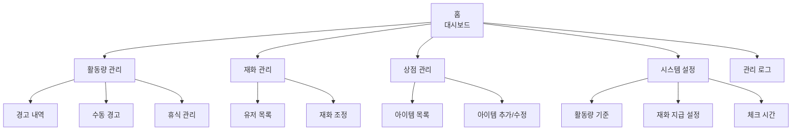

# 관리자 웹 UX

## 설계 원칙
- 비개발자 중심
- 한눈에 파악
- 실수 방지 (확인 팝업)
- 모든 작업 로그 기록

## 메뉴 구조



## 주요 화면

### 홈 (대시보드)
- 오늘의 알림 (경고 유저, 휴식 중)
- 전체 통계 (유저 수, 총 재화, 48h 답글)
- 봇 상태 (정상/오류, 마지막 체크, 다음 체크)
- 전체 유저 활동 현황 테이블
  - 상태 표시: 🟢 정상, 🟡 주의, 🔴 경고, 💤 휴식
  - 48h 답글 수, 다음 체크, 재화

### 활동량 관리
- 경고 내역 (필터: 오늘/이번주/전체)
- 수동 경고: 유저 선택 → 메시지 작성 → 확인 → DM 발송
- 휴식 관리: 목록, 등록, 해제

### 재화 관리
- 유저별 재화 현황 (정렬/필터/검색)
- 재화 조정: 금액 → 사유 → 확인 → 적용

### 상점 관리
- 아이템 목록 (카테고리/상태 필터)
- 아이템 추가/편집: 이름, 설명, 가격, 카테고리, 이미지, 판매 상태

### 시스템 설정
- 활동량 체크 기준: 기간(48h), 최소 답글(20개)
- 재화 지급 설정: N개당 M원
- 체크 시간: 오전 4시, 오후 4시 (12시간 간격)

### 관리 로그
- 전체 작업 기록 (필터/검색)
- 재화 조정, 경고 발송, 설정 변경, 상점 관리

## Flask 라우트

```python
# 인증
/login              # OAuth 로그인
/logout             # 로그아웃

# 메인
/                   # 홈 (대시보드)

# 활동량
/activity           # 경고 내역
/activity/warn      # 수동 경고 [POST]
/activity/vacation  # 휴식 관리

# 재화
/balance            # 유저 목록
/balance/adjust     # 재화 조정 [POST]

# 상점
/shop               # 아이템 목록
/shop/add           # 아이템 추가 [POST]
/shop/edit/<id>     # 아이템 수정 [POST]

# 설정
/settings           # 시스템 설정 [GET/POST]

# 로그
/logs               # 관리 로그
```

## 기술 구현
- Flask 3.x + Jinja2
- Bootstrap 5 (최소 디자인)
- Mastodon OAuth (권한 체크: Owner/Admin)
- Chart.js (통계용)
- 확인 팝업 (모든 중요 작업)
- admin_logs 자동 기록
