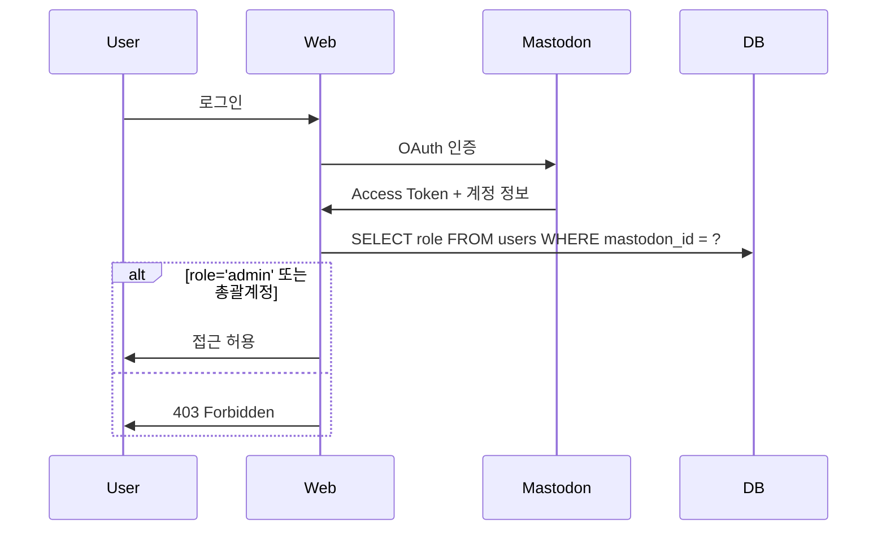

# 관리자 웹 OAuth 인증

## 접근 권한

1. **총괄계정** OAuth (모든 권한)
2. **role='admin' 유저** OAuth (역할 변경 제외)

## 인증 플로우



## OAuth 앱 등록

```bash
# 마스토돈 서버에서 OAuth 앱 생성
애플리케이션 이름: 마녀봇 관리자 웹
리디렉션 URI: https://admin.yourdomain.com/oauth/callback
스코프: read write follow
```

## 환경변수

```bash
MASTODON_INSTANCE=https://yourserver.duckdns.org
MASTODON_CLIENT_ID=your_client_id
MASTODON_CLIENT_SECRET=your_client_secret
MASTODON_REDIRECT_URI=https://admin.yourdomain.com/oauth/callback
ADMIN_ACCOUNT_ID=총괄계정_mastodon_id
```

## 구현 (Flask)

### 로그인
```python
@app.route('/login')
def login():
    mastodon = Mastodon(client_id=CLIENT_ID, client_secret=CLIENT_SECRET, api_base_url=INSTANCE)
    return redirect(mastodon.auth_request_url(redirect_uris=REDIRECT_URI, scopes=['read', 'write', 'follow']))
```

### 콜백
```python
@app.route('/oauth/callback')
def oauth_callback():
    code = request.args.get('code')
    mastodon = Mastodon(client_id=CLIENT_ID, client_secret=CLIENT_SECRET, api_base_url=INSTANCE)

    access_token = mastodon.log_in(code=code, redirect_uri=REDIRECT_URI, scopes=['read', 'write', 'follow'])
    account = mastodon.account_verify_credentials()
    mastodon_id = str(account['id'])

    if not is_admin(mastodon_id):
        return "접근 권한이 없습니다.", 403

    session['access_token'] = access_token
    session['mastodon_id'] = mastodon_id
    session['username'] = account['username']
    return redirect('/dashboard')


def is_admin(mastodon_id: str) -> bool:
    if mastodon_id == os.getenv('ADMIN_ACCOUNT_ID'):
        return True

    cursor.execute("SELECT role FROM users WHERE mastodon_id = ?", (mastodon_id,))
    row = cursor.fetchone()
    return row and row[0] == 'admin'
```

### 미들웨어
```python
from functools import wraps

def login_required(f):
    @wraps(f)
    def decorated(*args, **kwargs):
        if 'mastodon_id' not in session or not is_admin(session['mastodon_id']):
            return redirect('/login')
        return f(*args, **kwargs)
    return decorated


@app.route('/dashboard')
@login_required
def dashboard():
    return render_template('dashboard.html')
```

## 역할 관리

### 관리자 추가
```python
@app.route('/api/users/<mastodon_id>/role', methods=['POST'])
@login_required
def update_role(mastodon_id):
    # 총괄계정만 가능
    if session['mastodon_id'] != os.getenv('ADMIN_ACCOUNT_ID'):
        return {"error": "권한 없음"}, 403

    new_role = request.json.get('role')  # 'user' or 'admin'

    cursor.execute("UPDATE users SET role = ? WHERE mastodon_id = ?", (new_role, mastodon_id))
    cursor.execute("INSERT INTO admin_logs (admin_name, action_type, target_user, details) VALUES (?, 'change_role', ?, ?)",
                   (session['username'], mastodon_id, f"역할 변경: {new_role}"))
    conn.commit()

    return {"success": True}
```

## 보안

```python
# Flask 설정
app.config['SECRET_KEY'] = os.urandom(24)
app.config['SESSION_COOKIE_HTTPONLY'] = True
app.config['SESSION_COOKIE_SECURE'] = True  # HTTPS
app.config['PERMANENT_SESSION_LIFETIME'] = timedelta(hours=24)

# CSRF 방지
from flask_wtf.csrf import CSRFProtect
csrf = CSRFProtect(app)
```

## 초기 설정

### 1. 총괄계정 ID 확인
```bash
docker-compose exec web bin/tootctl accounts show admin_username
# Account ID: 1234567890
```

### 2. .env 설정
```bash
ADMIN_ACCOUNT_ID=1234567890
```

### 3. 첫 관리자 등록
```sql
-- economy.db
UPDATE users SET role = 'admin' WHERE mastodon_id = '첫_관리자_ID';
```

## 페이지 권한

| 기능 | 총괄계정 | role='admin' |
|------|----------|--------------|
| 대시보드, 유저 관리, 재화 조정 | ✅ | ✅ |
| 활동량, 일정, 시스템 설정 | ✅ | ✅ |
| **역할 변경** | ✅ | ❌ |
