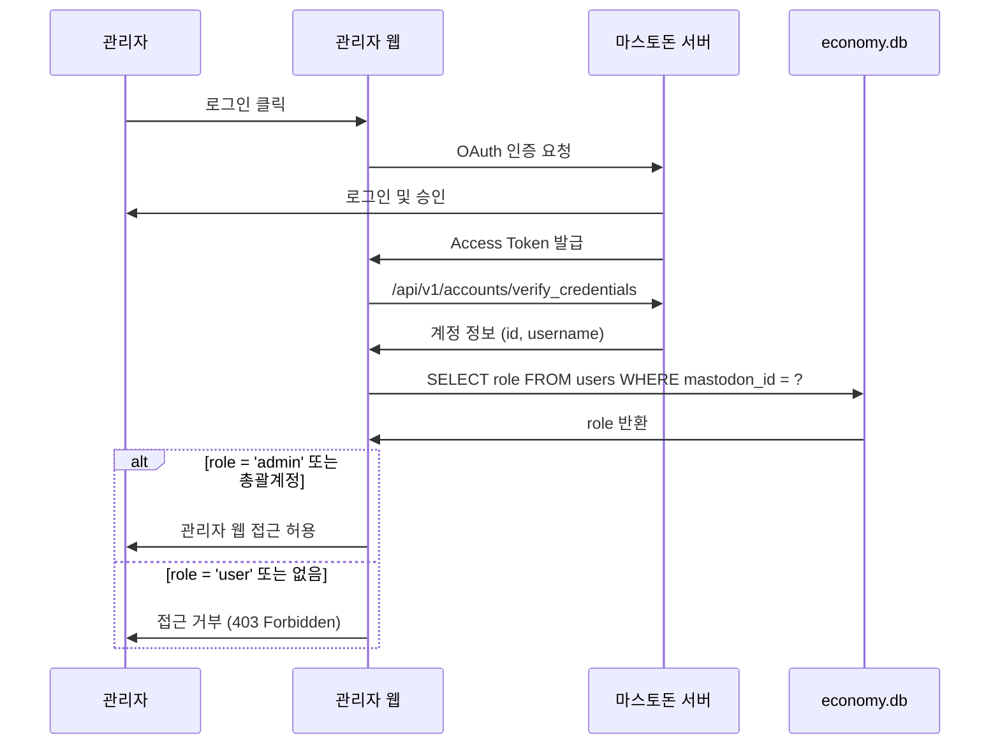

# 관리자 웹 OAuth 인증

## 개요

관리자 웹 접근은 2가지 방법으로 가능합니다:
1. **총괄계정** OAuth 로그인 (대표 관리자)
2. **일반 유저 계정** OAuth 로그인 (role='admin'인 경우)

## 인증 플로우



## 1. OAuth 앱 등록

### 설정
- **애플리케이션 이름**: 마녀봇 관리자 웹
- **리디렉션 URI**: `https://admin.yourdomain.com/oauth/callback`
- **스코프**: `read write follow`
- **권한**: 계정 정보 읽기, 툿 작성, 팔로우 관리

### 환경변수
```bash
MASTODON_INSTANCE=https://yourserver.duckdns.org
MASTODON_CLIENT_ID=your_client_id
MASTODON_CLIENT_SECRET=your_client_secret
MASTODON_REDIRECT_URI=https://admin.yourdomain.com/oauth/callback

ADMIN_ACCOUNT_ID=총괄계정_mastodon_id  # 총괄계정 ID (추가 확인용)
```

## 2. 로그인 플로우

### 2-1. 인증 요청 (Flask)
```python
@app.route('/login')
def login():
    mastodon = Mastodon(
        client_id=MASTODON_CLIENT_ID,
        client_secret=MASTODON_CLIENT_SECRET,
        api_base_url=MASTODON_INSTANCE
    )

    auth_url = mastodon.auth_request_url(
        redirect_uris=MASTODON_REDIRECT_URI,
        scopes=['read', 'write', 'follow']
    )

    return redirect(auth_url)
```

### 2-2. 콜백 및 권한 확인
```python
@app.route('/oauth/callback')
def oauth_callback():
    code = request.args.get('code')

    mastodon = Mastodon(
        client_id=MASTODON_CLIENT_ID,
        client_secret=MASTODON_CLIENT_SECRET,
        api_base_url=MASTODON_INSTANCE
    )

    # Access Token 발급
    access_token = mastodon.log_in(
        code=code,
        redirect_uri=MASTODON_REDIRECT_URI,
        scopes=['read', 'write', 'follow']
    )

    # 계정 정보 조회
    account = mastodon.account_verify_credentials()
    mastodon_id = str(account['id'])
    username = account['username']

    # 권한 확인
    if not is_admin(mastodon_id):
        return "접근 권한이 없습니다.", 403

    # 세션 저장
    session['access_token'] = access_token
    session['mastodon_id'] = mastodon_id
    session['username'] = username

    return redirect('/dashboard')


def is_admin(mastodon_id: str) -> bool:
    """관리자 권한 확인"""
    # 1. 총괄계정 확인
    if mastodon_id == os.getenv('ADMIN_ACCOUNT_ID'):
        return True

    # 2. users 테이블에서 role 확인
    conn = sqlite3.connect('economy.db')
    cursor = conn.cursor()
    cursor.execute("SELECT role FROM users WHERE mastodon_id = ?", (mastodon_id,))
    row = cursor.fetchone()
    conn.close()

    if row and row[0] == 'admin':
        return True

    return False
```

### 2-3. 로그인 미들웨어
```python
from functools import wraps

def login_required(f):
    @wraps(f)
    def decorated_function(*args, **kwargs):
        if 'mastodon_id' not in session:
            return redirect('/login')

        # 권한 재확인 (세션 하이재킹 방지)
        if not is_admin(session['mastodon_id']):
            session.clear()
            return "접근 권한이 없습니다.", 403

        return f(*args, **kwargs)
    return decorated_function


@app.route('/dashboard')
@login_required
def dashboard():
    return render_template('dashboard.html', username=session['username'])
```

## 3. 관리자 역할 관리

### users.role 컬럼
```sql
-- role 값
-- 'user': 일반 유저
-- 'admin': 관리자 (웹 접근 가능)
-- 'system': 시스템 계정 (봇)
-- 'story': 스토리 계정
```

### 관리자 추가/제거 (관리자 웹)

**UI**: 유저 관리 페이지에서 역할 변경 버튼

```python
@app.route('/api/users/<mastodon_id>/role', methods=['POST'])
@login_required
def update_user_role(mastodon_id):
    new_role = request.json.get('role')  # 'user' or 'admin'

    if new_role not in ['user', 'admin']:
        return {"error": "Invalid role"}, 400

    conn = sqlite3.connect('economy.db')
    cursor = conn.cursor()

    # role 업데이트
    cursor.execute(
        "UPDATE users SET role = ? WHERE mastodon_id = ?",
        (new_role, mastodon_id)
    )

    # admin_logs 기록
    cursor.execute("""
        INSERT INTO admin_logs (admin_name, action_type, target_user, details)
        VALUES (?, 'change_role', ?, ?)
    """, (
        session['username'],
        mastodon_id,
        f"역할 변경: {new_role}"
    ))

    conn.commit()
    conn.close()

    return {"success": True, "role": new_role}
```

## 4. 보안 고려사항

### 4-1. 세션 관리
- Flask session에 secret_key 설정
- HttpOnly, Secure 쿠키 사용
- 세션 만료 시간: 24시간

```python
app.config['SECRET_KEY'] = os.urandom(24)
app.config['SESSION_COOKIE_HTTPONLY'] = True
app.config['SESSION_COOKIE_SECURE'] = True  # HTTPS 전용
app.config['PERMANENT_SESSION_LIFETIME'] = timedelta(hours=24)
```

### 4-2. CSRF 방지
- Flask-WTF 사용
- 모든 POST 요청에 CSRF 토큰 검증

```python
from flask_wtf.csrf import CSRFProtect

csrf = CSRFProtect(app)
```

### 4-3. 권한 재확인
- 중요한 작업(재화 조정, role 변경 등) 시 권한 재확인
- 세션 만료 시 자동 로그아웃

## 5. 초기 관리자 설정

### 5-1. 총괄계정 ID 확인
```bash
# 마스토돈 서버에서 총괄계정 ID 확인
docker-compose exec web bin/tootctl accounts show admin_username
# Account ID: 1234567890
```

### 5-2. .env 파일 설정
```bash
ADMIN_ACCOUNT_ID=1234567890
```

### 5-3. 첫 관리자 계정 수동 설정
```bash
# economy.db에서 직접 role 변경
sqlite3 economy.db
```
```sql
UPDATE users SET role = 'admin' WHERE mastodon_id = '첫_관리자_ID';
SELECT * FROM users WHERE role = 'admin';
```

## 6. 관리자 웹 페이지 권한

### 페이지별 접근 권한

| 페이지 | 총괄계정 | role='admin' |
|--------|----------|--------------|
| 대시보드 | ✅ | ✅ |
| 유저 관리 | ✅ | ✅ |
| 재화 조정 | ✅ | ✅ |
| 활동량 관리 | ✅ | ✅ |
| 일정 관리 | ✅ | ✅ |
| 시스템 설정 | ✅ | ✅ |
| **역할 변경** | ✅ | ❌ (총괄계정만) |
| 관리자 로그 | ✅ | ✅ |

**역할 변경 권한**: 총괄계정만 가능 (보안상 중요)

```python
@app.route('/api/users/<mastodon_id>/role', methods=['POST'])
@login_required
def update_user_role(mastodon_id):
    # 총괄계정만 역할 변경 가능
    if session['mastodon_id'] != os.getenv('ADMIN_ACCOUNT_ID'):
        return {"error": "권한이 없습니다. 총괄계정만 가능합니다."}, 403

    # ... (역할 변경 로직)
```

## 7. 사용 시나리오

### 시나리오 1: 신규 관리자 추가
1. 총괄계정으로 관리자 웹 로그인
2. 유저 관리 페이지 접속
3. 승격할 유저 선택 → "관리자로 변경" 버튼 클릭
4. 해당 유저가 자신의 마스토돈 계정으로 관리자 웹 로그인 가능

### 시나리오 2: 관리자 권한 회수
1. 총괄계정으로 로그인
2. 해당 관리자 선택 → "일반 유저로 변경"
3. 즉시 관리자 웹 접근 불가 (다음 요청 시 403)

### 시나리오 3: 일반 관리자의 작업
1. 자신의 마스토돈 계정으로 관리자 웹 로그인
2. 대시보드, 유저 관리, 재화 조정 등 가능
3. 역할 변경은 불가 (총괄계정만 가능)
