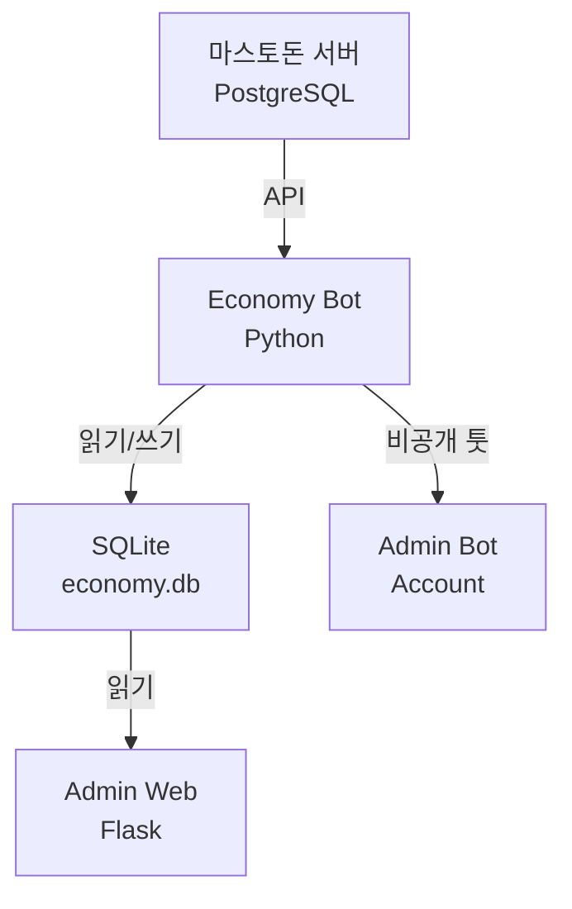
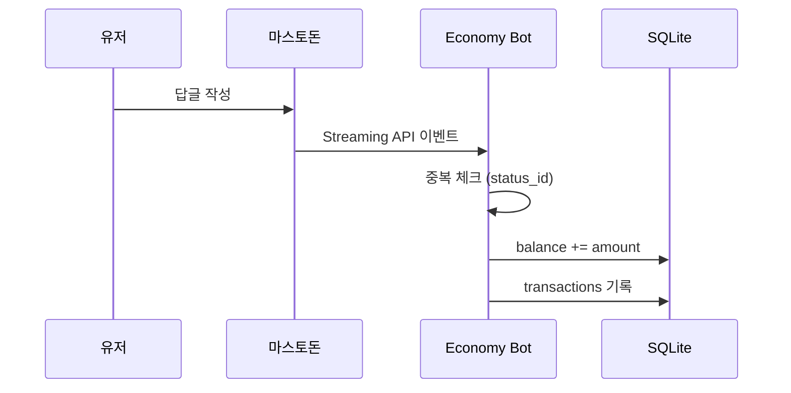
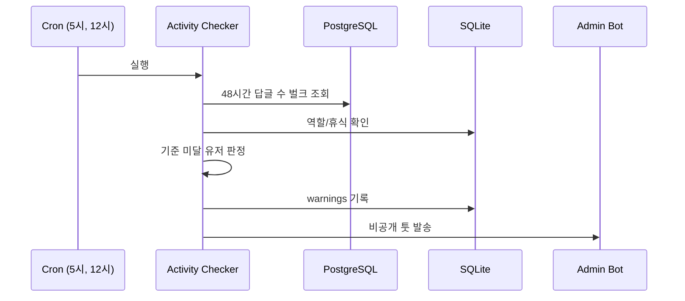

# 시스템 아키텍처

## 전체 구조

## 데이터 흐름

### 재화 지급

### 활동량 체크 (벌크)

## 주요 컴포넌트

### reward_bot.py
- Streaming API로 실시간 감지
- 답글 작성 시 즉시 재화 지급
- status_id로 중복 방지
- systemd 24시간 구동

### activity_checker.py
- cron: 오전 5시, 오후 12시
- PostgreSQL 벌크 쿼리 (48시간)
- role 필터링: user만 체크
- 휴식계 제외
- 경고 발송 (관리자 봇)

### command_handler.py
- 봇 멘션 처리
- 명령어: 내재화, 상점, 구매, 휴식 등
- DM 응답

### admin_web (Flask)
- OAuth 인증
- 대시보드, 활동량 관리, 재화 관리
- 상점 관리, 설정, 로그

## 성능 고려

### 병목 지점
- PostgreSQL 쿼리 → 하루 2회 벌크 처리
- SQLite 동시 쓰기 → WAL 모드
- Streaming 연결 끊김 → systemd 자동 재시작

### 확장성
- 50명: SQLite 충분
- 100명+: PostgreSQL 마이그레이션 검토
