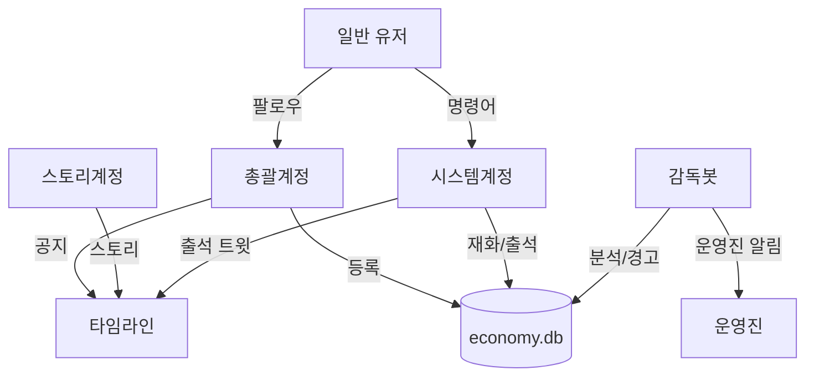

# 봇/계정 구조

## 4개 계정



## 1. 총괄계정

**역할**: 커뮤니티 대표, 어드민

**기능**:
- 유저 팔로우 → DB 등록 (follow 이벤트)
- 관리자 웹 OAuth (총괄계정 + role='admin' 유저)
- 공지 발행 (announcement)

## 2. 스토리계정

**역할**: 콘텐츠 전용

**기능**:
- 스토리 발행 (story)
- 자동 발행 (scheduled_posts)

## 3. 시스템계정 (@봇)

**역할**: 유저 친화적 봇

**자동 시스템**:
- 재화 지급 (4시/16시)
- 출석 트윗 발행 (10시)
- 출석 답글 처리

**명령어**:
- `@봇 내재화`, `@봇 상점`, `@봇 구매 [아이템]`, `@봇 내아이템`
- `@봇 휴식 N`, `@봇 휴식 해제`
- `@봇 일정`, `@봇 공지`, `@봇 도움말`

**응답**: 모두 DM

## 4. 감독봇

**역할**: 백그라운드 관리

**기능**:
- 소셜 분석 실행 (매일 4시)
- 경고 발송 (관리자 판단 후 수동)
- 운영진 알림 (admin_notice, private)
- 크리티컬 에러 알림

## 계정 설정 (settings)

```sql
INSERT INTO settings (key, value, description) VALUES
('admin_account', 'admin_account_name', '총괄계정명'),
('story_account', 'story_account_name', '스토리 계정명'),
('system_bot_account', 'system_bot_name', '시스템계정명'),
('supervisor_bot_account', 'supervisor_bot_name', '감독봇 계정명'),
('attendance_tweet_template', '🌟 오늘의 출석 체크!\n이 트윗에 답글 달아주세요!', '출석 트윗 템플릿');
```

## 유저 플로우

### 가입
1. 총괄계정 팔로우
2. economy.db에 등록

### 일상
1. 답글 작성 → 재화 누적 (4시/16시 정산)
2. 출석 트윗 답글 → 재화 지급
3. `@봇 내재화` → 보유 재화 확인
4. `@봇 상점` → `@봇 구매` → 아이템 구매

### 휴식
1. `@봇 휴식 7` → 7일간 휴식
2. 활동량 체크 제외
3. `@봇 휴식 해제` → 조기 복귀

### 경고
1. 감독봇이 소셜 분석 (매일 4시)
2. 관리자 웹에서 확인
3. 관리자가 경고 발송 결정
4. 감독봇이 DM 발송

## 구현 순서

**Phase 1**:
1. 총괄계정: 팔로우 등록
2. 시스템계정: 재화 지급, 출석 체크, 기본 명령어

**Phase 2**:
3. 감독봇: 소셜 분석, 경고 발송
4. 스토리계정: 예약 발송

**Phase 3**:
5. 시스템계정: 상점 기능
