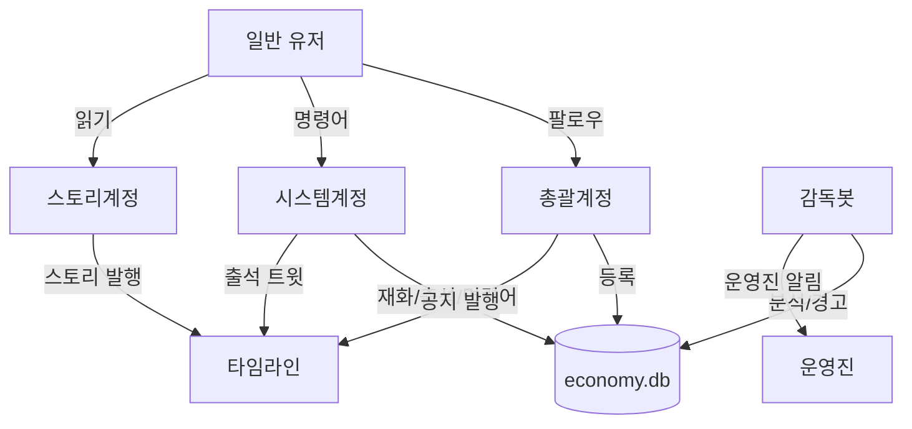

# 봇/계정 구조

## 개요

마녀봇 시스템은 4개의 마스토돈 계정으로 구성됩니다.



## 1. 총괄계정

**역할**: 커뮤니티 대표 계정, 어드민 역할

**기능**:
- 유저 팔로우 시 DB 등록 (follow 이벤트 트리거)
- 관리자 웹 OAuth 인증 (총괄계정 + role='admin' 유저)
- 공지 발행 (announcement type)

**특징**:
- 유저 진입점 (팔로우 = 가입)
- 공식 대표 계정
- 직접 멘션 받지 않음

## 2. 스토리계정

**역할**: 커뮤니티 스토리 콘텐츠 전용

**기능**:
- 예약된 스토리 발행 (story type)

**특징**:
- 콘텐츠 전용
- 자동 발행 (scheduled_posts)
- 유저 상호작용 없음

## 3. 시스템계정 (@봇)

**역할**: 유저 친화적 시스템 봇

**기능**:
- **자동 시스템**:
  - 재화 지급 (일괄 정산, 4시/16시)
  - 출석 체크 트윗 발행 (10시)
  - 출석 답글 처리 (재화 지급)

- **명령어 처리**:
  - `@봇 내재화`: 재화 조회
  - `@봇 상점`: 아이템 목록
  - `@봇 구매 [아이템]`: 아이템 구매
  - `@봇 내아이템`: 보유 아이템
  - `@봇 휴식 N`: 휴식 등록
  - `@봇 휴식 해제`: 휴식 해제
  - `@봇 일정`: 일정 조회
  - `@봇 공지`: 공지 조회
  - `@봇 도움말`: 명령어 안내

- **응답**: 모두 DM으로 전송

**특징**:
- 유저와의 주 접점
- 친근한 톤
- 보상/혜택 중심

## 4. 감독봇

**역할**: 백그라운드 분석 및 관리

**기능**:
- **자동 분석**:
  - 소셜 분석 실행 (매일 4시)
  - user_stats 저장

- **경고 발송**:
  - 활동량 미달 경고 (관리자 판단 후 수동)
  - 소셜 분석 경고 (편중/고립/비활동)

- **운영진 알림**:
  - admin_notice 발행 (운영진 전용, private)
  - 크리티컬 에러 알림 (DB 실패, API 오류 등)

**특징**:
- 유저에게 직접 노출 안 됨
- 관리/감시 역할
- 경고/알림 전담

## 계정 정보 (settings)

```sql
INSERT INTO settings (key, value, description) VALUES
-- 계정 설정
('admin_account', 'admin_account_name', '총괄계정명'),
('story_account', 'story_account_name', '스토리 계정명'),
('system_bot_account', 'system_bot_name', '시스템계정명 (@봇)'),
('supervisor_bot_account', 'supervisor_bot_name', '감독봇 계정명'),

-- 출석 트윗 템플릿
('attendance_tweet_template', '🌟 오늘의 출석 체크!\n이 트윗에 답글 달아주세요!', '출석 트윗 템플릿');
```

## 유저 플로우

### 가입
1. 총괄계정 팔로우
2. follow 이벤트 감지
3. economy.db에 등록
4. (환영 메시지 없음)

### 일상 활동
1. 답글 작성 → 재화 누적 (4시/16시 정산)
2. 시스템계정 출석 트윗 → 답글 → 재화 지급
3. `@봇 내재화` → 보유 재화 확인
4. `@봇 상점` → `@봇 구매` → 아이템 구매

### 휴식
1. `@봇 휴식 7` → 7일간 휴식 등록
2. 활동량 체크 제외
3. `@봇 휴식 해제` → 조기 복귀

### 경고 (관리자 판단)
1. 감독봇이 소셜 분석 실행 (매일 4시)
2. 관리자 웹에서 문제 유저 확인
3. 관리자가 경고 발송 결정
4. 감독봇이 DM 발송

## 구현 순서

### Phase 1
1. 총괄계정: 팔로우 등록
2. 시스템계정: 재화 지급, 출석 체크, 기본 명령어

### Phase 2
3. 감독봇: 소셜 분석, 경고 발송
4. 스토리계정: 예약 발송

### Phase 3
5. 시스템계정: 상점 기능 (아이템, 구매)
