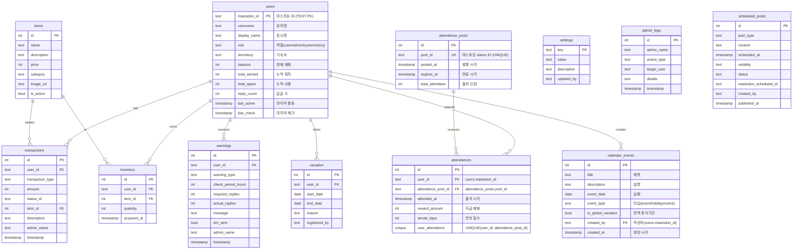

# 데이터베이스 설계

## DB 전략


## ERD



## SQLite 테이블 (economy.db)

## 논리 설계 결정 사항

### PK 전략
- **users.mastodon_id를 TEXT PK로 사용**
- 이유: 마스토돈 API와 직접 매핑, 코드 단순화, 소규모 프로젝트에 적합
- 장점: JOIN 감소, 코드 직관성
- 단점: TEXT PK 성능 (미미한 차이), 마이그레이션 어려움
- 트레이드오프: 단순성 > 성능 최적화

### 중복 방지 전략
- **attendances**: UNIQUE(user_id, attendance_post_id) - DB 레벨 제약
- **transactions**: status_id로 애플리케이션 레벨 체크
- **attendance_posts**: post_id UNIQUE

### 타임존
- **Asia/Seoul** 기준
- 출석/활동량 체크 모두 서울 시간 기준

### 전역 휴식기간
- **출석 트윗 발행 자체를 막음** (cron/celery에서 체크)
- 활동량 체크도 비활성화

---

### users
```sql
CREATE TABLE users (
    mastodon_id TEXT PRIMARY KEY,     -- 마스토돈 ID (TEXT PK)
    username TEXT NOT NULL,
    display_name TEXT,
    role TEXT DEFAULT 'user',         -- user/admin/system/story
    dormitory TEXT,
    balance INTEGER DEFAULT 0,
    total_earned INTEGER DEFAULT 0,
    total_spent INTEGER DEFAULT 0,
    reply_count INTEGER DEFAULT 0,
    last_active TIMESTAMP,
    last_check TIMESTAMP,
    created_at TIMESTAMP DEFAULT CURRENT_TIMESTAMP
);
CREATE INDEX idx_users_balance ON users(balance DESC);
CREATE INDEX idx_users_role ON users(role);
```

### transactions
```sql
CREATE TABLE transactions (
    id INTEGER PRIMARY KEY AUTOINCREMENT,
    user_id TEXT NOT NULL,
    transaction_type TEXT NOT NULL,  -- earn_reply/spend_shop/admin_add 등
    amount INTEGER NOT NULL,
    status_id TEXT,                  -- 중복 방지용
    item_id INTEGER,
    description TEXT,
    admin_name TEXT,
    timestamp TIMESTAMP DEFAULT CURRENT_TIMESTAMP,
    FOREIGN KEY(user_id) REFERENCES users(mastodon_id)
);
CREATE INDEX idx_transactions_user ON transactions(user_id, timestamp DESC);
CREATE INDEX idx_transactions_status ON transactions(status_id);
```

### warnings
```sql
CREATE TABLE warnings (
    id INTEGER PRIMARY KEY AUTOINCREMENT,
    user_id TEXT NOT NULL,
    warning_type TEXT DEFAULT 'auto',  -- auto/manual
    check_period_hours INTEGER,
    required_replies INTEGER,
    actual_replies INTEGER,
    message TEXT,
    dm_sent BOOLEAN DEFAULT 0,
    admin_name TEXT,
    timestamp TIMESTAMP DEFAULT CURRENT_TIMESTAMP,
    FOREIGN KEY(user_id) REFERENCES users(mastodon_id)
);
CREATE INDEX idx_warnings_user ON warnings(user_id, timestamp DESC);
```

### settings
```sql
CREATE TABLE settings (
    key TEXT PRIMARY KEY,
    value TEXT NOT NULL,
    description TEXT,
    updated_at TIMESTAMP DEFAULT CURRENT_TIMESTAMP,
    updated_by TEXT
);

-- 기본값
INSERT INTO settings (key, value, description) VALUES
('timezone', 'Asia/Seoul', '타임존 (서울 시간 기준)'),
('check_times', '04:00,16:00', '활동량 체크 시간 (12시간 간격)'),
('check_period_hours', '48', '체크 기간'),
('min_replies_48h', '20', '최소 답글 수'),
('replies_per_reward', '1', '답글당 재화'),
('reward_amount', '10', '지급량');
```

### vacation
```sql
CREATE TABLE vacation (
    id INTEGER PRIMARY KEY AUTOINCREMENT,
    user_id TEXT NOT NULL,
    start_date DATE NOT NULL,
    end_date DATE NOT NULL,
    reason TEXT,
    registered_by TEXT,
    created_at TIMESTAMP DEFAULT CURRENT_TIMESTAMP,
    FOREIGN KEY(user_id) REFERENCES users(mastodon_id)
);
CREATE INDEX idx_vacation_dates ON vacation(start_date, end_date);
```

### items
```sql
CREATE TABLE items (
    id INTEGER PRIMARY KEY AUTOINCREMENT,
    name TEXT NOT NULL,
    description TEXT,
    price INTEGER NOT NULL,
    category TEXT,
    image_url TEXT,
    is_active BOOLEAN DEFAULT 1,
    created_at TIMESTAMP DEFAULT CURRENT_TIMESTAMP
);
```

### inventory
```sql
CREATE TABLE inventory (
    id INTEGER PRIMARY KEY AUTOINCREMENT,
    user_id TEXT NOT NULL,
    item_id INTEGER NOT NULL,
    quantity INTEGER DEFAULT 1,
    acquired_at TIMESTAMP DEFAULT CURRENT_TIMESTAMP,
    FOREIGN KEY(user_id) REFERENCES users(mastodon_id),
    FOREIGN KEY(item_id) REFERENCES items(id),
    UNIQUE(user_id, item_id)
);
```

### admin_logs
```sql
CREATE TABLE admin_logs (
    id INTEGER PRIMARY KEY AUTOINCREMENT,
    admin_name TEXT NOT NULL,
    action_type TEXT NOT NULL,  -- adjust_balance/send_warning/change_settings 등
    target_user TEXT,
    details TEXT,
    timestamp TIMESTAMP DEFAULT CURRENT_TIMESTAMP
);
CREATE INDEX idx_admin_logs_timestamp ON admin_logs(timestamp DESC);
```

### scheduled_posts (스토리/공지/운영진 공지 예약)
```sql
CREATE TABLE scheduled_posts (
    id INTEGER PRIMARY KEY AUTOINCREMENT,
    post_type TEXT NOT NULL,            -- story/announcement/admin_notice
    content TEXT NOT NULL,
    scheduled_at TIMESTAMP NOT NULL,
    visibility TEXT DEFAULT 'public',   -- public/unlisted/private (admin_notice는 항상 private)
    status TEXT DEFAULT 'pending',      -- pending/published/cancelled
    mastodon_scheduled_id TEXT,         -- 마스토돈 예약 ID
    created_by TEXT NOT NULL,           -- 작성한 관리자
    created_at TIMESTAMP DEFAULT CURRENT_TIMESTAMP,
    published_at TIMESTAMP
);
CREATE INDEX idx_scheduled_posts_scheduled ON scheduled_posts(scheduled_at);
CREATE INDEX idx_scheduled_posts_status ON scheduled_posts(status);
CREATE INDEX idx_scheduled_posts_type ON scheduled_posts(post_type);
```

**post_type 설명**:
- `story`: 스토리 계정으로 발행
- `announcement`: 공지 계정으로 발행
- `admin_notice`: 관리자 봇으로 비공개 툿 발행 (운영진 전용)

**계정 설정** (settings 테이블에 추가):
```sql
INSERT INTO settings (key, value, description) VALUES
('story_account', 'story_account_name', '스토리 계정명'),
('announcement_account', 'notice_account_name', '공지 계정명'),
('admin_bot_account', 'admin_bot_name', '관리자 봇 계정명 (운영진 공지용)');
```

### attendances (출석 기록)
```sql
CREATE TABLE attendances (
    id INTEGER PRIMARY KEY AUTOINCREMENT,
    user_id TEXT NOT NULL,
    attendance_post_id TEXT NOT NULL,     -- 출석 트윗 post_id (FK)
    attended_at TIMESTAMP DEFAULT CURRENT_TIMESTAMP,
    reward_amount INTEGER NOT NULL,       -- 지급된 재화 (기본 + 연속 보너스)
    streak_days INTEGER DEFAULT 1,        -- 연속 출석 일수
    FOREIGN KEY(user_id) REFERENCES users(mastodon_id),
    FOREIGN KEY(attendance_post_id) REFERENCES attendance_posts(post_id),
    UNIQUE(user_id, attendance_post_id)   -- 중복 출석 방지 (DB 레벨)
);
CREATE INDEX idx_attendances_user ON attendances(user_id, attended_at DESC);
CREATE INDEX idx_attendances_post ON attendances(attendance_post_id);
```

**비즈니스 규칙:**
- 한 유저는 같은 출석 트윗에 1회만 출석 가능 (UNIQUE 제약)
- 하루 기준: Asia/Seoul 타임존
- reward_amount: 저장 이유 = 과거 보상 규칙 변경돼도 히스토리 유지
- streak_days: 저장 이유 = 특정 시점의 연속일 확인 가능

### attendance_posts (출석 트윗 기록)
```sql
CREATE TABLE attendance_posts (
    id INTEGER PRIMARY KEY AUTOINCREMENT,
    post_id TEXT UNIQUE NOT NULL,         -- 마스토돈 status ID
    posted_at TIMESTAMP DEFAULT CURRENT_TIMESTAMP,
    expires_at TIMESTAMP,                 -- 출석 마감 시간 (posted_at + 23h 59m)
    total_attendees INTEGER DEFAULT 0
);
CREATE INDEX idx_attendance_posts_posted ON attendance_posts(posted_at DESC);
```

**출석 설정** (settings 테이블에 추가):
```sql
INSERT INTO settings (key, value, description) VALUES
('attendance_time', '10:00', '출석 트윗 발행 시간'),
('attendance_base_reward', '50', '기본 출석 보상'),
('attendance_streak_7', '20', '7일 연속 보너스'),
('attendance_streak_14', '50', '14일 연속 보너스'),
('attendance_streak_30', '100', '30일 연속 보너스'),
('attendance_enabled', 'true', '출석 체크 시스템 활성화'),
('activity_check_enabled', 'true', '활동량 체크 시스템 활성화');
```

### calendar_events (커뮤니티 일정/이벤트)
```sql
CREATE TABLE calendar_events (
    id INTEGER PRIMARY KEY AUTOINCREMENT,
    title TEXT NOT NULL,
    description TEXT,
    event_date DATE NOT NULL,
    event_type TEXT DEFAULT 'event',    -- event/holiday/notice
    is_global_vacation BOOLEAN DEFAULT 0,  -- 전역 휴식기간 여부
    created_by TEXT NOT NULL,
    created_at TIMESTAMP DEFAULT CURRENT_TIMESTAMP,
    updated_at TIMESTAMP DEFAULT CURRENT_TIMESTAMP
);
CREATE INDEX idx_calendar_events_date ON calendar_events(event_date DESC);
CREATE INDEX idx_calendar_events_vacation ON calendar_events(is_global_vacation);
```

**event_type 설명**:
- `event`: 일반 커뮤니티 이벤트
- `holiday`: 공휴일/기념일
- `notice`: 중요 공지 날짜

**전역 휴식기간 (is_global_vacation=true)**:
- 해당 날짜에는 출석 체크 및 활동량 체크 비활성화
- 커뮤니티 전체 휴식 기간 지정 가능
- 관리자 웹에서 설정

### 추후 구현
- 게임 시스템 관련 테이블 (게임 종류 및 세부 사항 결정 후 추가)
- 아이템 양도 관련 테이블 (필요 시 추가)

## PostgreSQL 참조 (읽기 전용)

### 48시간 답글 수 조회 (벌크)
```sql
SELECT
    u.id,
    u.username,
    COUNT(s.id) as reply_count
FROM accounts u
LEFT JOIN statuses s ON s.account_id = u.id
    AND s.in_reply_to_id IS NOT NULL
    AND s.created_at > NOW() - INTERVAL '48 hours'
WHERE u.suspended = false
GROUP BY u.id, u.username;
```

## 백업
```bash
# 매일 3시 SQLite 백업
0 3 * * * sqlite3 /path/to/economy.db ".backup '/backups/economy_$(date +\%Y\%m\%d).db'"

# 60일 지난 백업 삭제
0 6 * * 0 find /backups -name "*.db" -mtime +60 -delete
```

### user_stats (소셜 분석 통계)
```sql
CREATE TABLE user_stats (
    id INTEGER PRIMARY KEY AUTOINCREMENT,
    user_id TEXT NOT NULL,
    analyzed_at TIMESTAMP DEFAULT CURRENT_TIMESTAMP,

    -- 대화 상대 분석 (48시간)
    unique_conversation_partners INTEGER DEFAULT 0,  -- 대화한 서로 다른 계정 수
    total_replies_sent INTEGER DEFAULT 0,             -- 보낸 답글 수
    top_partner_id TEXT,                              -- 가장 많이 대화한 계정 ID
    top_partner_username TEXT,                        -- 최다 대화 상대 username
    top_partner_count INTEGER DEFAULT 0,              -- 최다 상대와의 대화 횟수
    top_partner_ratio REAL DEFAULT 0.0,               -- 최다 대화 상대 비율 (0.0~1.0)

    -- 접속률 분석 (7일)
    active_days_7d INTEGER DEFAULT 0,                 -- 7일 중 활동한 날 수
    login_rate_7d REAL DEFAULT 0.0,                   -- 접속률 (0.0~1.0)

    -- 문제 지표
    is_isolated BOOLEAN DEFAULT 0,                    -- 고립: 대화 상대 < 3명
    is_inactive BOOLEAN DEFAULT 0,                    -- 비활동: 접속률 < 50%
    is_biased BOOLEAN DEFAULT 0,                      -- 편중: 특정 1명과 > 70% 대화

    FOREIGN KEY(user_id) REFERENCES users(mastodon_id)
);
CREATE INDEX idx_user_stats_user ON user_stats(user_id, analyzed_at DESC);
CREATE INDEX idx_user_stats_isolated ON user_stats(is_isolated);
CREATE INDEX idx_user_stats_biased ON user_stats(is_biased);
```

**분석 기준:**
- **고립 (is_isolated)**: 48시간 내 대화 상대 < 7명
- **비활동 (is_inactive)**: 7일 접속률 < 50%
- **편중 (is_biased)**: 특정 1명과의 대화 > 30%

**활용:**
- 새벽 4시 벌크 분석 시 자동 계산
- 관리자 웹에서 문제 유저 목록 조회
- 편중 유저에게 자동 경고 발송 가능

### warning_templates (경고 메시지 템플릿)
```sql
CREATE TABLE warning_templates (
    id INTEGER PRIMARY KEY AUTOINCREMENT,
    name TEXT NOT NULL,
    warning_type TEXT NOT NULL,              -- activity/isolation/inactive/bias/custom
    template TEXT NOT NULL,                   -- 템플릿 문자열 (변수 사용 가능)
    created_by TEXT,
    created_at TIMESTAMP DEFAULT CURRENT_TIMESTAMP,
    FOREIGN KEY(created_by) REFERENCES users(mastodon_id)
);

-- 기본 템플릿
INSERT INTO warning_templates (name, warning_type, template) VALUES
('활동량 미달 기본', 'activity',
 '@{username}님, 최근 48시간 답글이 {actual_replies}개로 기준({required_replies}개)에 미달했습니다. 커뮤니티 활동에 관심 부탁드립니다.'),
('고립 위험 기본', 'isolation',
 '@{username}님, 최근 대화 상대가 {unique_partners}명으로 적습니다. 다양한 멤버와 소통해보세요!'),
('비활동 기본', 'inactive',
 '@{username}님, 최근 7일 접속률이 {login_rate}%입니다. 커뮤니티에 관심 가져주세요!'),
('편중 경고 기본', 'bias',
 '@{username}님, @{top_partner}와의 대화가 {ratio}%입니다. 다양한 멤버와 소통해보세요!');
```

**사용 가능한 변수:**
- `{username}`: 유저명
- `{unique_partners}`: 대화 상대 수
- `{actual_replies}`: 실제 답글 수
- `{required_replies}`: 요구 답글 수
- `{login_rate}`: 접속률 (%)
- `{top_partner}`: 최다 대화 상대
- `{ratio}`: 최다 대화 비율 (%)

### ban_records (밴 기록)
```sql
CREATE TABLE ban_records (
    id INTEGER PRIMARY KEY AUTOINCREMENT,
    user_id TEXT NOT NULL,
    banned_at TIMESTAMP DEFAULT CURRENT_TIMESTAMP,
    banned_by TEXT NOT NULL,                  -- 관리자 username
    reason TEXT NOT NULL,                     -- 밴 사유
    warning_count INTEGER,                    -- 경고 횟수 (참고용)
    evidence_snapshot TEXT,                   -- 증거물 JSON (경고 이력, 통계 등)
    is_active BOOLEAN DEFAULT 1,              -- 활성화 여부
    unbanned_at TIMESTAMP,
    unbanned_by TEXT,
    unban_reason TEXT,
    FOREIGN KEY(user_id) REFERENCES users(mastodon_id)
);
CREATE INDEX idx_ban_records_user ON ban_records(user_id);
CREATE INDEX idx_ban_records_active ON ban_records(is_active);
```

**evidence_snapshot 구조 (JSON):**
```json
{
  "user_info": {
    "username": "user1",
    "mastodon_id": "115565546282398331",
    "role": "user",
    "banned_at": "2025-11-18 04:30:00"
  },
  "warning_history": [
    {
      "id": 1,
      "warning_type": "social_bias",
      "message": "편중 경고",
      "timestamp": "2025-11-15 04:00:00",
      "dm_sent": 0
    },
    {
      "id": 2,
      "warning_type": "activity",
      "message": "활동량 미달",
      "timestamp": "2025-11-16 04:00:00",
      "dm_sent": 0
    },
    {
      "id": 3,
      "warning_type": "social_bias",
      "message": "편중 경고",
      "timestamp": "2025-11-17 04:00:00",
      "dm_sent": 0
    }
  ],
  "latest_stats": {
    "unique_partners": 2,
    "total_replies": 25,
    "top_partner_ratio": 0.8,
    "active_days_7d": 3,
    "login_rate": 0.42,
    "is_isolated": 1,
    "is_biased": 1,
    "is_inactive": 1
  }
}
```

**밴 운영 정책:**
- 수동 밴 전용 (관리자 판단)
- 밴 시 증거물 자동 저장 (경고 이력, 최근 통계)
- 언밴 가능 (is_active=0 처리)

---

## 초기화
```bash
python3 init_db.py
```
