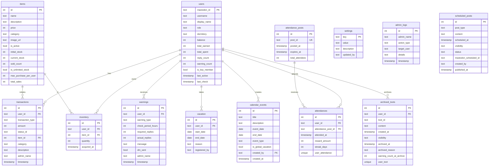

# 데이터베이스 설계

## DB 전략


## ERD



## SQLite 테이블 (economy.db)

### users
```sql
CREATE TABLE users (
    mastodon_id TEXT PRIMARY KEY,
    username TEXT NOT NULL,
    display_name TEXT,
    role TEXT DEFAULT 'user',
    dormitory TEXT,
    balance INTEGER DEFAULT 0,
    total_earned INTEGER DEFAULT 0,
    total_spent INTEGER DEFAULT 0,
    reply_count INTEGER DEFAULT 0,
    warning_count INTEGER DEFAULT 0,
    is_key_member BOOLEAN DEFAULT 0,
    last_active TIMESTAMP,
    last_check TIMESTAMP,
    created_at TIMESTAMP DEFAULT CURRENT_TIMESTAMP
);
CREATE INDEX idx_users_balance ON users(balance DESC);
CREATE INDEX idx_users_role ON users(role);
CREATE INDEX idx_users_warning_count ON users(warning_count);
CREATE INDEX idx_users_key_member ON users(is_key_member);
```

**경고 시스템**:
- `warning_count`: 누적 경고 횟수 (3회 도달 시 자동 아웃)
- 경고 발생 시 warnings 테이블에 기록되며 warning_count가 1 증가

**주요 멤버**:
- `is_key_member`: 주요 멤버 여부 (1이면 회피 패턴 감지 대상)
- 관리자가 수동으로 지정하는 필드

### transactions
```sql
CREATE TABLE transactions (
    id INTEGER PRIMARY KEY AUTOINCREMENT,
    user_id TEXT NOT NULL,
    transaction_type TEXT NOT NULL,
    amount INTEGER NOT NULL,
    status_id TEXT,
    item_id INTEGER,
    category TEXT,
    description TEXT,
    admin_name TEXT,
    timestamp TIMESTAMP DEFAULT CURRENT_TIMESTAMP,
    FOREIGN KEY(user_id) REFERENCES users(mastodon_id)
);
CREATE INDEX idx_transactions_user ON transactions(user_id, timestamp DESC);
CREATE INDEX idx_transactions_status ON transactions(status_id);
CREATE INDEX idx_transactions_category ON transactions(category);
```

**거래 유형 및 카테고리**:
- `transaction_type`: 거래 타입 (reward_settlement, manual_adjust, attendance, shop_purchase 등)
- `category`: 거래 분류 (보상, 구매, 정산, 수동조정 등) - 필터링 및 통계 분석용

### warnings
```sql
CREATE TABLE warnings (
    id INTEGER PRIMARY KEY AUTOINCREMENT,
    user_id TEXT NOT NULL,
    warning_type TEXT DEFAULT 'auto',
    check_period_hours INTEGER,
    required_replies INTEGER,
    actual_replies INTEGER,
    message TEXT,
    dm_sent BOOLEAN DEFAULT 0,
    admin_name TEXT,
    timestamp TIMESTAMP DEFAULT CURRENT_TIMESTAMP,
    FOREIGN KEY(user_id) REFERENCES users(mastodon_id)
);
CREATE INDEX idx_warnings_user ON warnings(user_id, timestamp DESC);
```

### settings
```sql
CREATE TABLE settings (
    key TEXT PRIMARY KEY,
    value TEXT NOT NULL,
    description TEXT,
    updated_at TIMESTAMP DEFAULT CURRENT_TIMESTAMP,
    updated_by TEXT
);

INSERT INTO settings (key, value, description) VALUES
('timezone', 'Asia/Seoul', '타임존'),
('check_period_hours', '48', '조회 기간 (시간)'),
('min_replies_48h', '5', '최소 답글 수 기준'),
('reward_reply_count', '100', '재화 지급 기준 답글 수'),
('reward_per_replies', '10', 'N개당 지급 재화'),
('last_reward_settlement_time', '2025-01-01 00:00:00', '마지막 정산 시각'),
('attendance_time', '10:00', '출석 트윗 발행 시간'),
('attendance_base_reward', '50', '기본 출석 보상'),
('attendance_check_enabled', '1', '출석 체크 활성화'),
('max_vacation_days', '90', '최대 휴식 기간 (일)'),
('vacation_self_service_enabled', '1', '봇 명령어 셀프 등록 허용'),
('isolation_threshold', '7', '고립 판정 기준 (N명 미만)'),
('bias_threshold', '0.1', '편향 판정 기준 (비율)'),
('inactive_threshold', '0.5', '비활동 판정 기준 (접속률)'),
('archive_warning_threshold', '3', '툿 아카이빙 경고 임계값'),
('admin_account_id', '', '어드민 마스토돈 계정 ID');
```

### vacation
```sql
CREATE TABLE vacation (
    id INTEGER PRIMARY KEY AUTOINCREMENT,
    user_id TEXT NOT NULL,
    start_date DATE NOT NULL,
    start_time TIME,
    end_date DATE NOT NULL,
    end_time TIME,
    reason TEXT,
    approved BOOLEAN DEFAULT 1,
    registered_by TEXT,
    created_at TIMESTAMP DEFAULT CURRENT_TIMESTAMP,
    FOREIGN KEY(user_id) REFERENCES users(mastodon_id)
);
CREATE INDEX idx_vacation_dates ON vacation(start_date, end_date);
```

**시간 필드**:
- `start_time`, `end_time`: NULL이면 전일 (00:00~23:59)
- 예: 2025-12-25 14:00 ~ 2025-12-26 18:00

### items
```sql
CREATE TABLE items (
    id INTEGER PRIMARY KEY AUTOINCREMENT,
    name TEXT NOT NULL,
    description TEXT,
    price INTEGER NOT NULL,
    category TEXT,
    image_url TEXT,
    is_active BOOLEAN DEFAULT 1,
    initial_stock INTEGER DEFAULT 0,
    current_stock INTEGER DEFAULT 0,
    sold_count INTEGER DEFAULT 0,
    is_unlimited_stock BOOLEAN DEFAULT 0,
    max_purchase_per_user INTEGER,
    total_sales INTEGER DEFAULT 0,
    created_at TIMESTAMP DEFAULT CURRENT_TIMESTAMP
);
```

**재고 관리**:
- `initial_stock`: 초기 재고 수량
- `current_stock`: 현재 남은 재고
- `sold_count`: 판매된 개수 (구매 시 증가)
- `is_unlimited_stock`: 무제한 재고 여부 (1이면 재고 무관)
- `max_purchase_per_user`: 1인당 최대 구매 개수 (NULL이면 제한 없음)
- `total_sales`: 총 매출액 (price × sold_count)

### inventory
```sql
CREATE TABLE inventory (
    id INTEGER PRIMARY KEY AUTOINCREMENT,
    user_id TEXT NOT NULL,
    item_id INTEGER NOT NULL,
    quantity INTEGER DEFAULT 1,
    acquired_at TIMESTAMP DEFAULT CURRENT_TIMESTAMP,
    FOREIGN KEY(user_id) REFERENCES users(mastodon_id),
    FOREIGN KEY(item_id) REFERENCES items(id),
    UNIQUE(user_id, item_id)
);
```

### admin_logs
```sql
CREATE TABLE admin_logs (
    id INTEGER PRIMARY KEY AUTOINCREMENT,
    admin_name TEXT NOT NULL,
    action_type TEXT NOT NULL,
    target_user TEXT,
    details TEXT,
    timestamp TIMESTAMP DEFAULT CURRENT_TIMESTAMP
);
CREATE INDEX idx_admin_logs_timestamp ON admin_logs(timestamp DESC);
```

### scheduled_posts
```sql
CREATE TABLE scheduled_posts (
    id INTEGER PRIMARY KEY AUTOINCREMENT,
    post_type TEXT NOT NULL,
    content TEXT NOT NULL,
    scheduled_at TIMESTAMP NOT NULL,
    visibility TEXT DEFAULT 'public',
    is_public BOOLEAN DEFAULT 1,
    status TEXT DEFAULT 'pending',
    mastodon_scheduled_id TEXT,
    created_by TEXT NOT NULL,
    created_at TIMESTAMP DEFAULT CURRENT_TIMESTAMP,
    published_at TIMESTAMP
);
CREATE INDEX idx_scheduled_posts_scheduled ON scheduled_posts(scheduled_at);
CREATE INDEX idx_scheduled_posts_status ON scheduled_posts(status);
CREATE INDEX idx_scheduled_posts_type ON scheduled_posts(post_type);
CREATE INDEX idx_scheduled_posts_public ON scheduled_posts(is_public);
```

**post_type**:
- `story`: 스토리 계정 발행
- `announcement`: 총괄계정 발행 (공지)
- `admin_notice`: 감독봇 발행 (운영진 전용, private)

**is_public**: 1 (공개, `@봇 공지`에 표시), 0 (비공개, 관리자 전용)

**계정 설정**:
```sql
INSERT INTO settings (key, value, description) VALUES
('admin_account', 'admin_account_name', '총괄계정명'),
('story_account', 'story_account_name', '스토리 계정명'),
('system_bot_account', 'system_bot_name', '시스템계정명 (@봇)'),
('supervisor_bot_account', 'supervisor_bot_name', '감독봇 계정명'),
('attendance_tweet_template', '🌟 오늘의 출석 체크!\n이 트윗에 답글 달아주세요!', '출석 트윗 템플릿');
```

### attendances
```sql
CREATE TABLE attendances (
    id INTEGER PRIMARY KEY AUTOINCREMENT,
    user_id TEXT NOT NULL,
    attendance_post_id TEXT NOT NULL,
    attended_at TIMESTAMP DEFAULT CURRENT_TIMESTAMP,
    reward_amount INTEGER NOT NULL,
    FOREIGN KEY(user_id) REFERENCES users(mastodon_id),
    FOREIGN KEY(attendance_post_id) REFERENCES attendance_posts(post_id),
    UNIQUE(user_id, attendance_post_id)
);
CREATE INDEX idx_attendances_user ON attendances(user_id, attended_at DESC);
CREATE INDEX idx_attendances_post ON attendances(attendance_post_id);
```

### attendance_posts
```sql
CREATE TABLE attendance_posts (
    id INTEGER PRIMARY KEY AUTOINCREMENT,
    post_id TEXT UNIQUE NOT NULL,
    posted_at TIMESTAMP DEFAULT CURRENT_TIMESTAMP,
    expires_at TIMESTAMP,
    total_attendees INTEGER DEFAULT 0
);
CREATE INDEX idx_attendance_posts_posted ON attendance_posts(posted_at DESC);
```

**출석 설정**:
```sql
INSERT INTO settings (key, value, description) VALUES
('attendance_time', '10:00', '출석 트윗 발행 시간'),
('attendance_base_reward', '50', '기본 출석 보상'),
('attendance_streak_7', '20', '7일 연속 보너스'),
('attendance_streak_14', '50', '14일 연속 보너스'),
('attendance_streak_30', '100', '30일 연속 보너스'),
('attendance_enabled', 'true', '출석 체크 활성화'),
('activity_check_enabled', 'true', '활동량 체크 활성화');
```

### calendar_events
```sql
CREATE TABLE calendar_events (
    id INTEGER PRIMARY KEY AUTOINCREMENT,
    title TEXT NOT NULL,
    description TEXT,
    event_date DATE NOT NULL,
    start_time TIME,
    end_date DATE,
    end_time TIME,
    event_type TEXT DEFAULT 'event',
    is_global_vacation BOOLEAN DEFAULT 0,
    created_by TEXT NOT NULL,
    created_at TIMESTAMP DEFAULT CURRENT_TIMESTAMP,
    updated_at TIMESTAMP DEFAULT CURRENT_TIMESTAMP
);
CREATE INDEX idx_calendar_events_date ON calendar_events(event_date DESC);
CREATE INDEX idx_calendar_events_vacation ON calendar_events(is_global_vacation);
```

**event_type**: `event` (일반), `holiday` (공휴일), `notice` (공지)
**기간제**:
- `end_date = NULL`: 단일 날짜 (event_date 하루)
- `end_date != NULL`: 기간 (event_date ~ end_date)
**시간**:
- `start_time`, `end_time`: NULL이면 전일 (00:00~23:59)
- 예: 2025-12-25 19:00 ~ 2025-12-25 22:00 (연말 파티)
**리뉴얼 기간**: `is_global_vacation=1` (출석 트윗 비활성화)

### user_stats
```sql
CREATE TABLE user_stats (
    id INTEGER PRIMARY KEY AUTOINCREMENT,
    user_id TEXT NOT NULL,
    analyzed_at TIMESTAMP DEFAULT CURRENT_TIMESTAMP,
    unique_conversation_partners INTEGER DEFAULT 0,
    total_replies_sent INTEGER DEFAULT 0,
    top_partner_id TEXT,
    top_partner_username TEXT,
    top_partner_count INTEGER DEFAULT 0,
    top_partner_ratio REAL DEFAULT 0.0,
    active_days_7d INTEGER DEFAULT 0,
    login_rate_7d REAL DEFAULT 0.0,
    is_isolated BOOLEAN DEFAULT 0,
    is_inactive BOOLEAN DEFAULT 0,
    is_biased BOOLEAN DEFAULT 0,
    is_avoiding BOOLEAN DEFAULT 0,
    avoided_users TEXT,
    FOREIGN KEY(user_id) REFERENCES users(mastodon_id)
);
CREATE INDEX idx_user_stats_user ON user_stats(user_id, analyzed_at DESC);
CREATE INDEX idx_user_stats_isolated ON user_stats(is_isolated);
CREATE INDEX idx_user_stats_biased ON user_stats(is_biased);
CREATE INDEX idx_user_stats_avoiding ON user_stats(is_avoiding);
```

**분석 기준**:
- 답글 미달: 48시간 내 5개 미만
- 고립: 대화 상대 < 7명 (48h)
- 비활동: 접속률 < 50% (7d)
- 편향: 특정 1명과 > 10%
- 회피: 주요 멤버(is_key_member=1)를 의도적으로 회피
  - `is_avoiding`: 회피 패턴 감지 여부
  - `avoided_users`: 회피 중인 유저 목록 (JSON 배열, 예: `["user1", "user2"]`)

### warning_templates
```sql
CREATE TABLE warning_templates (
    id INTEGER PRIMARY KEY AUTOINCREMENT,
    name TEXT NOT NULL,
    warning_type TEXT NOT NULL,
    template TEXT NOT NULL,
    created_by TEXT,
    created_at TIMESTAMP DEFAULT CURRENT_TIMESTAMP,
    FOREIGN KEY(created_by) REFERENCES users(mastodon_id)
);

INSERT INTO warning_templates (name, warning_type, template) VALUES
('활동량 미달', 'activity',
 '@{username}님, 최근 48시간 답글이 {actual_replies}개로 기준({required_replies}개)에 미달했습니다.'),
('고립 위험', 'isolation',
 '@{username}님, 최근 대화 상대가 {unique_partners}명으로 적습니다.'),
('비활동', 'inactive',
 '@{username}님, 최근 7일 접속률이 {login_rate}%입니다.'),
('편향 경고', 'bias',
 '@{username}님, @{top_partner}와의 대화가 {ratio}%입니다.');
```

**변수**: `{username}`, `{unique_partners}`, `{actual_replies}`, `{required_replies}`, `{login_rate}`, `{top_partner}`, `{ratio}`

### ban_records
```sql
CREATE TABLE ban_records (
    id INTEGER PRIMARY KEY AUTOINCREMENT,
    user_id TEXT NOT NULL,
    banned_at TIMESTAMP DEFAULT CURRENT_TIMESTAMP,
    banned_by TEXT NOT NULL,
    reason TEXT NOT NULL,
    warning_count INTEGER,
    evidence_snapshot TEXT,
    is_active BOOLEAN DEFAULT 1,
    unbanned_at TIMESTAMP,
    unbanned_by TEXT,
    unban_reason TEXT,
    FOREIGN KEY(user_id) REFERENCES users(mastodon_id)
);
CREATE INDEX idx_ban_records_user ON ban_records(user_id);
CREATE INDEX idx_ban_records_active ON ban_records(is_active);
```

### archived_toots
```sql
CREATE TABLE archived_toots (
    id INTEGER PRIMARY KEY AUTOINCREMENT,
    user_id TEXT NOT NULL,
    toot_id TEXT NOT NULL,
    content TEXT,
    created_at TIMESTAMP,
    visibility TEXT,
    in_reply_to_id TEXT,
    in_reply_to_account_id TEXT,
    media_attachments TEXT,
    archived_at TIMESTAMP DEFAULT CURRENT_TIMESTAMP,
    archived_reason TEXT,
    warning_count_at_archive INTEGER,
    FOREIGN KEY(user_id) REFERENCES users(mastodon_id)
);
CREATE INDEX idx_archived_toots_user ON archived_toots(user_id, archived_at DESC);
CREATE INDEX idx_archived_toots_toot ON archived_toots(toot_id);
CREATE UNIQUE INDEX idx_archived_toots_unique ON archived_toots(user_id, toot_id);
```

### story_events
```sql
CREATE TABLE story_events (
    id INTEGER PRIMARY KEY AUTOINCREMENT,
    title TEXT NOT NULL,
    description TEXT,
    calendar_event_id INTEGER,
    start_time TIMESTAMP NOT NULL,
    interval_minutes INTEGER DEFAULT 5,
    status TEXT DEFAULT 'pending',
    created_by TEXT NOT NULL,
    created_at TIMESTAMP DEFAULT CURRENT_TIMESTAMP,
    published_at TIMESTAMP,
    FOREIGN KEY(calendar_event_id) REFERENCES calendar_events(id) ON DELETE SET NULL
);
CREATE INDEX idx_story_events_start ON story_events(start_time);
CREATE INDEX idx_story_events_status ON story_events(status);
CREATE INDEX idx_story_events_calendar ON story_events(calendar_event_id);
```

**설명**:
- 여러 포스트를 일정 간격으로 발송하는 이벤트 단위
- `interval_minutes`: 포스트 간 간격 (분)
- `calendar_event_id`: 연결된 일정 (선택, FK)
- `status`: pending, in_progress, completed, failed

**예시**:
- 제목: "새해 인사 시리즈"
- 시작: 2025-01-01 00:00
- 간격: 10분
- 포스트 3개 → 00:00, 00:10, 00:20 발송

### story_posts
```sql
CREATE TABLE story_posts (
    id INTEGER PRIMARY KEY AUTOINCREMENT,
    event_id INTEGER NOT NULL,
    sequence INTEGER NOT NULL,
    content TEXT NOT NULL,
    media_urls TEXT,
    status TEXT DEFAULT 'pending',
    mastodon_post_id TEXT,
    scheduled_at TIMESTAMP,
    published_at TIMESTAMP,
    error_message TEXT,
    FOREIGN KEY(event_id) REFERENCES story_events(id) ON DELETE CASCADE
);
CREATE INDEX idx_story_posts_event ON story_posts(event_id, sequence);
CREATE INDEX idx_story_posts_status ON story_posts(status);
```

**설명**:
- 스토리 이벤트에 속한 개별 포스트
- `sequence`: 순서 (1, 2, 3, ...)
- `media_urls`: JSON 배열 (예: `["url1", "url2"]`)
- `scheduled_at`: 자동 계산 (start_time + interval_minutes × (sequence - 1))
- `status`: pending, published, failed

**CASCADE**: 이벤트 삭제 시 포스트도 함께 삭제

### oauth_admins
```sql
CREATE TABLE oauth_admins (
    id INTEGER PRIMARY KEY AUTOINCREMENT,
    mastodon_acct TEXT UNIQUE NOT NULL,
    display_name TEXT,
    added_by TEXT NOT NULL,
    added_at TIMESTAMP DEFAULT CURRENT_TIMESTAMP,
    is_active BOOLEAN DEFAULT 1,
    last_login_at TIMESTAMP
);
CREATE INDEX idx_oauth_admins_acct ON oauth_admins(mastodon_acct);
CREATE INDEX idx_oauth_admins_active ON oauth_admins(is_active);
```

**설명**:
- OAuth를 통해 로그인 가능한 관리자 계정 목록
- `mastodon_acct`: Mastodon 계정 (예: 'admin', 'user@remote.instance')
- `is_active`: 활성화 여부 (0이면 로그인 불가)
- `last_login_at`: 마지막 로그인 시각 (자동 업데이트)

**계정 형식 지원**:
- 로컬 계정: `admin` (도메인 없음)
- 로컬 계정 (도메인 포함): `admin@your-instance.com`
- 원격 계정: `user@remote.instance`

**관리 방법**:
```bash
# 관리자 추가
python3 add_oauth_admin.py admin "관리자"

# 관리자 목록 조회
python3 list_oauth_admins.py
```

**Note**: 환경 변수 `MASTODON_ADMIN_ACCOUNTS` 대신 이 테이블을 사용합니다.

## PostgreSQL 참조 (읽기 전용)

### 48시간 답글 수 조회 (벌크)
```sql
SELECT
    u.id,
    u.username,
    COUNT(s.id) as reply_count
FROM accounts u
LEFT JOIN statuses s ON s.account_id = u.id
    AND s.in_reply_to_id IS NOT NULL
    AND s.created_at > NOW() - INTERVAL '48 hours'
WHERE u.suspended = false
GROUP BY u.id, u.username;
```

## 백업
```bash
# 매일 3시 SQLite 백업
0 3 * * * sqlite3 /path/to/economy.db ".backup '/backups/economy_$(date +\%Y\%m\%d).db'"

# 60일 지난 백업 삭제
0 6 * * 0 find /backups -name "*.db" -mtime +60 -delete
```

## 초기화
```bash
python3 init_db.py
```
