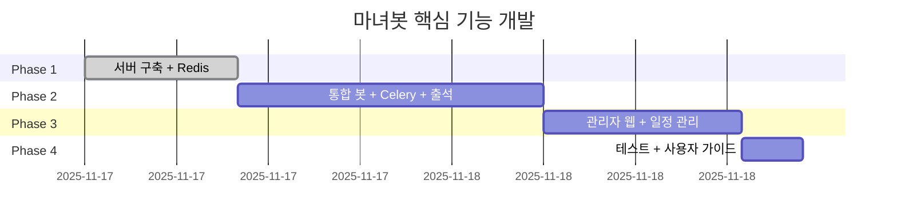

# 개발 로드맵

## 개발 일정

**총 예상**: 47시간

## Phase 1: 서버 + 최소 웹 (10시간)

### 완료
- [x] 로컬 DB 초기화 및 테스트
- [x] Flask OAuth + 대시보드
- [x] GCP 서버 구축 (Native)
- [x] HTTPS 마스토돈 접속
- [x] 관리자 계정 생성
- [x] Redis 설치

### 남은 작업
- [ ] VSCode SSH 연결 (0.5h)
- [ ] 봇 계정 생성 (0.5h)
- [ ] Flask 웹 배포 (3h)

## Phase 2: 통합 봇 (20시간)

### 2-1. 기본 구조 (4h)
- Streaming API 연결
- 이벤트 라우팅 (답글, 멘션, 명령어)
- SQLite 연동
- Redis 캐싱
- systemd 서비스

### 2-2. 재화 지급 (4h)
- 답글 감지 → 재화 지급
- 중복 방지 (status_id)
- 트랜잭션 기록
- Redis 캐시 업데이트

### 2-3. 출석 체크 (2h)
- cron 매일 10시 출석 트윗 발행
- 답글 감지 및 출석 처리
- 중복 방지 (attendance_post_id + user_id)
- 연속 출석 계산
- 보상 지급 (기본 + 보너스)
- DB 기록 (attendances, attendance_posts)

### 2-4. Celery (2h)
- Celery worker 설정
- 활동량 체크 Task
- 경고 발송 Task
- systemd 서비스

### 2-5. 활동량 체크 (4h)
- cron 4시, 16시
- PostgreSQL 읽기 (48시간 답글 수)
- 기준 미달 감지
- Celery Task로 경고 DM

### 2-6. 기본 명령어 (4h)
- `@봇 내재화`
- `@봇 도움말`
- 휴식 신청/해제

### 완료 조건
- [ ] 봇 24시간 작동
- [ ] Redis 캐싱 작동
- [ ] Celery worker 실행
- [ ] 답글 → 재화 지급
- [ ] 출석 트윗 자동 발행
- [ ] 출석 답글 → 재화 지급
- [ ] 활동량 체크 크론
- [ ] 기본 명령어 응답

### 제외 (Phase 5+)
- ❌ 상점
- ❌ 게임
- ❌ 콘텐츠 예약

## Phase 3: 관리자 웹 (13시간)

### 3-1. 대시보드 (2h)
- 통계 조회 (유저 수, 트랜잭션)
- Redis 캐싱
- 차트 (Chart.js)

### 3-2. 유저 관리 (2.5h)
- 목록 (페이지네이션)
- 상세 (재화, 트랜잭션)
- 재화 조정

### 3-3. 활동량 관리 (2.5h)
- 경고 내역
- 휴식 신청 목록
- 휴식 승인/거부

### 3-4. 일정 관리 (3h)
- 일정 등록/수정/삭제
- 목록 (월별/주별)
- 전역 휴식기간 설정
- 봇 명령어 연동

### 3-5. 시스템 설정 (1.5h)
- 설정 값 조회/수정
- 관리 로그

### 3-6. 권한 관리 (1.5h)
- 관리자 추가/제거

### 완료 조건
- [ ] 대시보드 통계
- [ ] 유저 목록/상세
- [ ] 재화 조정
- [ ] 경고 내역 확인
- [ ] 일정 등록/조회
- [ ] 전역 휴식기간 설정
- [ ] 시스템 설정 변경

### 제외 (Phase 5+)
- ❌ 상점 관리
- ❌ 콘텐츠 관리
- ❌ 복잡한 차트
- ❌ 일반 유저용 웹

## Phase 4: 테스트 + 가이드 (4시간)

### 4-1. 통합 테스트 (2h)
- 신규 유저 → 답글 → 재화
- 활동량 미달 → 경고
- 관리자 웹 재화 조정
- 버그 수정

### 4-2. 사용자 가이드 (2h)
- 일반 유저용 (재화, 명령어, 휴식)
- 관리자용 (웹 사용법, 경고 처리, 설정)

### 완료 조건
- [ ] 핵심 시나리오 테스트
- [ ] 사용자 가이드 작성
- [ ] 관리자 가이드 작성

## 시간별 일정

**작업 가능**: 평일 2-4h, 주말 4-8h
**시작**: 2025-11-17

### Week 1 (14h)
- 월 11/17: 서버 구축 (10h) ✅
- 화 11/18: VSCode SSH + 봇 계정 (2h)
- 수 11/19: Flask 웹 배포 시작 (2h)

### Week 2 (16h)
- 월 11/24: Flask 배포 완료 (4h)
- 화 11/25: 봇 기본 구조 (2h)
- 수 11/26: Redis + SQLite (2h)
- 목 11/27: 재화 지급 (2h)
- 금 11/28: 출석 체크 (2h)
- 주말 11/29-30: 출석 보상 (4h)

### Week 3 (17h)
- 월 12/1: Celery (2h)
- 화 12/2: 활동량 체크 (3h)
- 수 12/3: 경고 발송 (2h)
- 목 12/4: 기본 명령어 (2h)
- 금 12/5: 일정 조회 (2h)
- 주말 12/6-7: 웹 대시보드 + 유저 (6h)

### Week 4+
- 평일: 활동량/일정/설정 (2-3h/일)
- 주말: 테스트 + 가이드 (4-6h)

**예상 완료**: 2025-12 중순

## 체크리스트

### 필수
- [x] 서버 구축
- [x] 마스토돈 HTTPS
- [x] Redis 설치
- [ ] Celery worker
- [ ] 관리자 웹 OAuth
- [ ] 답글 → 재화
- [ ] 출석 체크 (자동 트윗, 보너스)
- [ ] 활동량 체크 (2회/일)
- [ ] 경고 발송 (DM)
- [ ] 휴식 신청/승인
- [ ] 기본 명령어
- [ ] 대시보드
- [ ] 유저 관리
- [ ] 활동량 관리
- [ ] 일정 관리
- [ ] 시스템 설정
- [ ] 사용자 가이드

### 제외 (Phase 5+)
- ❌ Docker 멀티 인스턴스
- ❌ 상점
- ❌ 게임
- ❌ 콘텐츠 관리
- ❌ 복잡한 분석
- ❌ 일반 유저 웹
- ❌ 고급 명령어

## Phase 5+ (추후)

### Docker 멀티 인스턴스 (5h)
- Native 백업
- Docker Compose
- 테스트/본서버 분리
- DuckDNS 2개 도메인
- Nginx 2개 도메인
- SSL 2개

### 상점 (8h)
- items, inventory 테이블
- 봇 명령어
- 관리자 웹 CRUD

### 콘텐츠 관리 (6h)
- 스토리/공지 예약
- 운영진 공지
- 과거 목록

### 일반 유저 웹 (12h)
- 프로필
- 랭킹
- 통계
- 디자인

## 위험 및 대응

| 위험 | 대응 |
|------|------|
| 서버 구축 지연 | ✅ 완료 |
| Streaming 연결 실패 | 공식 문서, 예외 처리 |
| OAuth 문제 | 토큰 재발급, 로그 |
| 47시간 초과 | 핵심 우선, 나머지 Phase 5+ |

## 성공 기준

### 최소 (47h)
1. ✅ 마스토돈 서버 (Native)
2. 재화 자동화
3. 출석 자동화
4. 활동량 자동화
5. 일정 관리
6. 관리자 웹

### 이상적 (Phase 5+)
1. Docker 멀티 인스턴스
2. 상점
3. 콘텐츠 관리
4. 60일 무중단
5. 일반 유저 웹
