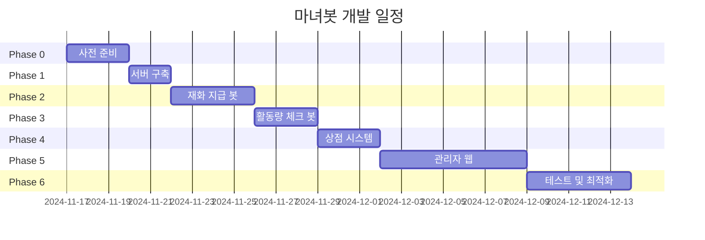

# 개발 로드맵

## 전체 일정



**총 예상 소요**: 16~24일

## Phase 0: 사전 준비

### 작업
- [ ] 오라클 클라우드 계정 생성
- [ ] DB 스키마 최종 확정
- [ ] 팀원과 요구사항 확인
- [ ] 도메인 준비 (DuckDNS)

### 완료 조건
- 서버 인프라 확보
- 도메인 및 SMTP 준비

## Phase 1: 서버 인프라 (1~2일)

### 작업
```bash
# VM 생성 및 기본 설정
apt update && apt upgrade -y
apt install -y docker.io docker-compose git nginx certbot

# 휘핑 에디션 설치
git clone https://github.com/whippyshou/mastodon.git
cd mastodon
cp .env.production.sample .env.production
# 환경 설정 (LOCAL_DOMAIN, SMTP 등)

# Docker 빌드 및 실행
docker-compose build
docker-compose run --rm web bundle exec rake db:migrate
docker-compose up -d

# SSL 설정
certbot --nginx -d yourserver.duckdns.org

# 타임존 설정 (UTC+9)
timedatectl set-timezone Asia/Seoul
```

### 완료 조건
- [ ] HTTPS 접속 가능
- [ ] 관리자 계정 로그인 성공
- [ ] PostgreSQL, Redis 정상 작동

## Phase 2: 재화 지급 봇 (3~4일)

### 작업
- DB 초기화 (`init_db.py`)
- `reward_bot.py` 구현
  - Streaming API 실시간 감지
  - 답글 → 재화 지급
  - status_id 중복 방지
- systemd 서비스 등록

### 완료 조건
- [ ] 봇 24시간 안정 작동
- [ ] 답글 시 재화 즉시 지급
- [ ] 중복 지급 없음
- [ ] DB 기록 정확

## Phase 3: 활동량 체크 봇 (2~3일)

### 작업
- `activity_checker.py` 구현
  - PostgreSQL 벌크 쿼리 (48시간)
  - 역할 필터링
  - 휴식계 제외
  - 경고 발송 (관리자 봇)
- cron 설정 (4시, 16시 - 12시간 간격)

### 완료 조건
- [ ] 크론 정확히 실행
- [ ] 48시간 답글 수 정확 계산
- [ ] 기준 미달 유저 감지
- [ ] 관리자 봇 비공개 툿 발송
- [ ] 휴식 중 유저 제외

## Phase 4: 상점 시스템 (2~3일)

### 작업
- items, inventory 테이블 추가
- 봇 명령어 구현
  - `@봇 상점`
  - `@봇 구매 [아이템]`
  - `@봇 내아이템`
- 관리자 웹 상점 관리 페이지

### 완료 조건
- [ ] 봇 명령어 작동
- [ ] 재화 부족 시 구매 실패
- [ ] inventory 정확 저장
- [ ] 관리자 웹 아이템 CRUD

## Phase 5: 관리자 웹 (5~7일)

### 작업 (일자별)
1. Flask 프로젝트 + OAuth
2. 홈 대시보드
3. 활동량 관리
4. 재화 관리
5. 상점 관리
6. 시스템 설정 + 로그
7. Nginx 배포 + 테스트

### 완료 조건
- [ ] 모든 메뉴 정상 작동
- [ ] OAuth 권한 체크
- [ ] admin_logs 기록
- [ ] 확인 팝업 작동

## Phase 6: 테스트 및 최적화 (3~5일)

### 작업
- 통합 테스트 (30명 시뮬레이션)
- 성능 최적화 (쿼리, 인덱스)
- 백업 자동화
- 문서화

### 완료 조건
- [ ] 50명 동시 사용 가능
- [ ] 자동 백업 작동
- [ ] 모니터링 스크립트 작동
- [ ] 문서 작성 완료

## 체크리스트

### 필수 기능
- [ ] 48시간 활동량 체크 (오전 4시, 오후 4시 - 12시간 간격)
- [ ] 경고 발송 (관리자 봇 비공개 툿)
- [ ] 휴식계 시스템
- [ ] 답글 기반 재화 지급 (실시간)
- [ ] 커스텀 지급 방식 (N개당 M원)
- [ ] 상점 시스템
- [ ] 봇 명령어 (내재화, 상점, 구매, 휴식)

### 관리자 웹
- [ ] 홈 대시보드
- [ ] 활동량 관리
- [ ] 재화 관리
- [ ] 상점 관리
- [ ] 콘텐츠 관리 (스토리/공지/운영진 공지)
- [ ] 시스템 설정
- [ ] 관리 로그

### 성능
- [ ] 50명 동시 사용
- [ ] 페이지 로딩 3초 이내
- [ ] 봇 응답 5초 이내

### 안정성
- [ ] 1주일 무중단 운영
- [ ] 봇 자동 재시작
- [ ] 백업 정상 작동

## 위험 요소

| 위험 | 확률 | 대응 |
|------|------|------|
| 오라클 계정 실패 | 중 | 대안 호스팅 |
| 봇 중단/재시작 | 중 | systemd 자동 재시작 |
| PostgreSQL 부하 | 낮 | 벌크 처리 (하루 2회) |
| SQLite 동시 쓰기 | 낮 | WAL 모드 + 재시도 |
