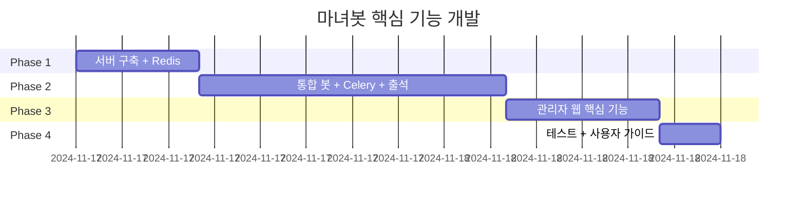

# 개발 로드맵

## 시간 배분 전략

**우선순위**: 핵심 기능만 구현, 나머지는 추후 확장

## 개발 일정

**총 예상 시간**: 42시간

## Phase 1: 서버 + 최소 웹 (재조정: 10시간)

### 완료된 작업
- [x] 로컬 DB 초기화 및 테스트
- [x] Flask OAuth + 대시보드
- [x] GCP 서버 구축 (Native 설치)
  - VM 생성, 기본 패키지 설치
  - DuckDNS 도메인 설정
  - Ruby, Node.js, PostgreSQL, Redis 설치
  - 휘핑 에디션 마스토돈 Native 설치
  - Nginx + SSL 설정
- [x] HTTPS 마스토돈 접속 확인
- [x] 관리자 계정 생성

### 진행 중 작업
- [ ] **Docker로 재설치 (2-3시간)** ← 현재 우선순위!
  - Native 설치 백업
  - Docker Compose 환경 구축
  - 테스트 서버 + 본 서버 분리
  - DuckDNS 2개 도메인 설정
  - Nginx 2개 도메인 설정
  - SSL 인증서 2개 발급
- [ ] VSCode SSH 연결 문제 해결 (0.5시간)
  - GCP 방화벽 설정
  - SSH 키 설정 확인
- [ ] 봇 계정 생성 (0.5시간)
  - 테스트 서버: 봇 계정 2개
  - 본 서버: 봇 계정 2개
  - OAuth 앱 등록, 토큰 발급
- [ ] Flask 웹 배포 (3시간)
  - 서버에 프로젝트 배포
  - Gunicorn + Nginx 설정
  - OAuth 로그인 테스트

### 완료 조건
- [x] 로컬 DB 초기화 완료
- [x] 로컬 OAuth 로그인 동작
- [x] HTTPS 마스토돈 접속 가능 (Native)
- [x] Redis 서버 정상 작동
- [ ] **Docker 기반 테스트+본서버 정상 작동**
- [ ] VSCode SSH 접속 성공
- [ ] 관리자 웹 로그인 성공

## Phase 2: 통합 봇 구현 (20시간)

### 핵심 기능만 구현

#### 2-1. 통합 봇 기본 구조 (4시간)
- 하나의 Streaming API 연결
- 이벤트 라우팅 (답글, 멘션, 명령어)
- SQLite 연동 (재화 지급, 트랜잭션)
- Redis 캐싱 연동 (유저 정보)
- systemd 서비스 등록

#### 2-2. 재화 지급 기능 (4시간)
- 답글 감지 → 재화 지급
- 중복 방지 (status_id 체크)
- 트랜잭션 기록
- Redis 캐시 업데이트

#### 2-3. 출석 체크 기능 (2시간)
- **출석 트윗 자동 발행**: cron으로 매일 오전 10시에 출석 트윗 게시
- **답글 감지 및 출석 처리**: 출석 트윗에 대한 답글 감지
- **중복 방지**: 하루에 한 번만 출석 가능 (attendance_post_id + user_id 체크)
- **연속 출석 계산**: 이전 출석 기록 조회하여 연속 일수 계산
- **보상 지급**: 기본 보상 + 연속 출석 보너스 (7일/14일/30일)
- **DB 기록**: attendances 테이블에 출석 기록, attendance_posts 테이블에 출석 트윗 기록
- **트랜잭션**: earn_attendance 타입으로 transactions에 기록

#### 2-4. Celery 백그라운드 작업 (2시간)
- Celery worker 설정
- 활동량 체크 Task 구현
- 경고 발송 Task 구현
- systemd 서비스 등록

#### 2-5. 활동량 체크 (4시간)
- cron 스크립트 (4시, 16시)
- PostgreSQL 읽기 쿼리 (48시간 답글 수)
- 기준 미달 유저 감지
- Celery Task로 경고 DM 발송

#### 2-6. 기본 명령어 (4시간)
- `@봇 내재화` - 재화 조회 (Redis 캐시 활용)
- `@봇 도움말` - 명령어 안내
- 휴식 신청/해제 (간단한 구현)

### 완료 조건
- [ ] 봇 24시간 안정 작동
- [ ] Redis 캐싱 정상 작동
- [ ] Celery worker 정상 실행
- [ ] 답글 시 재화 지급 확인
- [ ] 출석 트윗 자동 발행 확인 (매일 오전 10시)
- [ ] 출석 답글 시 재화 지급 확인 (기본 + 연속 보너스)
- [ ] 활동량 체크 크론 작동
- [ ] 기본 명령어 응답

### 제외 기능 (Phase 5+로 이동)
- ❌ 상점 시스템 (아이템, 구매)
- ❌ 복잡한 게임 시스템
- ❌ 콘텐츠 예약 발송

## Phase 3: 관리자 웹 핵심 기능 (10시간)

### 필수 기능만 구현

#### 3-1. 대시보드 개선 (2시간)
- 실제 통계 조회 (유저 수, 트랜잭션) with Redis 캐싱
- 간단한 차트 (Chart.js)

#### 3-2. 유저 관리 (2.5시간)
- 유저 목록 (페이지네이션)
- 유저 상세 (재화, 트랜잭션 내역)
- 재화 수동 조정 (관리자 전용)

#### 3-3. 활동량 관리 (2.5시간)
- 경고 내역 조회
- 휴식 신청 목록
- 휴식 승인/거부

#### 3-4. 시스템 설정 (1.5시간)
- 설정 값 조회/수정 (활동량 기준, 재화 비율)
- 관리 로그 조회

#### 3-5. 관리자 권한 관리 (1.5시간)
- 첫 유저를 관리자로 수동 설정
- 관리자 추가/제거 기능

### 완료 조건
- [ ] 대시보드 통계 표시
- [ ] 유저 목록/상세 조회
- [ ] 재화 조정 가능
- [ ] 활동량 경고 내역 확인
- [ ] 시스템 설정 변경 가능

### 제외 기능 (Phase 5+로 이동)
- ❌ 상점 관리 (아이템 CRUD)
- ❌ 콘텐츠 관리 (스토리/공지)
- ❌ 복잡한 차트/분석
- ❌ 일반 유저용 웹

## Phase 4: 테스트 + 사용자 가이드 (4시간)

### 4-1. 통합 테스트 (2시간)
- 시나리오 기반 테스트
  - 신규 유저 가입 → 답글 작성 → 재화 지급
  - 활동량 미달 → 경고 발송
  - 관리자 웹에서 재화 조정
- 버그 수정

### 4-2. 사용자 가이드 작성 (2시간)
- 일반 유저용 가이드
  - 재화 시스템 설명
  - 명령어 사용법
  - 휴식 신청 방법
- 관리자용 가이드
  - 웹 사용법
  - 경고 처리 방법
  - 설정 변경 가이드

### 완료 조건
- [ ] 핵심 시나리오 테스트 완료
- [ ] 사용자 가이드 작성 완료
- [ ] 관리자 가이드 작성 완료

## 시간별 상세 일정 (예시)

### Week 1 (21시간)
- **Day 1 (4시간)**: 서버 구축 + Redis 설치
- **Day 2 (4시간)**: 마스토돈 설정 + 웹 배포
- **Day 3 (4시간)**: 통합 봇 기본 구조 (Redis 연동)
- **Day 4 (4시간)**: 재화 지급 기능
- **Day 5 (5시간)**: Celery 설정 + 활동량 체크

### Week 2 (19시간)
- **Day 6 (4시간)**: 기본 명령어 (Redis 캐싱)
- **Day 7 (4시간)**: 대시보드 + 유저 관리
- **Day 8 (3시간)**: 활동량 관리
- **Day 9 (4시간)**: 시스템 설정 + 권한 관리
- **Day 10 (4시간)**: 테스트 + 가이드 작성

## 체크리스트

### 필수 구현 기능
- [ ] 서버 구축 완료
- [ ] 마스토돈 HTTPS 접속
- [ ] Redis 서버 설치 및 연동
- [ ] Celery worker 설정 및 실행
- [ ] 관리자 웹 OAuth 로그인
- [ ] 답글 기반 재화 지급 (실시간, Redis 캐싱)
- [ ] 출석 체크 시스템 (자동 트윗 발행, 답글 감지, 연속 보너스)
- [ ] 활동량 체크 (하루 2회, Celery Task)
- [ ] 경고 발송 (DM, 백그라운드 처리)
- [ ] 휴식 신청/승인
- [ ] 기본 명령어 (`@봇 내재화`, `@봇 도움말`)
- [ ] 관리자 웹 대시보드 (Redis 캐싱)
- [ ] 유저 관리 (목록, 상세, 재화 조정)
- [ ] 활동량 관리 (경고 내역, 휴식 관리)
- [ ] 시스템 설정
- [ ] 사용자 가이드 작성

### 제외 기능 (Phase 5+)
- ❌ 상점 시스템 (아이템, 구매, 인벤토리)
- ❌ 게임 시스템
- ❌ 콘텐츠 관리 (스토리/공지 예약)
- ❌ 복잡한 통계/분석
- ❌ 일반 유저용 웹
- ❌ 고급 명령어

## Phase 5+ (추후 확장)

### 상점 시스템 (8시간)
- items, inventory 테이블
- 봇 명령어 (`@봇 상점`, `@봇 구매`)
- 관리자 웹 아이템 CRUD

### 콘텐츠 관리 (6시간)
- 스토리/공지 예약 발송
- 운영진 공지 (관리자 봇)
- 과거 콘텐츠 목록

### 일반 유저용 웹 (12시간)
- 프로필 조회
- 재화 랭킹
- 활동 통계
- 디자인 작업

## 위험 요소 및 대응

| 위험 | 확률 | 대응 |
|------|------|------|
| 서버 구축 지연 | 중 | docs/server_setup.md 참고, 단계별 진행 |
| 봇 Streaming 연결 실패 | 낮 | Mastodon.py 공식 문서, 예외 처리 |
| OAuth 연동 문제 | 낮 | 토큰 재발급, 로그 확인 |
| 40시간 초과 | 높 | 핵심 기능 우선, 나머지는 Phase 5+로 |

## 성공 기준

### 최소 목표 (40시간 내 달성)
1. 마스토돈 서버 정상 운영
2. 재화 지급 자동화
3. 활동량 체크 자동화
4. 관리자 웹 기본 기능

### 이상적 목표 (Phase 5+)
1. 상점 시스템
2. 콘텐츠 관리
3. 60일 무중단 운영
4. 일반 유저용 웹
