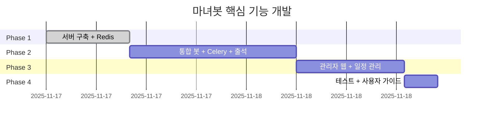

# 개발 로드맵

## 🎯 당장 할일 (2시간 테스트 플랜)

### 1단계: 환경 준비 (10분)
- [ ] 프로젝트 디렉토리로 이동
- [ ] Python 가상환경 생성: `python3 -m venv venv && source venv/bin/activate`
- [ ] 의존성 설치: `pip install -r requirements.txt`
- [ ] `.env` 파일 생성 및 편집 (`.env.example` 참고)

### 2단계: DB 초기화 & 테스트 데이터 (5분)
- [ ] `python init_db.py` - DB 생성
- [ ] `python scripts/seed_test_data.py` - 테스트 데이터 삽입
- [ ] `sqlite3 economy.db "SELECT COUNT(*) FROM users;"` - 확인

### 3단계: Admin Web 서버 실행 (5분)
- [ ] `cd admin_web && python app.py`
- [ ] 브라우저 `http://localhost:5000` 접속
- [ ] 에러 로그 확인

### 4단계: API 자동 테스트 (20분)
- [ ] `python scripts/test_all_api.py` 실행
- [ ] 실패한 API 목록 기록

### 5단계: 수동 웹 테스트 (40분)
**OAuth 우회용 임시 코드** - `admin_web/app.py`에 추가:
```python
@app.route('/debug-login')
def debug_login():
    session['user_id'] = 'test_admin'
    session['username'] = 'TestAdmin'
    return redirect('/dashboard')
```

**체크리스트:**
- [ ] 대시보드 - 통계 확인
- [ ] 사용자 목록/상세 - 거래 내역
- [ ] 경고/휴가/이벤트/상점 - CRUD 테스트
- [ ] 설정/로그 확인

### 6단계: 문제 기록 (30분)
- [ ] 발견한 에러/성능 문제/UI 개선사항 문서화

---

## 📊 현재 상태 (2025-11-18)

### ✅ 완료
- **Admin Web 100%** - 2,192줄 (Controllers, Services, Repositories, Routes, Templates)
- **DB 스크립트** - init_db.py (377줄)
- **테스트 도구** - test_all_api.py (601줄), seed_test_data.py (534줄)
- **문서** - 12개 문서 파일

### ❌ 미착수
- **Mastodon Bot** - 모든 파일 0바이트 (reward_bot.py, activity_checker.py, command_handler.py, database.py, utils.py)

**전체 진행률: 약 67%** (Admin Web 완료, Bot 미착수)

---

## 개발 일정



**총 예상**: 47시간

## Phase 1: Admin Web 구현 ✅ **완료**

### 완료 (100%)
- [x] 로컬 DB 초기화 및 테스트
- [x] Flask OAuth (Mastodon) + 로그인/로그아웃
- [x] 대시보드 - 통계, 차트
- [x] 사용자 관리 - 목록, 상세, 거래 내역, 재화 조정
- [x] 경고 관리 - 목록, 생성, 삭제
- [x] 휴가 관리 - 신청, 승인, 거부
- [x] 이벤트 관리 - 일정 CRUD
- [x] 상점 관리 - 아이템 CRUD
- [x] 설정 관리 - 시스템 설정
- [x] 관리자 로그 - 활동 기록
- [x] 전체 5-layer 아키텍처 (Model-Repository-Service-Controller-Route)
- [x] 11개 DB 모델, 2,192줄 구현 완료

### 서버 배포 (예정)
- [ ] GCP 서버 구축
- [ ] HTTPS 설정
- [ ] Flask 웹 배포
- [ ] Redis 설치

## Phase 2: Mastodon Bot 구현 ❌ **미착수** (20시간)

> **현재 상태**: 파일만 생성, 모든 코드 0바이트

### 2-1. 기본 구조 (4h) - 미착수
- [ ] `bot/reward_bot.py` - Mastodon.py Streaming API 연결
- [ ] 이벤트 라우팅 (답글, 멘션, 명령어)
- [ ] `bot/database.py` - SQLite 연동 헬퍼
- [ ] `bot/utils.py` - 유틸리티 함수
- [ ] systemd 서비스 설정

### 2-2. 재화 지급 (4h) - 미착수
- [ ] 답글 감지 → 재화 지급 로직
- [ ] 중복 방지 (status_id)
- [ ] 트랜잭션 기록
- [ ] 보상 알림 멘션

### 2-3. 출석 체크 (2h) - 미착수
- [ ] `bot/activity_checker.py` - 출석 체크 시스템
- [ ] cron 하루 2회 (04:00, 16:00) 출석 포스트
- [ ] 답글 감지 및 출석 처리
- [ ] 중복 방지 (attendance_post_id + user_id)
- [ ] 연속 출석 계산 및 보너스
- [ ] DB 기록 (attendances)

### 2-4. 활동량 체크 (4h) - 미착수
- [ ] cron 4시, 16시
- [ ] Mastodon API로 48시간 답글 수 조회
- [ ] 기준 미달 감지
- [ ] 경고 DM 발송
- [ ] 휴가 중 사용자 제외

### 2-5. 사용자 명령어 (4h) - 미착수
- [ ] `bot/command_handler.py` - 명령어 처리
- [ ] `/내정보` - 잔액, 통계 조회
- [ ] `/순위` - 랭킹 조회
- [ ] `/도움말` - 명령어 안내
- [ ] 휴가 신청/해제 명령어

### 2-6. 관리자 명령어 (2h) - 미착수
- [ ] 관리자 권한 확인
- [ ] 재화 수동 지급/차감
- [ ] 경고 발송
- [ ] 시스템 상태 조회

### 완료 조건
- [ ] 봇 24시간 작동
- [ ] 답글 → 재화 지급
- [ ] 출석 트윗 자동 발행 (하루 2회)
- [ ] 출석 답글 → 재화 지급
- [ ] 활동량 체크 크론 (하루 2회)
- [ ] 사용자 명령어 응답
- [ ] 관리자 명령어 응답

## Phase 3: Admin Web 고도화 (Phase 1에서 이미 완료됨)

> Phase 1에서 이미 전체 구현 완료. 아래는 원래 계획이었던 항목.

### ✅ 3-1. 대시보드 (2h) - 완료
- [x] 통계 조회 (유저 수, 트랜잭션, 경고, 휴가)
- [x] Chart.js 차트
- [x] 최근 활동 로그

### ✅ 3-2. 유저 관리 (2.5h) - 완료
- [x] 목록 (검색, 필터링)
- [x] 상세 (재화, 거래 내역, 경고 내역)
- [x] 재화 조정 (수동 지급/차감)

### ✅ 3-3. 활동량 관리 (2.5h) - 완료
- [x] 경고 목록 및 상세
- [x] 경고 생성/삭제
- [x] 휴가 신청 목록
- [x] 휴가 승인/거부

### ✅ 3-4. 일정 관리 (3h) - 완료
- [x] 이벤트 등록/수정/삭제
- [x] 캘린더 목록
- [x] 일반 이벤트 / 전역 휴식기간 구분

### ✅ 3-5. 시스템 설정 (1.5h) - 완료
- [x] 설정 값 조회/수정
- [x] 관리 로그 조회 (필터링, 검색)

### ✅ 3-6. 상점 관리 - 완료
- [x] 아이템 목록/생성/수정/삭제
- [x] 재고 관리

### 완료 조건
- [x] 대시보드 통계
- [x] 유저 목록/상세
- [x] 재화 조정
- [x] 경고 내역 확인
- [x] 일정 등록/조회
- [x] 전역 휴식기간 설정
- [x] 시스템 설정 변경
- [x] 상점 아이템 관리

## Phase 4: 테스트 + 문서화 (4시간)

### 4-1. Admin Web 테스트 (2h) - **당장 할일!**
- [ ] DB 초기화 및 테스트 데이터 생성
- [ ] API 자동 테스트 (`test_all_api.py`)
- [ ] 웹 UI 수동 테스트 (모든 화면)
- [ ] 발견된 버그 수정

### 4-2. Bot 통합 테스트 (2h) - Bot 완료 후
- [ ] 신규 유저 → 답글 → 재화 지급
- [ ] 출석 체크 → 보상 지급
- [ ] 활동량 미달 → 경고 DM
- [ ] 관리자 웹 재화 조정 → Bot 반영
- [ ] 명령어 응답 테스트

### 4-3. 문서화 - 부분 완료
- [x] 관리자 가이드 (ADMIN_GUIDE.md)
- [x] 긴급 대응 가이드 (EMERGENCY.md)
- [x] API 문서 (api_design.md)
- [x] 서버 설정 가이드 (server_setup.md)
- [ ] 일반 사용자 가이드 (재화, 명령어, 휴식)
- [ ] Bot 운영 가이드

### 완료 조건
- [ ] Admin Web 테스트 완료
- [ ] Bot 통합 테스트 완료
- [ ] 모든 문서 작성 완료

## 시간별 일정

**작업 가능**: 평일 2-4h, 주말 4-8h
**예상 완료**: 2025-12 중순


## Phase 5+ (추후)

### Docker 멀티 인스턴스 (5h)
- Native 백업
- Docker Compose
- 테스트/본서버 분리
- DuckDNS 2개 도메인
- Nginx 2개 도메인
- SSL 2개

### 상점 (8h)
- items, inventory 테이블
- 봇 명령어
- 관리자 웹 CRUD

### 콘텐츠 관리 (6h)
- 스토리/공지 예약
- 운영진 공지
- 과거 목록

### 일반 유저 웹 (12h)
- 프로필
- 랭킹
- 통계
- 디자인

